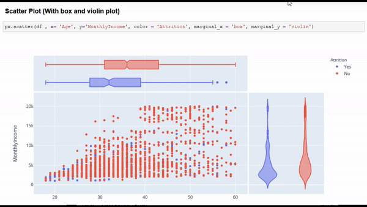
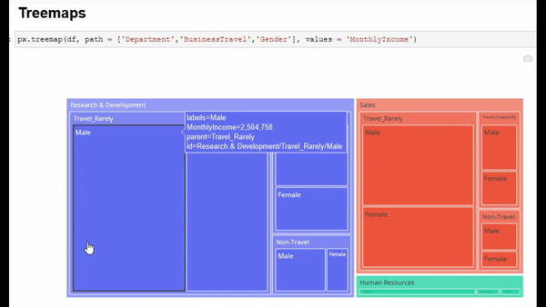

# Advance Visualizations

View my notebook on Kaggle: [Click here](https://www.kaggle.com/gauravkumar008/advanced-visualizations)<br>
Also view my notebook on: [nbviewer.jupyter.org](https://nbviewer.jupyter.org/)<br>
```You just need to copy and paste my .ipynb notebook link on nbviewer.jupyter.org```<br>

## Aim:
**To make the beginners comfortable with plotly in order to make advanced and interactive visualizations :). This notebooks is not focusing on data analysis, just trying to show how to create plots using different columns**

## Short Description
**In this project, i have shown how to create advanced and interactive beautiful plots with data using some fancy libraries like Plotly and WordCloud. I have disscussed several types of charts like bar chart, histogram, Treemap, Box plot and Violin plot**

## ```Warning```:
 - **Lots of plotly plots can make you browser slower**
 - **```Github``` doesn't support the visualizations of Plotly.**
   - **So, either download the .ipynb notebook and run it on your browser**
   - **Or view it on kaggle. The Kaggle link of the same notebook has been provided at the top :)**

## Output:
**Here are some of the visualizations that I made:**

 - ### Scatter plot (With Box and Violin plot)


 - ### Treemap


## Author:
[Gaurav Kumar](https://github.com/Gaurav1401)