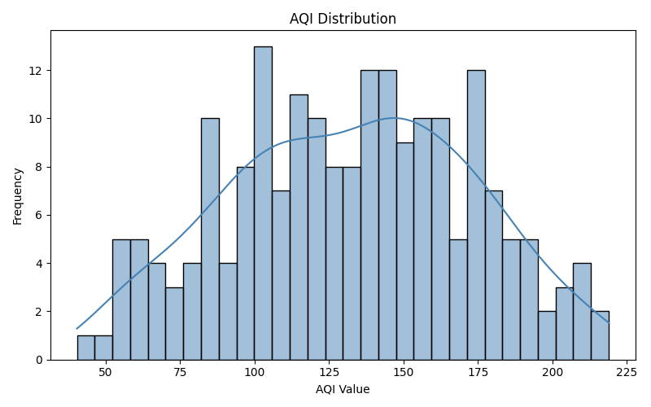
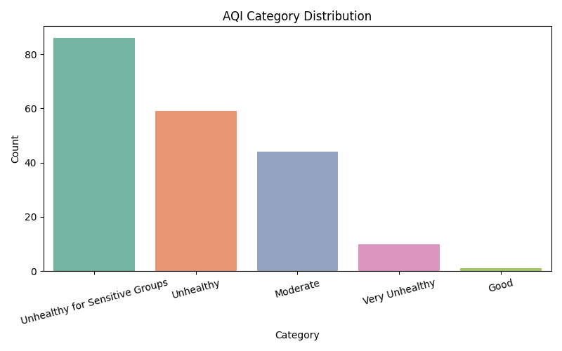
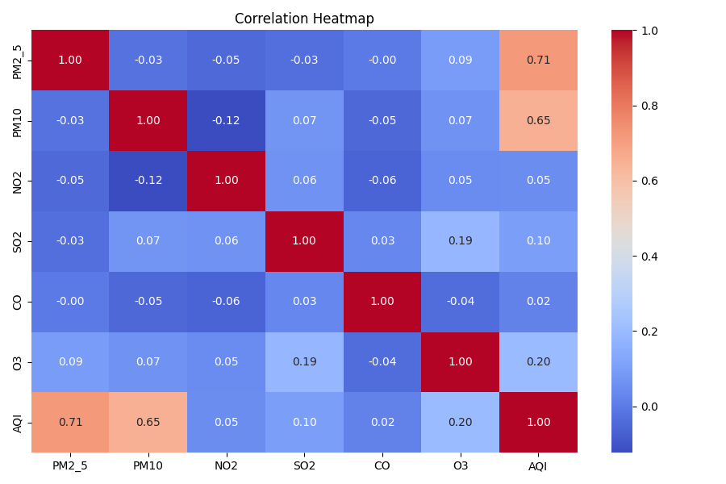
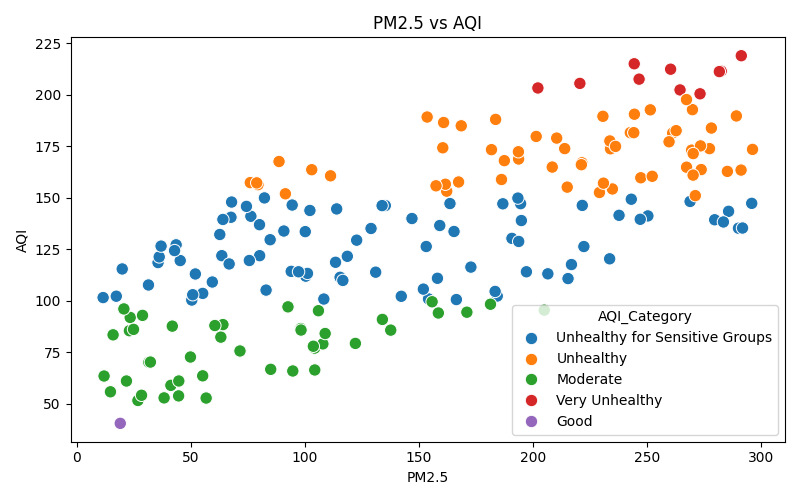

# Air Quality Index (AQI) Prediction using Machine Learning

## 📌 Overview
This project predicts Air Quality Index (AQI) based on pollutant levels
using Machine Learning algorithms.

## 📊 Dataset Features
- **PM2.5** : Fine particulate matter
- **PM10** : Coarse particulate matter
- **NO2** : Nitrogen Dioxide
- **SO2** : Sulfur Dioxide
- **CO** : Carbon Monoxide
- **O3** : Ozone
- **AQI** : Air Quality Index (target)

## 🛠️ Libraries Used
- Pandas, NumPy, Matplotlib, Seaborn, Scikit-learn

## 🤖 ML Models Used
- Random Forest Classifier (AQI Category prediction)
- Random Forest Regressor (AQI value prediction)

## 📈 Results
| Model | Score |
|-------|-------|
| Random Forest Classifier | High Accuracy |
| Random Forest Regressor | R2 ≈ 0.99 |

## 📸 Screenshots

## ✍️ Author
GSSoC '26 Contributor — madhavzanwar