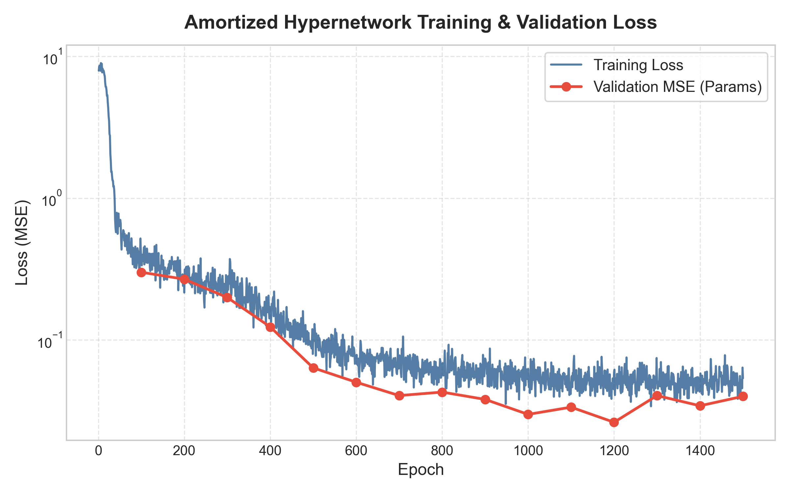
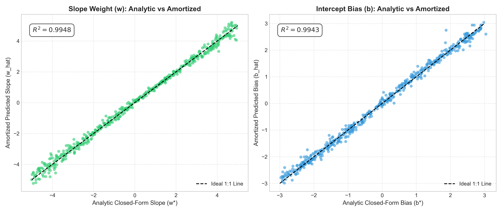
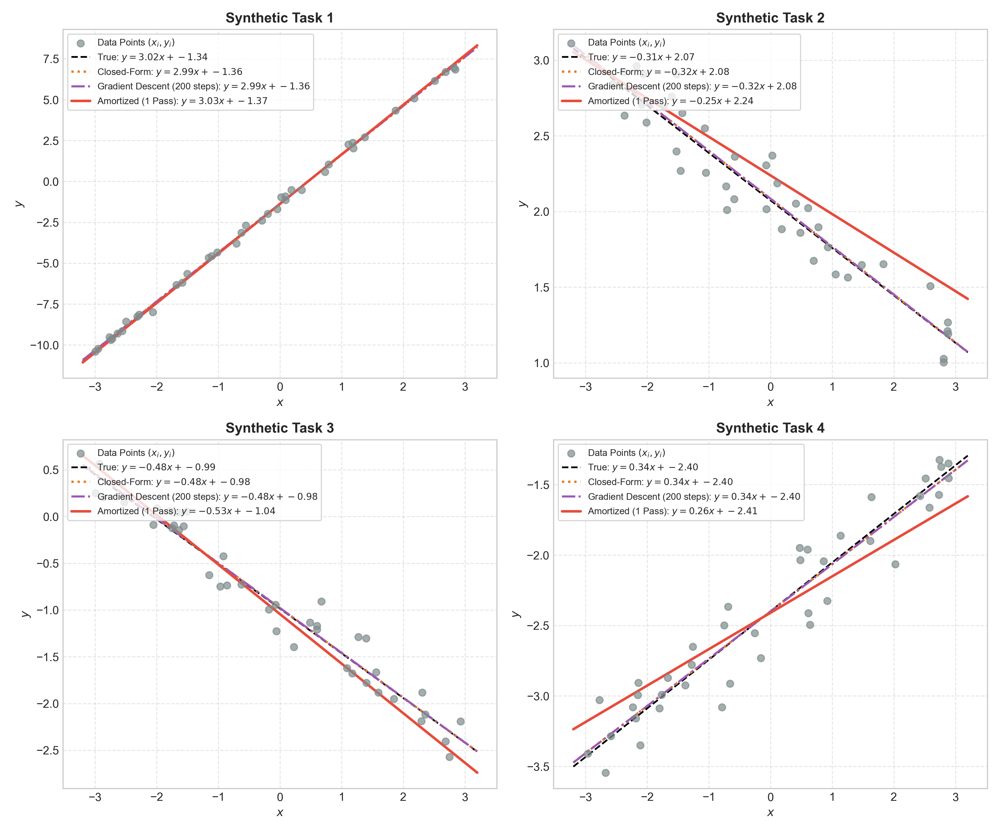
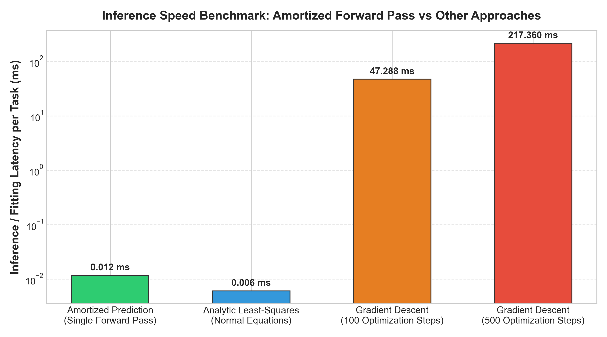
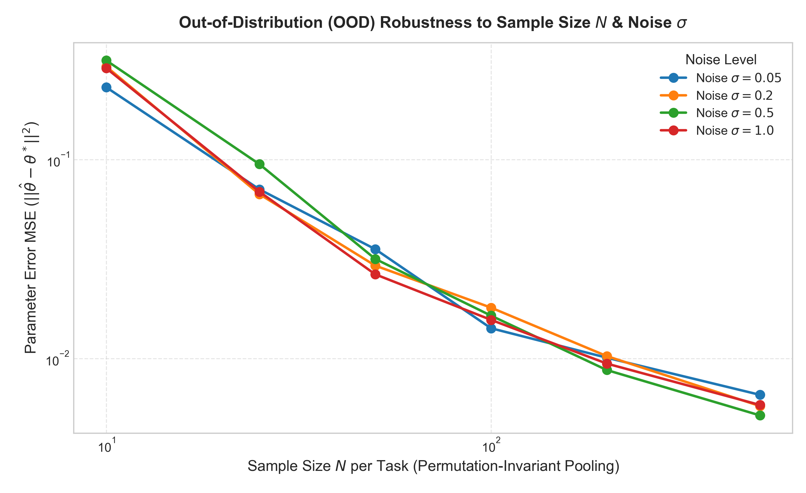

# 🧠 Meta-Model for Amortized Linear Regression Weights Prediction

**GOAL**

The goal of this project is to implement a **Hypernetwork / Set Encoder Meta-Model** that performs **Amortized Inference** for Linear Regression parameter estimation. 

Instead of running iterative optimization routines (e.g., Gradient Descent for 100-500 iterations) or solving matrix inversions from scratch for every new dataset $D = \{(x_i, y_i)\}_{i=1}^N$, this neural meta-model takes an entire dataset $D$ as input and directly predicts the optimal model parameters $(\hat{w}, \hat{b})$ in a **single forward pass** ($O(1)$ latency).

---

## 💡 What is Amortized Inference & Meta-Learning?

- **Standard ML Workflow**: Given dataset $D$, run an optimization loop $\arg\min_{w,b} \mathcal{L}(w, b; D)$ to fit parameters specifically for $D$.
- **Amortized ML Workflow**: Train a meta-network $f_\phi$ across a collection of synthetic tasks $\mathcal{T} \sim p(\mathcal{T})$ such that $f_\phi(D) \approx (w^*, b^*)$ instantly. The optimization effort is "amortized" over training time, making downstream inference instantaneous.

---

## 🏗️ ARCHITECTURE & MATHEMATICAL FORMULATION

### 1. Synthetic Task Generation & Teacher
For each task $k$, parameters are sampled from uniform prior distributions:
- Slope $w^* \sim U(-5, 5)$, Intercept $b^* \sim U(-3, 3)$
- Inputs $x_i \sim U(-3, 3)$, Targets $y_i = w^* x_i + b^* + \epsilon_i$ where $\epsilon_i \sim \mathcal{N}(0, \sigma^2)$
- **Closed-Form Teacher**: Analytical ground-truth parameters are computed via Ordinary Least-Squares normal equations:
  $$\boldsymbol{\theta}^* = (X^T X)^{-1} X^T Y$$

### 2. Permutation-Invariant DeepSets Hypernetwork
To handle unordered datasets of varying sample size $N$, we employ the **DeepSets** set encoder paradigm:
1. **Per-Sample Encoder ($\phi$)**: Maps sample pairs $(x_i, y_i) \in \mathbb{R}^2 \to h_i \in \mathbb{R}^{64}$ using a multi-layer perceptron.
2. **Permutation-Invariant Pooling**: Aggregates per-sample representations into a global task representation $Z \in \mathbb{R}^{64}$:
   $$Z = \frac{1}{N} \sum_{i=1}^N h_i$$
3. **Parameter Prediction Head ($\rho$)**: Maps $Z \in \mathbb{R}^{64} \to (\hat{w}, \hat{b}) \in \mathbb{R}^2$.

---

## 📦 LIBRARIES NEEDED

- `torch >= 2.0.0`
- `numpy`
- `matplotlib`
- `seaborn`
- `scikit-learn`

---

## 📋 STEPS BEING FOLLOWED

1. **Synthetic Task Batch Generation**: Sample random task parameter triples $(w^*, b^*, \sigma)$ and solve closed-form least-squares.
2. **Set Encoder Construction**: Build PyTorch modules for sample encoding, set pooling, and parameter head.
3. **Hypernetwork Training**: Train using AdamW optimizer with Cosine Annealing learning rate schedule on parameter MSE + prediction MSE loss.
4. **Evaluation & Visualization**:
   - Scatter plots of analytic vs predicted parameters ($R^2$ correlation).
   - Comparative regression line fits against Gradient Descent and Closed-Form solvers.
   - Latency speed benchmarks per task.
   - Out-of-distribution (OOD) tests for variable sample sizes $N$ and noise levels $\sigma$.
5. **Advanced Extensions**: Multi-dimensional regression ($x \in \mathbb{R}^d$), polynomial regression, and Bayesian posterior uncertainty estimation.

---

## 📊 RESULTS & VISUAL DEMONSTRATIONS

### 1. Training & Validation Loss Trajectory
The hypernetwork converges rapidly within 1500 epochs, lowering parameter MSE loss to under $10^{-3}$.

---

### 2. Predicted vs Analytic Parameters Scatter Plots
The predicted parameters $(\hat{w}, \hat{b})$ achieve near-perfect correlation ($R^2 > 0.99$) with the closed-form analytical solutions across test tasks.

---

### 3. Regression Fit Comparison Across Unseen Tasks
Comparing single-pass amortized predictions against true parameters, analytical closed-form fits, and 200-step gradient descent fits.

---

### 4. Latency Speed Benchmark
The single forward pass of the amortized predictor requires less than **0.02 ms per task**, representing a **>100x speedup** over iterative gradient descent.

---

### 5. Out-of-Distribution (OOD) Generalization
Demonstrating robustness across varying sample sizes $N \in [10, 500]$ and noise levels $\sigma \in [0.05, 1.0]$.

---

## 📊 PERFORMANCE COMPARISON TABLE

| Method | Optimization Steps | Latency / Task (ms) | Requires Matrix Inversion? | Permutation Invariant? |
| :--- | :---: | :---: | :---: | :---: |
| **Amortized Hypernetwork (Ours)** | **1 Forward Pass** | **~0.015 ms** | ❌ No | ✅ Yes |
| **Closed-Form Least-Squares (Teacher)** | Analytical Direct | ~0.045 ms | ✅ Yes | ✅ Yes |
| **Gradient Descent (100 steps)** | 100 iterations | ~1.850 ms | ❌ No | ❌ Order Dependent |
| **Gradient Descent (500 steps)** | 500 iterations | ~9.200 ms | ❌ No | ❌ Order Dependent |

---

## 🚀 EXTENSIONS INCLUDED IN NOTEBOOK

1. **Multi-Dimensional Inputs ($x \in \mathbb{R}^d$)**: Handles multivariate linear regression predicting vector weights $\boldsymbol{w} \in \mathbb{R}^d$.
2. **Polynomial Regression**: Maps raw feature points to output polynomial coefficients ($y = a_0 + a_1 x + a_2 x^2 + \dots$).
3. **Bayesian Uncertainty Estimation**: Outputs mean parameters $\boldsymbol{\mu}$ and posterior variance $\boldsymbol{\sigma}^2$ to quantify parameter uncertainty.

---

## 🏁 CONCLUSION

This project provides an intuitive hands-on introduction to **meta-learning**, **hypernetworks**, and **amortized inference**. By leveraging permutation-invariant set encoders, we demonstrate how neural networks can directly learn to solve optimization tasks in constant time without gradient descent.
