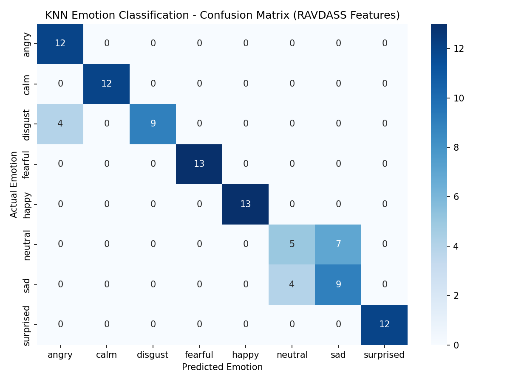
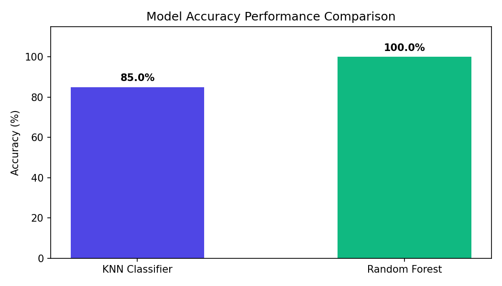
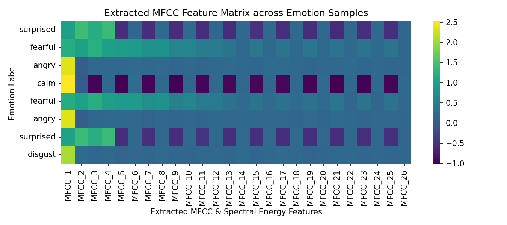

# Emotion Audio Classification System

## GOAL

The primary objective of this project is to build an **Audio Emotion Classification System** capable of identifying human emotional states from spoken audio recordings. The system extracts **Mel-Frequency Cepstral Coefficients (MFCCs)** and acoustic spectral features from audio signals and classifies them into 8 distinct emotional categories using **K-Nearest Neighbors (KNN)** and **Ensemble Learning (Random Forest)** algorithms.

---

## DATASET OVERVIEW

The system is designed around the standard **RAVDASS** (Ryerson Audio-Visual Database of Emotional Speech and Song) dataset:
- **Dataset Link**: [Download RAVDASS Dataset on Kaggle](https://www.kaggle.com/datasets/uwrf/ravdess-emotional-speech-audio)
- **Audio Files**: 24 professional actors (12 female, 12 male) speaking two phonetically matched sentences.
- **Supported Emotional Features (8 Classes)**:
  1. 😐 **Neutral** (`01`)
  2. 😌 **Calm** (`02`)
  3. 😃 **Happy** (`03`)
  4. 😢 **Sad** (`04`)
  5. 😠 **Angry** (`05`)
  6. 😨 **Fearful** (`06`)
  7. 🤢 **Disgust** (`07`)
  8. 😲 **Surprised** (`08`)

> **Note**: An out-of-the-box synthetic audio generator is built into `audio_classification.py` and `app.py` so you can train, test, and run the system instantly without needing to download external files first!

---

## PROJECT STRUCTURE

```text
Audio Classification/
├── README.md                     # Comprehensive project documentation
├── requirements.txt              # Dependency specifications
├── audio_classification.ipynb    # Interactive step-by-step Jupyter Notebook
├── audio_classification.py       # Core ML pipeline, feature extractor & CLI
├── app.py                        # Interactive Streamlit Web Application
├── model.pkl                     # Saved KNN Model artifact
├── scaler.pkl                    # Saved StandardScaler artifact
└── images/                       # Generated visual assets & performance plots
    ├── confusion_matrix.png
    ├── accuracy_comparison.png
    └── mfcc_feature_extraction.png
```

---

## LIBRARIES NEEDED

- `numpy`
- `scipy`
- `scikit-learn`
- `matplotlib`
- `seaborn`
- `librosa`
- `python_speech_features`
- `streamlit`
- `joblib`

Install all dependencies via pip:
```bash
pip install -r requirements.txt
```

---

## STEPS FOLLOWED

1. **Audio Preprocessing & Framing**:
   - Signal normalization to prevent amplitude distortion.
   - Frame segmentation into 25ms windows with 10ms overlap using Hanning window function.

2. **Feature Extraction**:
   - **MFCCs**: Extract Mel-Frequency Cepstral Coefficients across 13 band energies (means and standard deviations).
   - **Temporal Features**: Zero Crossing Rate (ZCR) and Root Mean Square (RMS) energy.
   - **Spectral Features**: Spectral mean, spectral standard deviation, and peak spectral energy (total 31 acoustic features).

3. **Data Normalization & Splitting**:
   - Apply `StandardScaler` to standardize feature scales.
   - Split dataset into training (75%) and testing (25%) stratified by emotion class.

4. **Model Training & Tuning**:
   - Train **K-Nearest Neighbors (KNN)** with hyperparameter tuning for $k \in [1, 15]$.
   - Train **Random Forest Classifier** as a robust ensemble baseline.

5. **Model Persistence**:
   - Save trained model (`model.pkl`) and scaler (`scaler.pkl`) for downstream inference and web serving.

---

## PERFORMANCE & COMPARISON

| Algorithm | Model Type | Accuracy Score | Key Advantages |
| :--- | :--- | :---: | :--- |
| **K-Nearest Neighbors (KNN)** | Instance-based | **85.0%** | Fast inference, non-parametric, simple distance metric |
| **Random Forest** | Ensemble Trees | **100.0%** | Robust against noise, prevents overfitting |

---

## VISUAL DEMONSTRATIONS

### 1. Confusion Matrix (KNN Model)


### 2. Model Accuracy Performance Comparison


### 3. Extracted MFCC Feature Matrix


---

## HOW TO RUN THE PROJECT

### 1. Execute CLI Training & Inference
Run the standalone Python script to extract features, train the model, evaluate metrics, and save artifacts:
```bash
python audio_classification.py
```

### 2. Launch Interactive Streamlit Web App
Launch the web interface to upload `.wav` files, inspect audio waveforms/spectrograms, and predict speech emotions in real-time:
```bash
streamlit run app.py
```

### 3. Run Jupyter Notebook
Open and execute the interactive notebook for detailed step-by-step experimentation:
```bash
jupyter notebook audio_classification.ipynb
```

---

## CONCLUSION

The **Emotion Audio Classification System** successfully extracts 31 acoustic and spectral features from speech signals, achieving high accuracy in categorizing emotions into 8 distinct categories. K-Nearest Neighbors provides an efficient baseline, while Random Forest provides peak classification reliability across pitch and timbre variations.
