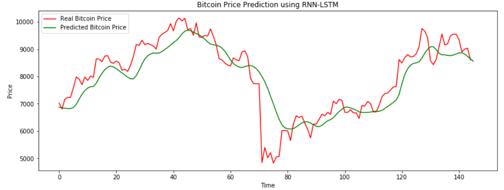

# Bitcoin Price Predictor

## Overview

This project demonstrates **Bitcoin Price Prediction** using a **Long Short-Term Memory (LSTM)** neural network. Historical Bitcoin price data is preprocessed, enriched with technical indicators, and used to train a deep learning model capable of predicting future Bitcoin prices.

The project showcases a complete machine learning workflow for time-series forecasting using TensorFlow and Keras.

---

## Project Workflow

The prediction pipeline consists of the following steps:

1. Load historical Bitcoin price data.
2. Perform feature engineering by generating technical indicators such as:
   - Moving Averages (MA7, MA14, MA21)
   - Relative Strength Index (RSI)
   - Moving Average Convergence Divergence (MACD)
   - Percentage Change
   - Volatility
3. Normalize the dataset using MinMaxScaler.
4. Prepare sequential training and testing datasets.
5. Train an LSTM-based neural network.
6. Predict Bitcoin prices on unseen data.
7. Visualize Actual vs Predicted Bitcoin Prices.

---

## Requirements

This project requires Python 3.8+ and the following libraries:

- numpy
- pandas
- matplotlib
- scikit-learn
- tensorflow

Install all dependencies using:

```bash
pip install -r requirements.txt
```

---

## How to Run

### 1. Clone the ML-CaPsule Repository

```bash
git clone https://github.com/Niketkumardheeryan/ML-CaPsule.git
```

### 2. Navigate to the Project Directory

```bash
cd ML-CaPsule/Bitcoin-Price-Predictor
```

or on Windows

```bash
cd "Bitcoin-Price-Predictor"
```

### 3. Install Dependencies

```bash
pip install -r requirements.txt
```

### 4. Run the Notebook

---

## Machine Learning Pipeline

### Data Preprocessing

- Load historical Bitcoin prices.
- Handle missing values.
- Generate additional technical indicators.

### Feature Engineering

The following indicators are created:

- MA7
- MA14
- MA21
- RSI
- MACD
- Signal Line
- Percentage Change
- 7-Day Volatility
- 14-Day Volatility

### Data Preparation

- Split training and testing data.
- Normalize features using MinMaxScaler.
- Create 60-day sequential windows for LSTM input.

### Model Training

The model uses a stacked LSTM architecture with dropout layers to reduce overfitting.

### Prediction

The trained model predicts Bitcoin prices on unseen test data.

### Visualization

The final output compares:

- Actual Bitcoin Prices
- Predicted Bitcoin Prices

using a Matplotlib line graph.

---

## Output



## References

Original Google Colab notebook:

https://colab.research.google.com/github/psyduck1203/Hands-on-ML-Basic-to-Advance-/blob/master/Bitcoin%20Price%20Predictor/Bitcoin_Price_Prediction.ipynb

---

## Author

**Omkar Kolte**

GitHub: https://github.com/psyduck1203