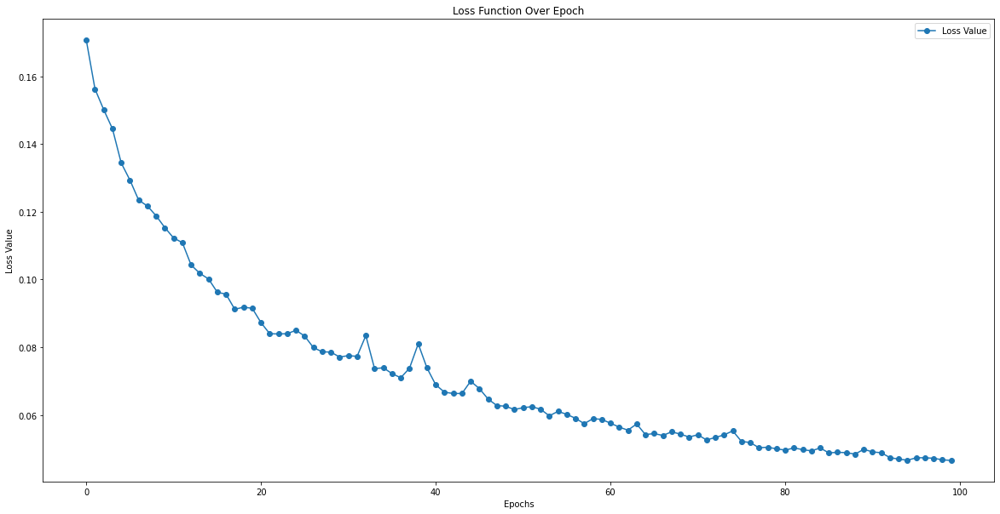
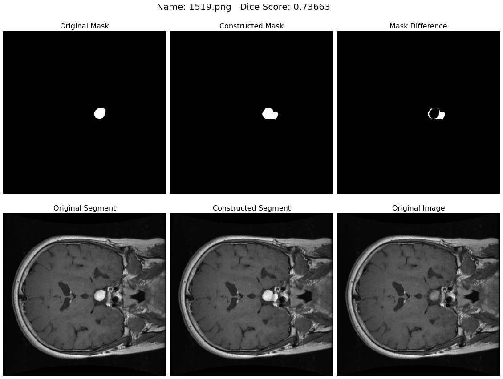
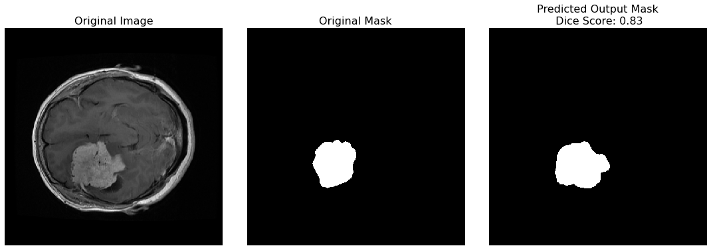

# Brain Tumor Segmentation using UNET architecture
This project uses U-Net Architecture to create segmentation masks for brain tumor MRI images.

## Dataset Used:
The dataset used was obtained from kaggle and contains 3064 T1-weighted contrast-enhanced MR images with three kinds of brain tumor. Each image is of dimension 512 x 512 x 1 , these are black and white images thus having a single channel.

## Data Augmentation:
The basic forms of data augmentation are used here to diversify the training data. All the augmentation methods are used from Pytorch's Torchvision module.

- Horizontally Flip
- Vertically Flip
- Rotation Between 15° to 75°

## Model Architecture
The model architecture is depicted in this picture.

## Model Training
Kaggle GPU kernel was used for training purposes:
- `Epochs` -> 100
- `Training Time(approx)` -> 3hours 20min
- `Computation Details` -> Device Used: (cuda), Tesla P100-PCIE-16GB
- `Packages Used Versions` -> Pytorch Version: 1.9.1

## Loss graph:

## Results
Mean Dice Score obtained is: 0.720. 

 

## Prediction-1

 
## Prediction-2

