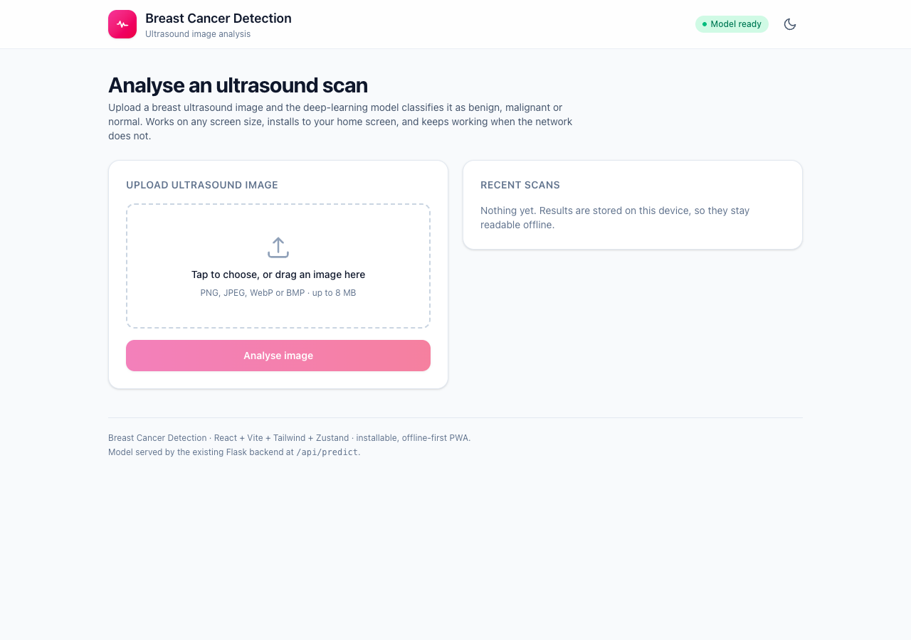
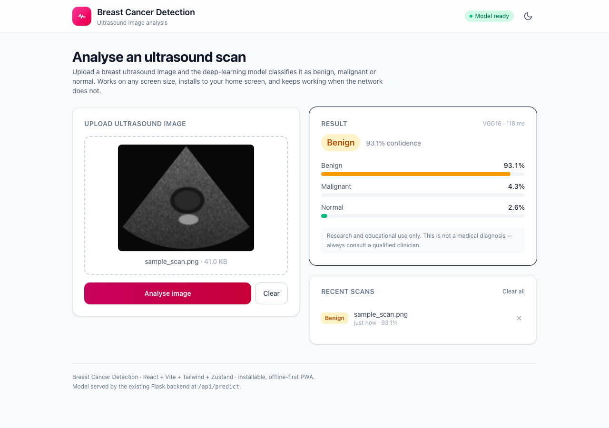
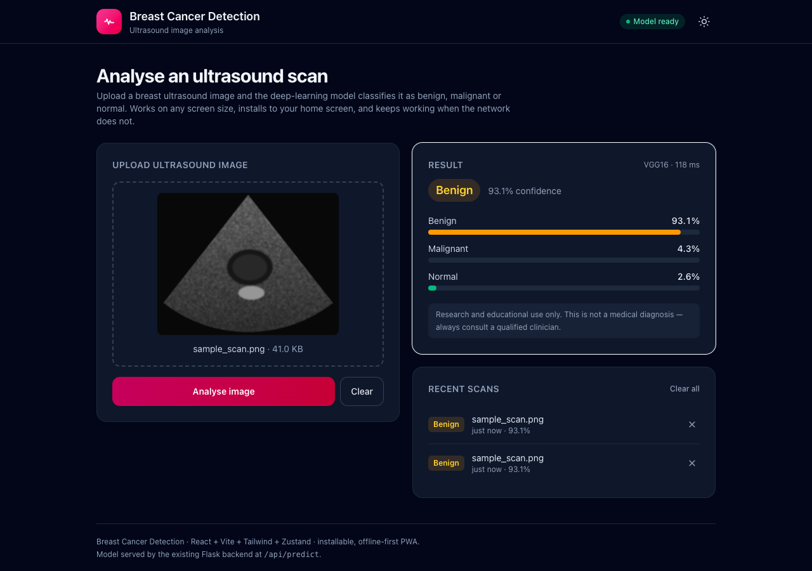
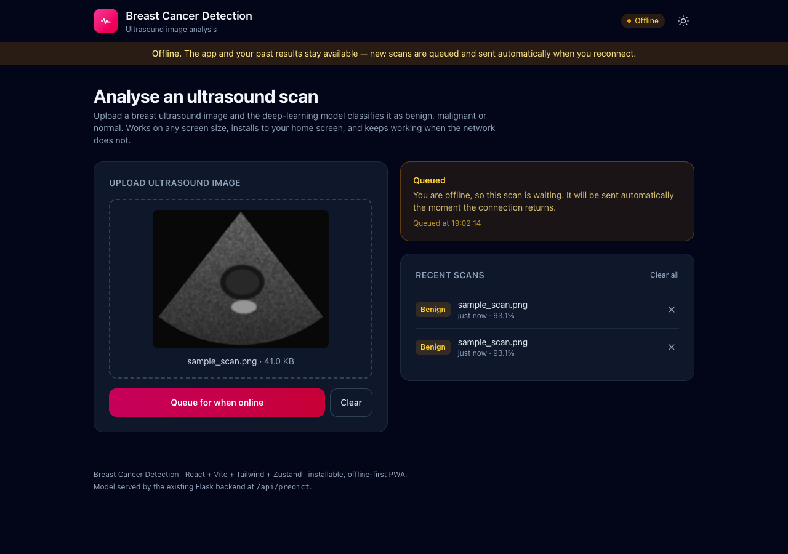
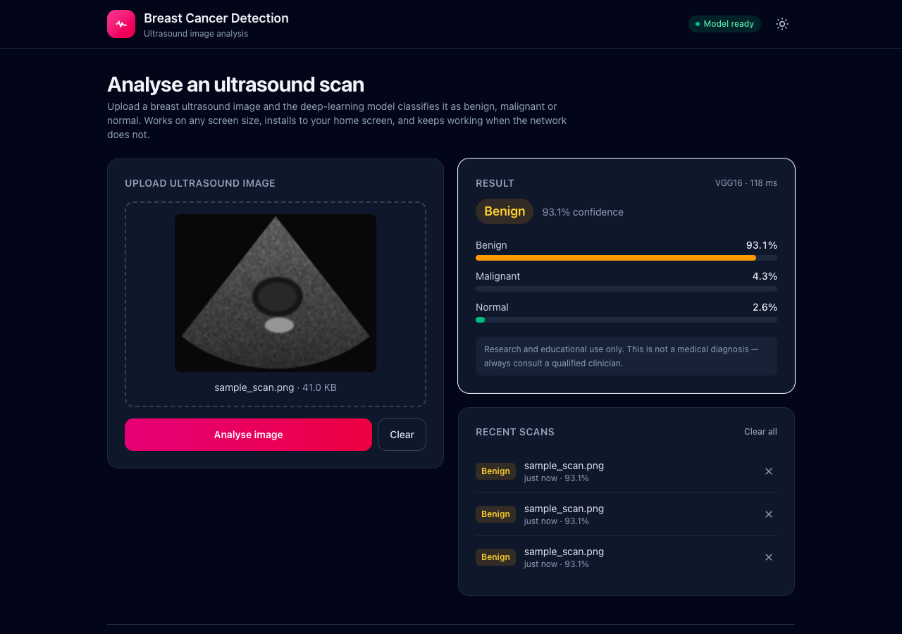
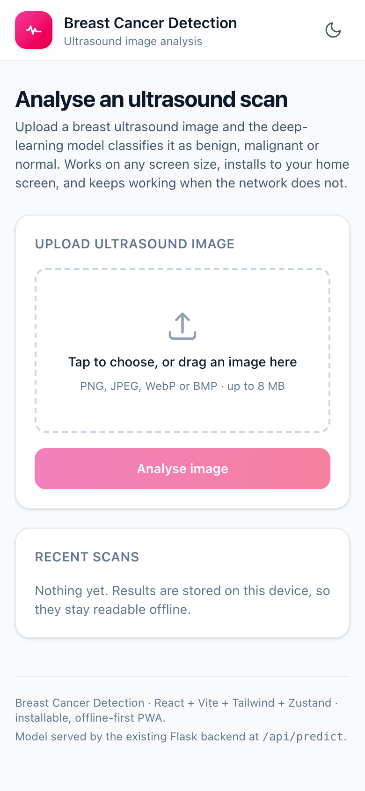
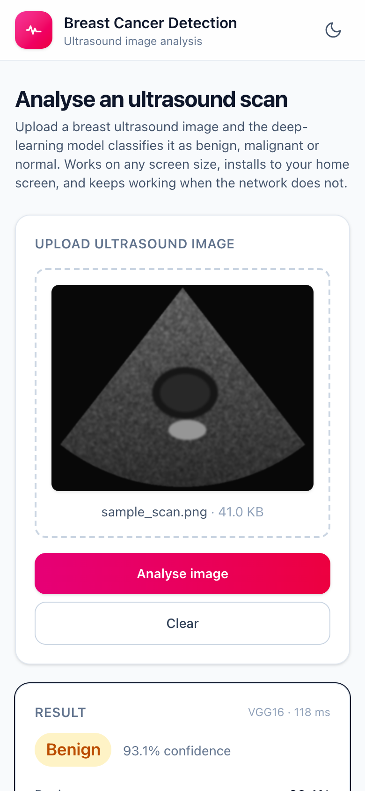
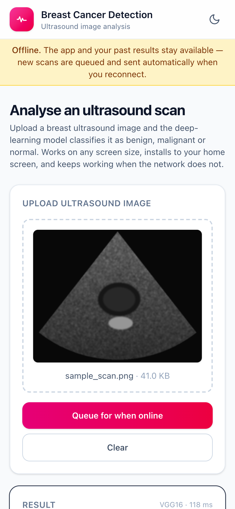

# 🩺 Breast Cancer Detection — Offline-First PWA Frontend

A responsive, installable **Progressive Web App** frontend for the Breast Cancer Detection
ultrasound classifier, replacing the server-rendered Jinja page with a modern SPA.

Built for [Issue #1797](https://github.com/Niketkumardheeryan/ML-CaPsule/issues/1797).

**Stack:** React 19 · Vite 7 · Tailwind CSS 4 · Zustand 5 · vite-plugin-pwa (Workbox)

---

## 🎯 What this solves

The issue listed three problems with the existing HTML/Flask template. Each is addressed:

| Problem | Fix |
|---|---|
| **Not responsive** — hard to use on a phone | Mobile-first Tailwind layout: single column on phones, two columns from `lg`, tap targets sized for touch, safe-area insets for notched devices |
| **Dated UX** — full page reload for every prediction | SPA with async `fetch`, a drag-and-drop dropzone with live preview, loading state, per-class confidence bars, dark mode |
| **Needs a constant connection** | Installable, offline-first PWA: the app shell is pre-cached, past results are stored on-device, and new scans are queued and sent automatically on reconnect |

**The original interface still works.** Nothing was removed — `/` still renders the Jinja
template exactly as before. This app is served alongside it at `/app`.

---

## ✨ Features

- **Installable** — web manifest + service worker; the browser's own install prompt is
  surfaced in-app via `beforeinstallprompt`.
- **Offline-first** — Workbox pre-caches the shell (12 entries, ~300 KB). Open the app with
  no network and it still loads, with your history intact.
- **Offline queue** — analysing while offline queues the scan and shows why; when the
  connection returns the request is sent automatically, with no user action.
- **Never serves a stale prediction** — `/api/predict` is `NetworkOnly` by policy. A cached
  diagnosis would be actively harmful, so the app queues instead of guessing.
- **On-device history** — the last 20 results persist via `zustand/middleware` `persist`,
  readable offline, individually removable.
- **Dark mode** — class-based, persisted with the rest of the store.
- **Accessible** — semantic landmarks, labelled icon buttons, `role="alert"` errors,
  visible focus rings, and `prefers-reduced-motion` respected.
- **Client-side validation** — type and size are checked before any upload is attempted.

---

## 🏛️ Architecture

```
frontend/
├── index.html
├── vite.config.js               # base, PWA/Workbox config, dev proxy to Flask
├── src/
│   ├── main.jsx
│   ├── App.jsx                  # wiring: file handling, predict flow, offline retry
│   ├── index.css                # Tailwind v4 entry + dark variant
│   ├── components/
│   │   ├── Header.jsx           # branding, connection pill, theme toggle
│   │   ├── UploadCard.jsx       # dropzone, preview, validation, submit
│   │   ├── ResultCard.jsx       # prediction, confidence bars, queued state
│   │   ├── HistoryPanel.jsx     # persisted recent scans
│   │   ├── OfflineBanner.jsx
│   │   └── InstallPrompt.jsx
│   ├── store/usePredictionStore.js   # Zustand store + persist
│   ├── lib/api.js               # fetch layer and payload normalisation
│   ├── lib/format.js            # pure presentation helpers
│   └── hooks/useOnlineStatus.js
├── tests/                       # 31 Vitest unit tests
└── screenshots/
```

**State machine** (in `usePredictionStore.js`):

```
idle ──selectFile──> ready ──analyse──> loading ──> success | error
                               │
                               └──(offline)──> queued ──(reconnect)──> loading
```

The selected `File` and its object URL are deliberately kept **out** of the store — a `File`
cannot be serialised and an object URL is dead after a reload, so only metadata is persisted.

---

## 🔌 Backend API

Two endpoints were **added** to `webapp.py`. The existing `/` and `/predict` routes are
untouched, so the classic UI keeps working.

`GET /api/health`

```json
{ "status": "ok", "model_loaded": true, "classes": ["Benign", "Malignant", "Normal"] }
```

`POST /api/predict` — multipart form field `image`

```json
{
  "prediction": "Benign",
  "confidence": 0.9312,
  "probabilities": { "Benign": 0.9312, "Malignant": 0.0431, "Normal": 0.0257 },
  "model": "VGG16",
  "elapsed_ms": 118.4
}
```

Errors return a JSON `{"error": "..."}` with a meaningful status: `400` for a bad upload,
`503` when the model weights are missing, `500` on an inference failure.

`GET /app` serves this app once it is built.

---

## 🚀 Getting started

```bash
cd "Breast Cancer Detection using DL with Webapp/Webapp/frontend"
npm install
```

**Development** — two terminals, no CORS setup needed (Vite proxies `/api` to Flask):

```bash
# terminal 1
cd .. && python webapp.py          # http://127.0.0.1:5000

# terminal 2
npm run dev                        # http://localhost:5173
```

**Production** — build once, then Flask serves everything:

```bash
npm run build                      # emits frontend/dist
cd .. && python webapp.py
# classic UI  -> http://127.0.0.1:5000/
# new PWA     -> http://127.0.0.1:5000/app
```

The service worker only registers on a built app over `http://localhost` or HTTPS — that is a
browser requirement, not a project limitation.

**Tests**

```bash
npm test
```

```text
✓ tests/format.test.js (15 tests)
✓ tests/store.test.js  (16 tests)

Test Files  2 passed (2)
     Tests  31 passed (31)
```

---

## 📸 Screenshots

Captured from the built app running in Chrome via Playwright. The trained weights are not
distributed with the repository, so the API responses shown come from a stub returning a
representative payload; the screenshots themselves are real renders, not mock-ups.

| Desktop — empty | Desktop — result |
|---|---|
|  |  |

| Dark mode | Offline, queued |
|---|---|
|  |  |

| Reconnected — sent automatically |
|---|
|  |

| Mobile — empty | Mobile — result | Mobile — offline |
|---|---|---|
|  |  |  |

> The ultrasound in these shots is a **synthetic placeholder** generated for the demo, not
> patient data.

---

## ⚠️ Note on clinical use

This interface is for research and education. It surfaces a model's output and is not a
medical diagnosis — the UI states this next to every result.

---

## 👤 Author

Contributed to **ML-CaPsule** under **GSSoC** by [Anijesh](https://github.com/Anijesh) — resolves issue #1797.
