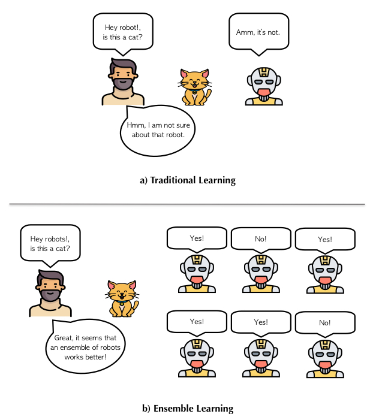

<!-- PROJECT SHIELDS -->
<!--
*** I'm using markdown "reference style" links for readability.
*** Reference links are enclosed in brackets [ ] instead of parentheses ( ).
*** See the bottom of this document for the declaration of the reference variables
*** for contributors-url, forks-url, etc. This is an optional, concise syntax you may use.
*** https://www.markdownguide.org/basic-syntax/#reference-style-links
-->
[![Medium][medium-shield]][medium-url]
[![Twitter][twitter-shield]][twitter-url]
[![Linkedin][linkedin-shield]][linkedin-url]

# Ensemble Learning: Stacking, Blending and Voting
This repository contains an example of each of the Ensemble Learning methods: Stacking, Blending, and Voting. The examples for Stacking and Blending were made from scratch, the example for Voting was using the scikit-learn utility.

If you want to know more about the theory of each of these models, I recommend you take a look at the blog: <a href="https://towardsdatascience.com/ensemble-learning-stacking-blending-voting-b37737c4f483"> Ensemble Learning: Stacking, Blending & Votingr</a>

<p align="center">

</p>

<!-- TABLE OF CONTENTS -->
## Table of Contents

* [Files](#files)
* [How to use](#how-to-use)
* [Contributing](#contributing)
* [Contact](#contact)
* [License](#license)

<!-- files -->
## 1. Files
* **stacking.py**: Contains an example from scratch about Stacked Generalization method
* **blending.py**: Contains an example from scratch about Blending, a variation from Stacked Generalization method.
* **voting.py**: Contains an example about Voting method by using the scikit-learn module.


<!-- how-to-use -->
## 2. How to use
For running ``stacking.py``:

```SH
python stacking.py
```

For running ``blending.py``:

```SH
python blending.py
```

For running ``voting.py``:

```SH
python voting.py
```

however, I recommend you to work with a virtual environment, in this case I am using pipenv. So in order to install the dependencies located in the ``Pipfile`` you just need to type:

```SH
pipenv install
```
and then

```SH
pipenv shell
```

<!-- contributing -->
## 3. Contributing
Feel free to fork the model and add your own suggestiongs.

1. Fork the Project
2. Create your Feature Branch (`git checkout -b feature/YourGreatFeature`)
3. Commit your Changes (`git commit -m 'Add some YourGreatFeature'`)
4. Push to the Branch (`git push origin feature/YourGreatFeature`)
5. Open a Pull Request

<!-- contact -->
## 5. Contact
If you have any question, feel free to reach me out at:
* <a href="https://twitter.com/Fernando_LpzV">Twitter</a>
* <a href="https://medium.com/@fer.neutron">Medium</a>
* <a href="https://www.linkedin.com/in/fernando-lopezvelasco/">Linkedin</a>
* Email: fer.neutron@gmail.com

<!-- license -->
## 6. License
Distributed under the MIT License. See ``LICENSE.md`` for more information.


<!-- MARKDOWN LINKS & IMAGES -->
<!-- https://www.markdownguide.org/basic-syntax/#reference-style-links -->
[medium-shield]: https://img.shields.io/badge/medium-%2312100E.svg?&style=for-the-badge&logo=medium&logoColor=white
[medium-url]: https://medium.com/@fer.neutron
[twitter-shield]: https://img.shields.io/badge/twitter-%231DA1F2.svg?&style=for-the-badge&logo=twitter&logoColor=white
[twitter-url]: https://twitter.com/Fernando_LpzV
[linkedin-shield]: https://img.shields.io/badge/linkedin-%230077B5.svg?&style=for-the-badge&logo=linkedin&logoColor=white
[linkedin-url]: https://www.linkedin.com/in/fernando-lopezvelasco/