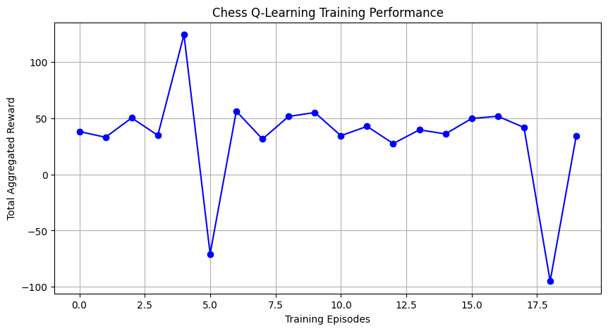
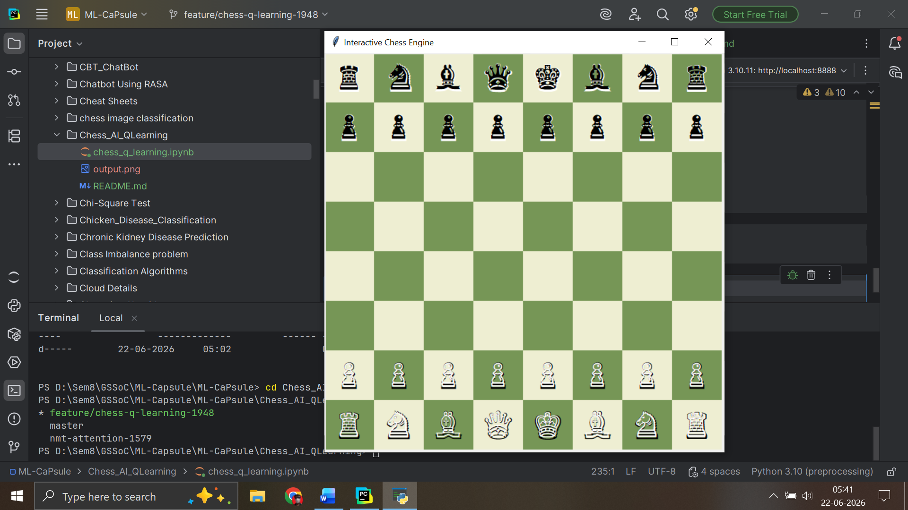

# Chess AI using Deep Q-Learning (DQN)

An interactive, graphical chess application powered by a Deep Q-Network built with TensorFlow and python-chess.

## Features
- **Deep Q-Network Implementation:** Uses a CNN architecture to evaluate game board state matrices ($8 \times 8 \times 12$).
- **Interactive UI:** Built using Tkinter, featuring perspective flipping (White/Black), legal move highlighting, and gameplay modes (vs AI or local PvP).

## Performance Visualizations

## Gameplay Interface

