# 📊 Tableau Complete Guide
### GSSoC 2026 Contribution

---

## Table of Contents

1. [Introduction to Tableau & Its Interface](#1-introduction-to-tableau--its-interface)
2. [Connecting Datasets](#2-connecting-datasets)
3. [Creating Basic Charts and Dashboards](#3-creating-basic-charts-and-dashboards)
4. [Filters, Parameters, and Calculated Fields](#4-filters-parameters-and-calculated-fields)
5. [Data Storytelling Techniques](#5-data-storytelling-techniques)
6. [Beginner-Friendly Practice Datasets](#6-beginner-friendly-practice-datasets)
7. [How to Choose Visuals Depending on Data](#8-how-to-choose-visuals-depending-on-data)
8. [Best Practices for Dashboard Design and Visualization](#9-best-practices-for-dashboard-design-and-visualization)

---

## 1. Introduction to Tableau & Its Interface

### What is Tableau?

Tableau is a leading data visualization and business intelligence (BI) platform that enables users to connect to data, create interactive dashboards, and share insights — all without writing code. It was founded in 2003 and is now part of Salesforce.

Tableau is widely used by data analysts, business analysts, data scientists, and executives to make sense of data quickly and visually.

### Tableau Product Family

| Product | Description |
|---|---|
| **Tableau Desktop** | Full authoring tool for creating workbooks and dashboards |
| **Tableau Public** | Free version; workbooks are published publicly |
| **Tableau Online / Cloud** | Cloud-hosted server for sharing and collaboration |
| **Tableau Server** | On-premise server deployment |
| **Tableau Prep** | Tool for data cleaning and transformation |
| **Tableau Reader** | Free tool to view packaged workbooks |

> **For beginners:** Start with **Tableau Public** (free) or a **Tableau Desktop trial** (14 days).

---

### The Tableau Interface

When you open Tableau Desktop or Public, you are greeted by the **Start Page**. From here you can connect to data, open recent workbooks, or explore sample data.

#### Key Interface Areas

```
┌──────────────────────────────────────────────────────────────────┐
│  Menu Bar: File | Data | Worksheet | Dashboard | Story | Analysis │
├───────────────┬──────────────────────────────────────────────────┤
│               │  Toolbar (Undo, Redo, Save, Show Me, etc.)        │
│  Data Pane    ├──────────────┬───────────────────────────────────┤
│               │  Columns     │                                   │
│  Dimensions   │  Shelf       │                                   │
│  (blue pills) ├──────────────┤       CANVAS / VIEW               │
│               │  Rows        │                                   │
│  Measures     │  Shelf       │                                   │
│  (green pills)├──────────────┤                                   │
│               │  Marks Card  │                                   │
│  Sets /       │  (Color,     │                                   │
│  Parameters   │  Size, Label │                                   │
│               │  Detail,     │                                   │
│               │  Tooltip)    │                                   │
├───────────────┴──────────────┴───────────────────────────────────┤
│  Sheet Tabs / Dashboard Tabs / Story Tabs                         │
└──────────────────────────────────────────────────────────────────┘
```
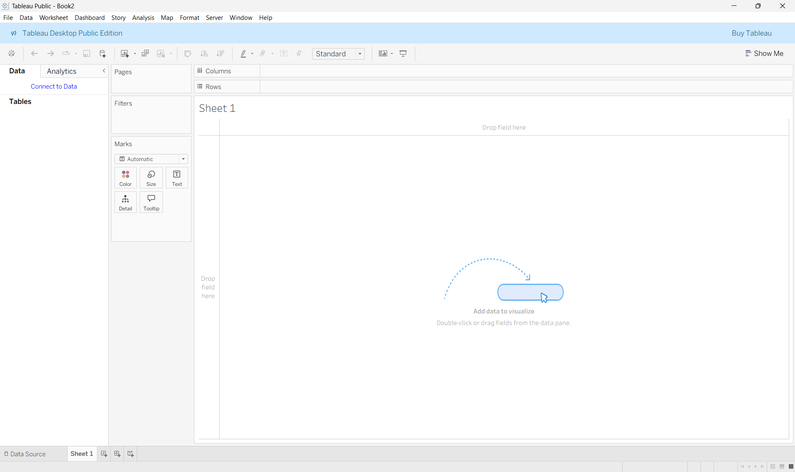)
#### Data Pane Breakdown

- **Dimensions** (Blue pills): Categorical fields — names, regions, dates, IDs. They define the granularity (level of detail) of a view.
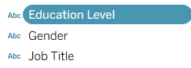
- **Measures** (Green pills): Numerical fields — sales, profit, quantity. They are aggregated (SUM, AVG, etc.) by default. you can also create aggregates of columns by duplicating them and converting the duplicate into a measure(Use drop downs near column names).
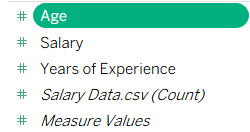
- **Calculated Fields**: Custom fields you create using formulas.
- **Sets**: Subsets of dimension members you define.
- **Parameters**: User-controlled input values.

#### Shelves and Cards

| UI Element | Purpose |
|---|---|
| **Columns Shelf** | Fields placed here become columns (X-axis or table columns) |
| **Rows Shelf** | Fields placed here become rows (Y-axis or table rows) |
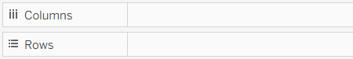
| **Marks Card** | Controls visual encoding: Color, Size, Label, Detail, Tooltip, Shape |
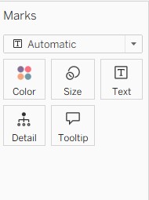
| **Filters Shelf** | Restricts data shown in the view |
| **Pages Shelf** | Creates animated or paginated views |

#### View Toolbar

- **Show Me** panel: Recommends chart types based on fields you've selected.
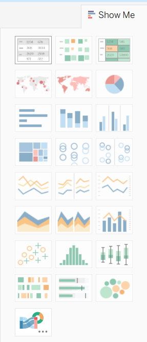
- **Fit** options: Fit width, fit height, entire view.
- **Swap** button: Swaps rows and columns axes.

---

## 2. Connecting Datasets

Tableau supports 80+ native connectors. Connecting data is your first step in any project.

### Types of Data Connections

#### File-Based Connections
- **Excel (.xlsx, .xls)** — Most common for beginners
- **CSV / Text files** — Flat comma- or tab-delimited data
- **JSON** — Nested or semi-structured data
- **PDF** — Tableau can extract tables from PDFs
- **Spatial files** — Shapefiles for mapping (.shp)

#### Database Connections
- **MySQL, PostgreSQL, SQL Server, Oracle**
- **Google BigQuery, Amazon Redshift, Snowflake**
- **Salesforce, Google Sheets, Microsoft Azure**

#### Web Data Connectors (WDC)
Custom JavaScript connectors for APIs and web services.
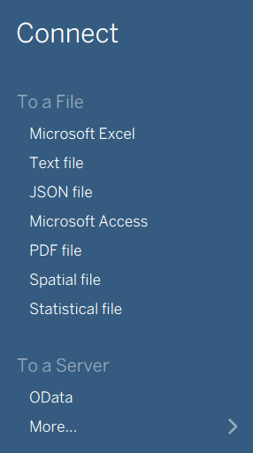
---

### Step-by-Step: Connecting an Excel File

1. Open Tableau. On the **Start Page**, under **Connect**, click **Microsoft Excel**.
2. Navigate to your file and click **Open**.
3. In the **Data Source** tab, drag the sheet you want from the left panel to the canvas.
4. Preview the data in the grid at the bottom.
5. Click **Sheet 1** tab at the bottom to start visualizing.

### Step-by-Step: Connecting a CSV File

1. On the **Start Page**, click **Text File** under Connect.
2. Select your `.csv` file.
3. Tableau auto-detects delimiters and data types.
4. Verify column types in the data preview (click the icon above each column header to change type).

---

### The Data Source Tab

This is where you shape your data before visualization.

| Feature | What It Does |
|---|---|
| **Live vs Extract** | Live = queries database in real-time. Extract = saves a snapshot (.hyper file) for performance |
| **Joins** | Combine multiple tables (Inner, Left, Right, Full Outer) |
| **Unions** | Stack tables with the same structure vertically |
| **Data Interpreter** | Cleans Excel files with merged cells, headers in wrong rows |
| **Pivot** | Converts wide data to long (tidy) format |
| **Split** | Splits a string column into multiple columns |

### Understanding Data Types

Tableau automatically assigns data types. You can change them:

| Icon | Data Type |
|---|---|
| `Abc` | String (text) |
| `#` | Number (whole or decimal) |
| `📅` | Date |
| `🕐` | Date & Time |
| `T/F` | Boolean |
| `🌐` | Geographic Role |
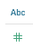

> **Tip:** Always check that Tableau has assigned the correct data type before building views. Dates stored as strings won't work in time-series charts. You can change datatype of a column by clicking the dropdown near it, and selecting **Change Data Type**.

---

### Joins and Relationships

**Joins** (legacy approach) merge data at the row level before analysis. This can create duplicate rows.

**Relationships** (Tableau 2020.2+) are the modern approach. They create flexible, context-aware links between tables without pre-joining.

```
Orders Table  ──── (Order ID) ──── Returns Table
              Relationship
```

**When to use each:**
- Use **Relationships** for most multi-table work — they're more flexible.
- Use **Joins** when you need row-level control or are working with legacy data models.

---

## 3. Creating Basic Charts and Dashboards

### Building Your First Chart

The fastest way to build a chart is:
1. Select fields in the Data Pane (hold Ctrl/Cmd to multi-select).
2. Click **Show Me** in the top-right corner.
3. Tableau recommends a chart type — click to apply.

Alternatively, **drag and drop** fields to the Rows and Columns shelves manually.

---

### Common Chart Types

#### Bar Chart
**Best for:** Comparing categories.

Steps:
1. Drag a **Dimension** (e.g., `Category`) to **Columns**.
2. Drag a **Measure** (e.g., `Sales`) to **Rows**.
3. Tableau auto-creates a bar chart.
4. Drag `Category` to **Color** on the Marks card for colored bars.
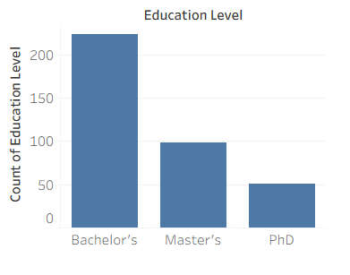
#### Line Chart
**Best for:** Trends over time.

Steps:
1. Drag a **Date field** (e.g., `Order Date`) to **Columns**.
2. Drag a **Measure** (e.g., `Sales`) to **Rows**.
3. Right-click the date → select the time granularity: Year, Quarter, Month, Day.

#### Scatter Plot
**Best for:** Correlation between two measures.

Steps:
1. Drag one measure (e.g., `Profit`) to **Columns**.
2. Drag another measure (e.g., `Sales`) to **Rows**.
3. Drag a dimension (e.g., `Sub-Category`) to **Detail** or **Color** in the Marks card.
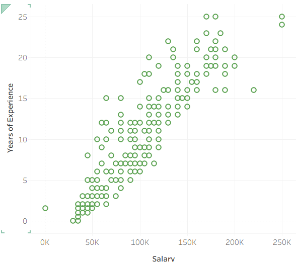
#### Pie Chart
**Best for:** Part-to-whole (use sparingly, max 5–6 slices).

Steps:
1. Select a dimension and a measure.
2. In **Show Me**, click the pie chart.
3. Adjust **Size** and **Label** from the Marks card.
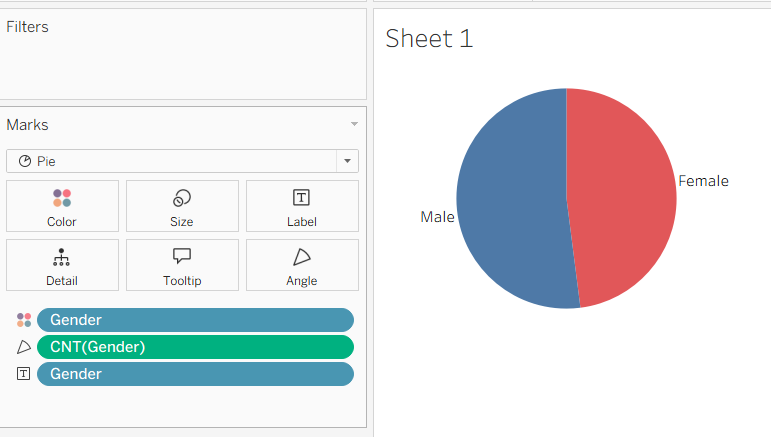
#### Map
**Best for:** Geographic data.

Steps:
1. Double-click a geographic field (e.g., `State`, `Country`). Tableau auto-creates a map.
2. Drag a measure to **Color** or **Size** for a choropleth or bubble map.

#### Heatmap / Highlight Table
**Best for:** Comparing values across two dimensions.

Steps:
1. Drag one dimension to **Rows** and another to **Columns**.
2. Drag a measure to **Color** in the Marks card.
3. In **Show Me**, select Highlight Table or Square.

---

### Sorting and Formatting

- **Quick sort:** Click the sort icons on the axis or header (ascending/descending).
- **Custom sort:** Right-click dimension header → Sort → choose Field, Manual, or Alphabetic.
- **Format pane:** Right-click anywhere → Format. Controls fonts, borders, shading, number formats.

---

### Creating a Dashboard

A dashboard is a collection of multiple worksheets and objects on a single canvas.

#### Steps to Build a Dashboard

1. Click the **New Dashboard** icon at the bottom of the screen (or go to **Dashboard > New Dashboard**).
2. Set the **Size** in the Dashboard panel (Fixed, Automatic, or Range). For web: use **Automatic**.
3. From the **Sheets** list on the left, **drag worksheets** onto the canvas.
4. Use **Layout** containers (Horizontal / Vertical / Tiled / Floating) to arrange them.
5. Add **Objects** from the bottom of the left panel:
   - **Text:** Titles and annotations
   - **Image:** Logos or icons
   - **Web Page:** Embed external content
   - **Blank:** Padding/spacer
6. Add **Dashboard Actions** (Filter, Highlight, URL) under **Dashboard > Actions** for interactivity.

---

## 4. Filters, Parameters, and Calculated Fields

### Filters

Filters restrict which data is shown. Tableau applies filters in a specific **Order of Operations**:

```
Extract Filters
   ↓
Data Source Filters
   ↓
Context Filters
   ↓
Dimension Filters
   ↓
Measure Filters
   ↓
Table Calculation Filters
```

#### Adding Filters

**Method 1:** Drag a field to the **Filters shelf**.
**Method 2:** Right-click a field → **Show Filter** (adds a filter card to the view).

#### Filter Types

| Filter Type | When to Use |
|---|---|
| **Dimension Filter** | Filter by category (e.g., show only "West" region) |
| **Measure Filter** | Filter by value range (e.g., Sales > 1000) |
| **Date Filter** | Relative date (last 30 days), Range, or specific dates |
| **Context Filter** | Makes a filter apply first; improves performance for Top N filters |
| **Data Source Filter** | Filters data before it enters Tableau; fastest |

#### Quick Filters (Filter Controls)

Right-click a field in the Filters shelf → **Show Filter**. Available controls:
- Single Value (list, dropdown, slider)
- Multiple Values (list, dropdown, custom)
- Wildcard match
- Range of values

---

### Parameters

A **Parameter** is a user-controlled dynamic value that can replace a constant in filters, calculated fields, or reference lines.

#### Creating a Parameter

1. Right-click in the Data Pane → **Create Parameter**.
2. Name it (e.g., `Top N`).
3. Set **Data Type** (Integer, String, Float, Date, Boolean).
4. Set **Allowable Values**: All / List / Range.
5. Click OK.

#### Using a Parameter in a Top N Filter

1. Create a Parameter named `Top N` (Integer, Range 1–20).
2. Create a **Calculated Field** named `Top N Filter`:
   ```
   RANK(SUM([Sales])) <= [Top N]
   ```
3. Drag `Top N Filter` to Filters shelf → select **True**.
4. Right-click the parameter → **Show Parameter Control** to display the slider.

---

### Calculated Fields

Calculated fields let you create new data from existing fields using Tableau's formula language.

#### Creating a Calculated Field

1. Right-click in the Data Pane → **Create Calculated Field**.
2. Name it and write your formula.
3. Click OK. It appears in the Data Pane as a new field.

---

#### Common Formula Categories

**String Functions**
```tableau
UPPER([Name])               // Convert to uppercase
LEFT([Product Name], 5)     // First 5 characters
CONTAINS([Region], "East")  // Returns TRUE/FALSE
```

**Math Functions**
```tableau
ROUND([Sales] / [Quantity], 2)   // Average sale price
ABS([Profit])                     // Absolute value
```

**Date Functions**
```tableau
YEAR([Order Date])               // Extract year
DATEDIFF('day', [Order Date], [Ship Date])  // Days to ship
TODAY()                          // Current date
```

**Logical (IF/CASE)**
```tableau
// IF statement
IF [Sales] > 10000 THEN "High"
ELSEIF [Sales] > 5000 THEN "Medium"
ELSE "Low"
END

// CASE statement
CASE [Region]
  WHEN "West" THEN "W"
  WHEN "East" THEN "E"
  ELSE "Other"
END
```

**Aggregations**
```tableau
SUM([Sales])
AVG([Profit])
COUNTD([Customer ID])   // Count distinct
```

**Level of Detail (LOD) Expressions**
LOD expressions let you compute aggregations at a different granularity than the view.

```tableau
// FIXED: Compute regardless of view dimensions
{ FIXED [Region] : SUM([Sales]) }

// INCLUDE: Add a dimension even if not in view
{ INCLUDE [Customer ID] : AVG([Sales]) }

// EXCLUDE: Remove a dimension from the computation
{ EXCLUDE [Month] : SUM([Sales]) }
```

> **Example use case:** Find each customer's first order date:
> ```tableau
> { FIXED [Customer ID] : MIN([Order Date]) }
> ```

---

### Table Calculations

Table calculations compute values across the table structure (not the underlying data). Applied by right-clicking a measure on a shelf → **Add Table Calculation**.

Common table calculations:
- **Running Total** — Cumulative sum
- **Percent of Total** — Each bar's % of the grand total
- **Rank** — Rank marks by value
- **Difference / Percent Difference** — Period-over-period change
- **Moving Average** — Smoothed trend line

---

## 5. Data Storytelling Techniques

Data storytelling is the skill of combining data, visuals, and narrative to communicate insights clearly and persuasively.

### The Three Pillars of Data Storytelling

```
        DATA
         |
    _____|_____
   |           |
VISUALS ─── NARRATIVE
         |
      INSIGHT
```

1. **Data** — The facts and evidence.
2. **Visuals** — Charts and dashboards that make patterns visible.
3. **Narrative** — The "so what", the context, interpretation, and recommendation.

---

### Tableau Story Points

**Stories** in Tableau are a sequence of views or dashboards that walk the viewer through a narrative.

#### Creating a Story

1. Click the **New Story** icon at the bottom (or **Story > New Story**).
2. Drag sheets/dashboards from the left panel onto the **story canvas**.
3. Add a **caption** for each story point (like a slide title).
4. Use the **Navigator** (dots, numbers, or arrows) for progression.
5. Add **annotations** within views to highlight specific data points.

---

### Storytelling - Best Practices

**1. Start with the key question**
Every dashboard should answer one primary question. Define it before building. Eg: "Why Sales are going down?", "Which Audience to target?"

**2. Lead with the insight, not the data**
Open with the conclusion: *"Sales in Q3 dropped 18% — driven entirely by the West region."*

**3. Use progressive disclosure**
Reveal complexity gradually. Start with the summary → let users drill down into detail.

**4. Highlight, don't just show**
Use color, annotations, and reference lines to direct attention to what matters.

**5. Provide context**
A number alone is meaningless. Always compare: vs last year, vs target, vs industry average. Set a benchmark.

**6. Use annotations strategically**
Right-click a data point → **Annotate > Mark / Point / Area** to add context directly in the view.
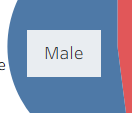

**7. Keep a consistent visual thread**
Use the same color for the same category throughout a story.

**8. End with a call to action**
Great data stories conclude with a recommendation: *"We recommend increasing marketing budget for the East region by 15%."*

---

### Effective Use of Color in Storytelling

| Color Role | Usage |
|---|---|
| **Sequential palette** | Low-to-high values (e.g., white → blue for sales density) |
| **Diverging palette** | Values around a midpoint (e.g., profit: red → white → green) |
| **Categorical palette** | Distinct categories (e.g., different product lines) |
| **Highlight color** | One accent color to draw attention; rest in grey |

> **Rule:** Use color to encode data, not just to decorate.

---

## 6. Beginner-Friendly Practice Datasets

### Built-in Tableau Sample Data

Tableau ships with excellent sample datasets. Find them in:
`Documents > My Tableau Repository > Datasources`

| Dataset | What to Practice |
|---|---|
| **Superstore** | Sales analysis, bar charts, maps, time series, profit analysis |
| **World Indicators** | Global metrics, line charts, scatter plots, geographic maps |
| **Sample Coffee Chain** | Regional sales, hierarchies, groups |

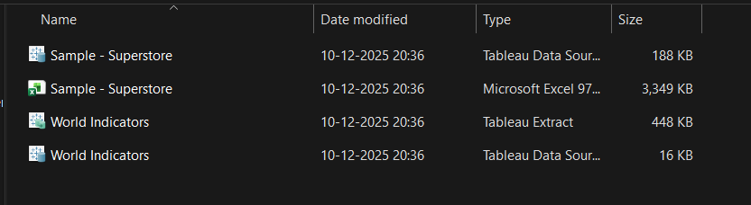
---

### Free Public Datasets

| Source | URL | Good For |
|---|---|---|
| **Kaggle** | kaggle.com/datasets | Hundreds of curated datasets across all domains |
| **UC Irvine ML Repository** | archive.ics.uci.edu | Classic datasets (Iris, Titanic, Wine) |
| **Google Dataset Search** | datasetsearch.research.google.com | Broad cross-domain search |
| **Data.gov** | data.gov | US government open data |
| **Our World in Data** | ourworldindata.org | Social, economic, health trends |
| **Tableau Public Gallery** | public.tableau.com | Download workbooks with built-in data |
| **Maven Analytics** | mavenanalytics.io/data-playground | Clean, beginner-friendly datasets |
| **FiveThirtyEight** | github.com/fivethirtyeight/data | Sports, politics, culture datasets |

---

### Recommended Datasets for Beginners

#### 1. Superstore (Built-in)
- **Fields:** Order Date, Category, Sub-Category, Sales, Profit, Quantity, Region, Customer Name
- **Practice:** Bar charts, line charts, geographic maps, scatter plots, dashboards

#### 2. Titanic Dataset (Kaggle)
- **Fields:** Survived, Pclass, Sex, Age, Fare, Embarked
- **Practice:** Grouped bars, filters, calculated fields (survival rate)

#### 3. Netflix Movies & TV Shows (Kaggle)
- **Fields:** Type, Title, Country, Release Year, Rating, Duration, Genre
- **Practice:** Word clouds, area charts, filters, pie charts

#### 4. COVID-19 Data (Our World in Data)
- **Fields:** Country, Date, New Cases, Deaths, Vaccinations
- **Practice:** Time series, maps, dual-axis charts, LOD calculations

#### 5. Global Superstore (Extended Superstore)
- **Fields:** All Superstore fields + Country, Postal Code, Market
- **Practice:** Global maps, currency differences, market-level analysis

---

## 7. How to Choose Visuals Depending on Data

Choosing the right chart is one of the most important and most overlooked skills in data visualization.

### Visual Selection Framework

Ask yourself two questions:
1. **What relationship am I showing?** (Comparison, distribution, composition, relationship, trend)
2. **What type of data do I have?** (Categorical, quantitative, temporal, geographic)

---

### Decision Guide by Purpose

#### Comparison
*Comparing values across categories.*

| Chart | When to Use |
|---|---|
| **Bar Chart** | Comparing a few categories (~2–15). Best for most comparisons. |
| **Grouped Bar** | Comparing sub-categories side by side (e.g., Sales by Category AND Region). |
| **Dot Plot** | Comparing many categories; less cluttered than bars. |
| **Lollipop Chart** | Same as bar but cleaner for many categories. |
| **Bullet Chart** | Comparing a measure to a target. |

#### Trend Over Time
*Showing how a value changes with time.*

| Chart | When to Use |
|---|---|
| **Line Chart** | Continuous data over time. Best for trends. |
| **Area Chart** | Line chart + emphasis on magnitude. Avoid for multiple overlapping series. |
| **Bar Chart (time)** | Discrete time periods (months, quarters). |
| **Gantt Chart** | Duration/timeline of tasks or events. |

#### Distribution
*Showing how data spreads across a range.*

| Chart | When to Use |
|---|---|
| **Histogram** | Frequency distribution of a continuous measure. |
| **Box Plot** | Summary statistics (median, quartiles, outliers). |
| **Violin Plot** | Distribution shape + density (via extension). |

#### Part-to-Whole / Composition
*Showing how parts relate to the whole.*

| Chart | When to Use |
|---|---|
| **Stacked Bar** | Part-to-whole across multiple categories. |
| **100% Stacked Bar** | Comparing proportions across categories. |
| **Pie / Donut** | Only for 2–5 parts; when part-to-whole is the main message. |
| **Treemap** | Hierarchical part-to-whole with many categories. |
| **Waterfall Chart** | Cumulative contribution of parts (e.g., financial P&L). |

#### Relationship / Correlation
*Showing how two variables relate to each other.*

| Chart | When to Use |
|---|---|
| **Scatter Plot** | Correlation between two measures. |
| **Bubble Chart** | Correlation + third variable encoded as size. |
| **Heatmap** | Correlation across many pairs (correlation matrix). |

#### Geographic / Spatial
*Showing data with a location component.*

| Chart | When to Use |
|---|---|
| **Filled Map (Choropleth)** | Measure by region/state/country using color. |
| **Symbol Map** | Points on a map; size or color encodes measure. |
| **Density Map** | Showing concentration of points. |

---

### The "Show Me" Panel in Tableau

The **Show Me** panel in the top-right of Tableau's interface recommends chart types based on your selected fields. Greyed-out options mean you don't have the right combination of fields.

| You have... | Tableau recommends... |
|---|---|
| 1 dimension | Bar chart, pie chart |
| 1 measure | Histogram |
| 1 dimension + 1 measure | Bar chart, line chart, pie |
| 2 dimensions + 1 measure | Heat map, crosstab, treemap |
| 2 measures | Scatter plot |
| Geographic field | Map |

---

### Anti-Patterns to Avoid

| Anti-Pattern | Why It's Bad | Better Alternative |
|---|---|---|
| 3D charts | Distort perception of value | Flat 2D charts |
| Pie with 7+ slices | Impossible to compare slices | Bar chart |
| Dual axis misuse | Misleads scale comparison | Separate charts or normalized axes |
| Rainbow color on sequential data | Hard to read magnitude | Sequential single-hue palette |
| Truncated Y-axis | Exaggerates small differences | Start Y-axis at 0 for bars |

---

## 8. Best Practices for Dashboard Design and Visualization

### Best Practices for Layout and Composition

**1. Follow the F-Pattern or Z-Pattern**
Users scan screens in these patterns. Place the most important KPIs top-left.

**2. Use a logical hierarchy**
- **Top:** Summary KPIs and title
- **Middle:** Main analysis charts
- **Bottom:** Detail tables or supporting charts

**3. Limit to 3–5 views per dashboard**
More than 5 views causes cognitive overload. If you need more, create multiple dashboards linked together.

**4. White space is your friend**
Don't fill every pixel. Breathing room around charts makes them easier to read.

**5. Align everything**
Use Tableau's **Layout > Position and Size** panel to set exact positions. Misaligned charts look amateurish.

---

### Best Practices for Color

**1. Use a maximum of 5–7 colors**
More colors = more confusion.

**2. Respect color semantics**
- Red = bad / negative
- Green = good / positive
- Blue = neutral

**3. Make sure colors are colorblind-accessible**
~8% of men have color vision deficiency. Avoid red-green combinations. Use tools like ColorBrewer or Tableau's colorblind-safe palettes.

**4. Use grey for background context**
Make your key metric "pop" by putting everything else in grey.

**5. Consistent color encoding**
If "East Region" is blue in one chart, it must be blue in all charts on the dashboard.

---

### Best Practices for Typography

**1. Limit to 2 font sizes**
Title: 16–20pt. Body: 10–12pt.

**2. Use bold for emphasis, not decoration**

**3. Left-align text**
Right-aligned or centered body text is harder to read.

**4. High contrast for readability**
Dark text on light backgrounds. Avoid light grey text.

---

### Best Practices for Performance Optimization

| Practice | Benefit |
|---|---|
| Use **Extracts** instead of Live connections | Faster query performance |
| Avoid too many marks (>5,000 slow things down) | Faster rendering |
| Use **Context Filters** for Top N | Reduces data scanned |
| **Hide unused fields** in the data source | Reduces extract size |
| Avoid complex nested LOD expressions | Reduces query complexity |
| Use **Dashboard Device Layouts** | Optimized for phone, tablet, desktop |

---

### Dashboard Design Checklist
Use this checklist to see whether you have covered all aspects.
- [ ] Title clearly states what the dashboard shows
- [ ] Data source and date range are visible
- [ ] All axes are labeled
- [ ] Color legend is visible and labeled
- [ ] Filters are clearly labeled and easy to use
- [ ] No more than 5 views on a single dashboard
- [ ] KPIs are at the top
- [ ] Consistent font and color throughout
- [ ] Mobile layout tested (if applicable)
- [ ] Tooltip provides useful context on hover

---

## Resources & Further Learning

| Resource | Link |
|---|---|
| **Tableau Official Training** | training.tableau.com |
| **Tableau Help Documentation** | help.tableau.com |
| **Tableau Public Gallery** | public.tableau.com |
| **Tableau Community Forums** | community.tableau.com |
| **Makeover Monday** | makeovermonday.co.uk |
| **Tableau Magic Blog** | tableaumagic.com |
| **Viz of the Day** | public.tableau.com/en-us/gallery |
| **Storytelling with Data (book)** | storytellingwithdata.com |
| **The Big Book of Dashboards (book)** | bigbookofdashboards.com |

---

*This guide is part of GSSoC 2026 open-source contributions.
Author - Shreya ghoshal
GitHub: https://github.com/ShreyaCodes176*