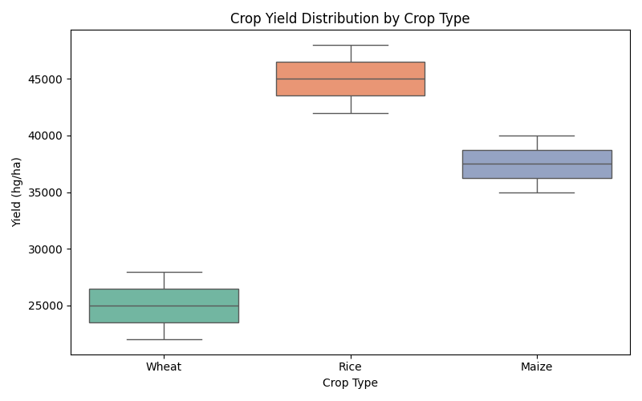
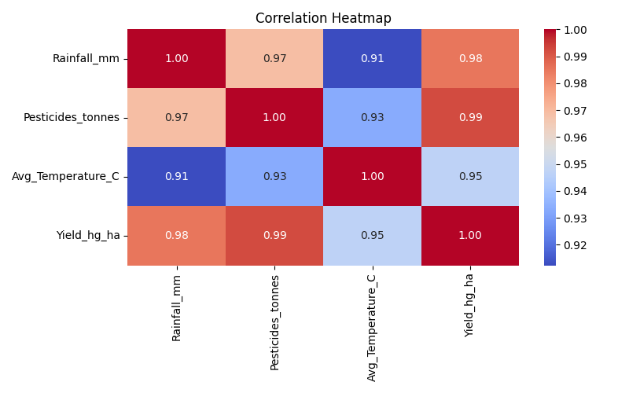
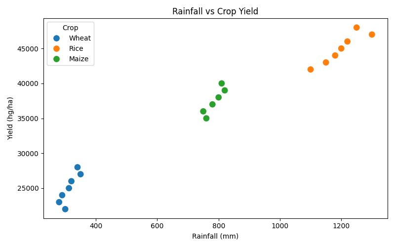
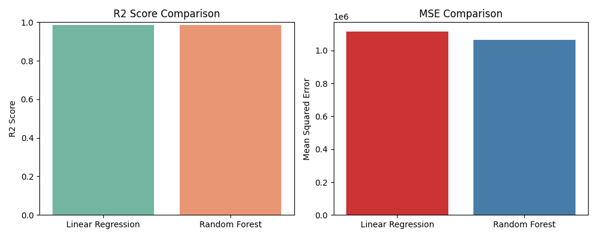

# Crop Yield Prediction using Machine Learning

## 📌 Overview
This project predicts crop yield based on environmental and agricultural 
factors such as rainfall, temperature, and pesticide usage using 
Machine Learning algorithms.

## 📊 Dataset
The dataset contains the following features:
- **Crop** : Type of crop (Wheat, Rice, Maize)
- **Rainfall_mm** : Average rainfall in mm
- **Pesticides_tonnes** : Pesticides used in tonnes
- **Avg_Temperature_C** : Average temperature in Celsius
- **Yield_hg_ha** : Crop yield in hg/ha (target variable)

## 🛠️ Libraries Used
- Pandas
- NumPy
- Matplotlib
- Seaborn
- Scikit-learn

## 🤖 ML Models Used
- Linear Regression
- Random Forest Regressor

## 📈 Results
| Model | R2 Score |
|-------|----------|
| Linear Regression | 0.99 |
| Random Forest | 0.99 |

## 📸 Screenshots
### Yield by Crop Type

### Correlation Heatmap

### Rainfall vs Yield

### Model Comparison

## ✍️ Author
GSSoC '26 Contributor — madhavzanwar