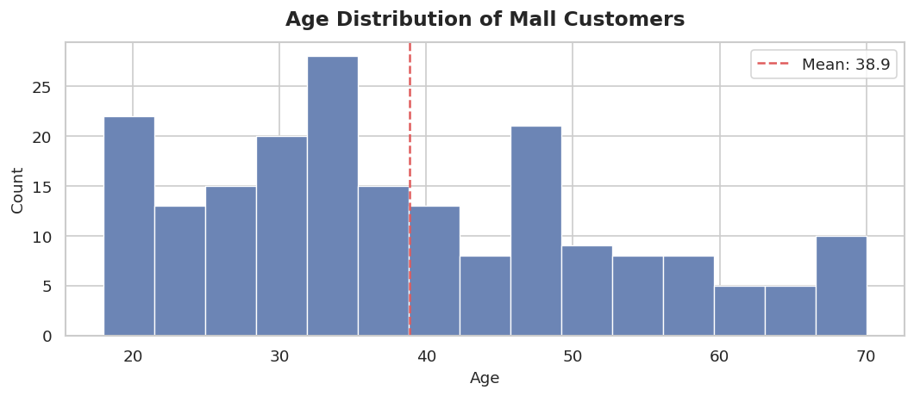
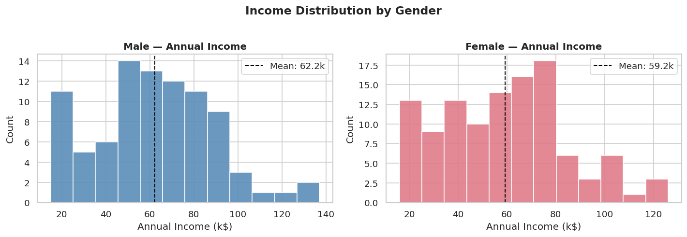
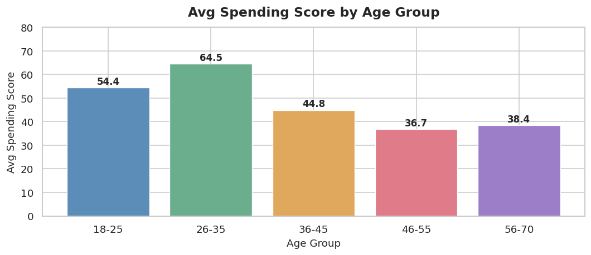
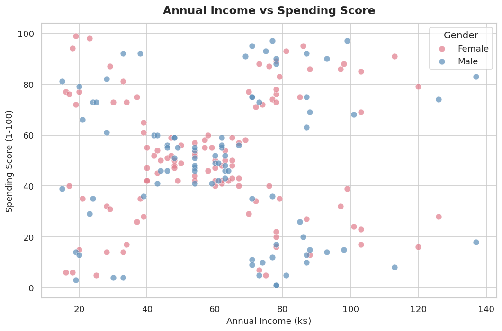
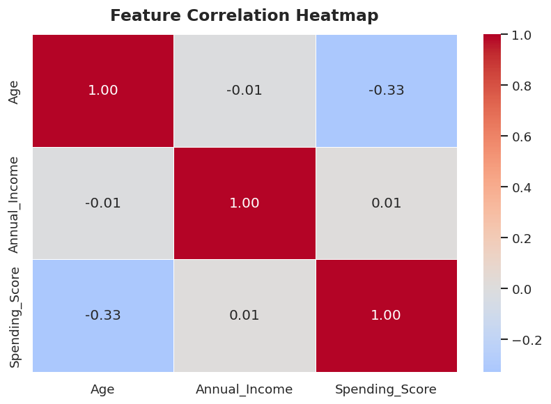
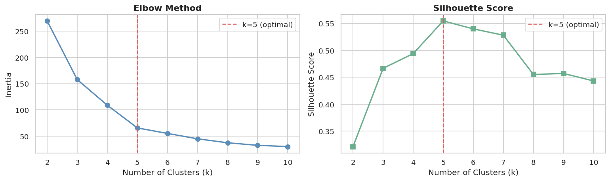
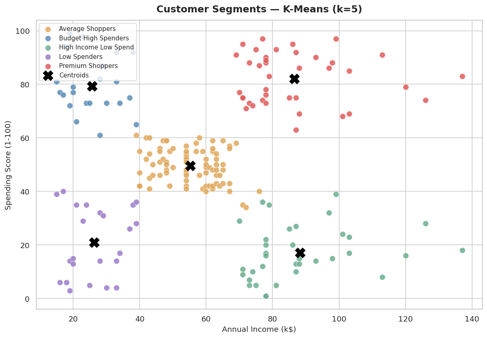
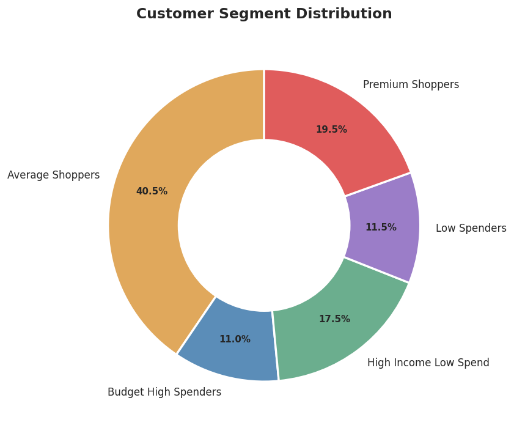

# 🛍️ Shopping Mall Customer Analyzer
 
> Customer segmentation using K-Means Clustering on Mall Customer data.
 


 
---
 
## 📌 Objective
 
Analyze mall customer behavior and group them into actionable segments using unsupervised machine learning.
 
**Pipeline:**
```
Dataset → Cleaning → EDA → Visualization → K-Means → Insights
```
 
---
 
## 📂 Files
 
| File | Description |
|------|-------------|
| `shopping_mall_analyzer.ipynb` | Main notebook |
| `Mall_Customers.csv` | Dataset (200 customers) |
| `images/` | Saved plot outputs |
 
---
 
## 📊 Dataset
 
**Source:** [Kaggle — Mall Customer Segmentation](https://www.kaggle.com/datasets/vjchoudhary7/customer-segmentation-tutorial)
 
| Column | Description |
|--------|-------------|
| CustomerID | Unique ID |
| Gender | Male / Female |
| Age | Customer age |
| Annual Income (k$) | Yearly income |
| Spending Score (1-100) | Mall-assigned score |
 
---
 
## 🔍 Analysis Questions
 
- Which age group spends most?
- Male vs female spending comparison?
- High income but low spending customers?
---
 
## 📈 Visualizations









---
 
## 🤖 ML Model — K-Means Clustering
 
- **Algorithm:** K-Means
- **Optimal k:** 5 (via Elbow Method + Silhouette Score)
- **Features used:** Annual Income, Spending Score
### Customer Segments
 
| Segment | Profile | Business Action |
|---------|---------|-----------------|
| 🔴 Premium Shoppers | High income, high spend | Loyalty programs |
| 🔵 Budget High Spenders | Low income, high spend | Affordable bundles |
| 🟢 High Income Low Spend | High income, low spend | Targeted campaigns — highest revenue potential |
| 🟣 Low Spenders | Low income, low spend | Re-engagement or deprioritize |
| 🟡 Average Shoppers | Mid income, mid spend | Personalized upsell |
 
---
 
## 🚀 How to Run
 
```bash
# Clone repo
git clone https://github.com/Niketkumardheeryan/ML-CaPsule.git
cd "ML-CaPsule/Customer Segmentation using Machine Learning"
 
# Install dependencies
pip install pandas numpy matplotlib seaborn scikit-learn
 
# Open notebook
jupyter notebook shopping_mall_analyzer.ipynb
```
 
> **Note:** Place `Mall_Customers.csv` in the same folder. If missing, notebook auto-generates synthetic demo data.
 
---
 
## 🛠️ Tech Stack
 
- Python 3.8+
- pandas, numpy
- matplotlib, seaborn
- scikit-learn
---
 
*Contributed as part of GSSoC | Issue #1175*