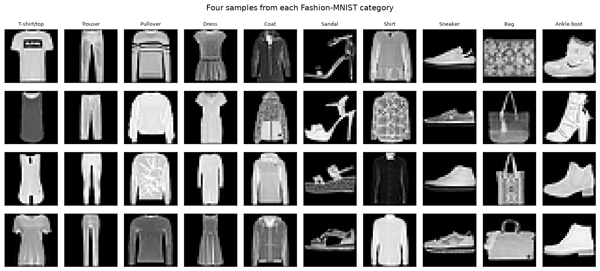
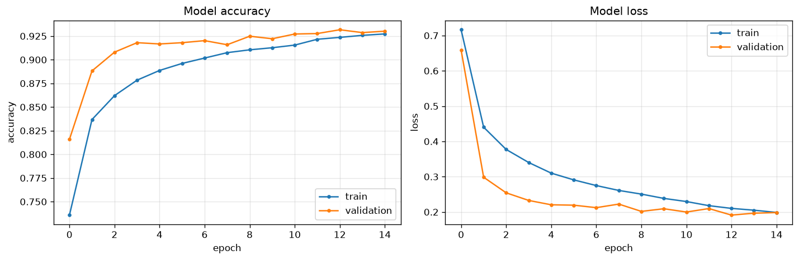
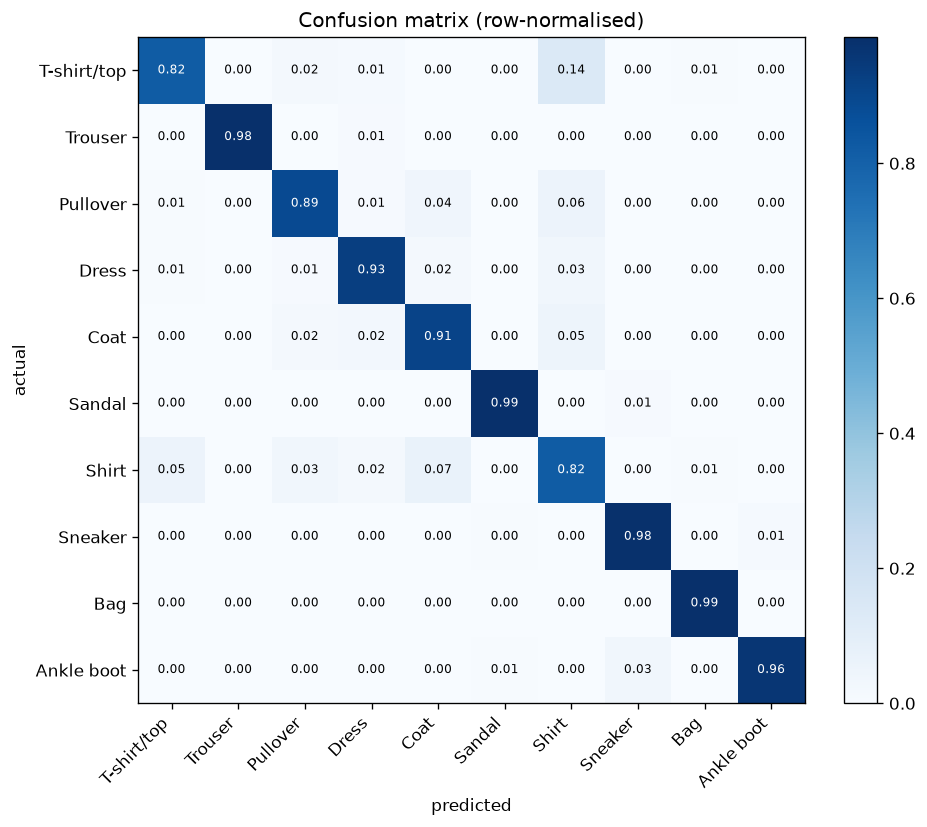
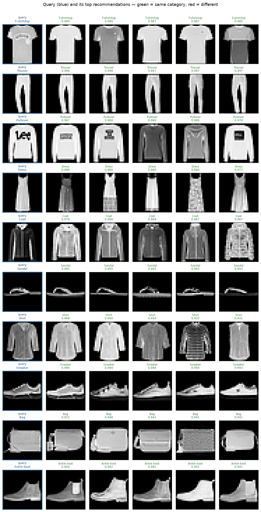
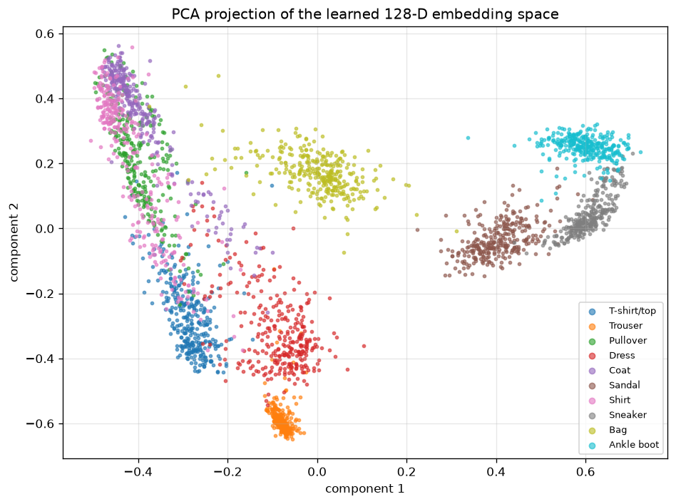

# 👗 Fashion Recommendation System — Deep Learning on Fashion-MNIST

A content-based fashion recommender: give it a clothing image and it returns the visually
most similar items from a catalogue — **and the recommendations come for free from a
classifier**.

Built for [Issue #1799](https://github.com/Niketkumardheeryan/ML-CaPsule/issues/1799).

---

## 🎯 Goal

Train a CNN to recognise the ten Fashion-MNIST categories, then throw away its output layer
and keep the **128-dimensional vector** it learned just underneath. Images the network
considers similar land close together in that space, so a nearest-neighbour search over those
vectors is already a recommendation engine — no second model, and no hand-labelled
"these two items are similar" pairs.

The project also answers the question most recommender demos skip: **does it actually work?**
Retrieval is scored with precision@k against a raw-pixel baseline.

---

## 🧠 Pipeline

| Stage | What happens |
|---|---|
| 1. Classify | Train a CNN on the 10 Fashion-MNIST categories |
| 2. Embed | Reuse the penultimate dense layer as a 128-D feature extractor |
| 3. Index | Fit a cosine nearest-neighbour index over 20,000 catalogue embeddings |
| 4. Recommend | For a query image, retrieve the top-k most similar catalogue items |
| 5. Evaluate | Score retrieval with precision@k, compared against a raw-pixel baseline |

---

## 📦 Dataset

**Fashion-MNIST** — 70,000 greyscale 28×28 images (60,000 train / 10,000 test) across 10
categories: t-shirt/top, trouser, pullover, dress, coat, sandal, shirt, sneaker, bag and
ankle boot. Perfectly balanced at 6,000 training images per class.

It ships with Keras (`keras.datasets.fashion_mnist`), so the notebook is **fully reproducible
with no manual download and no API key**.



---

## 🏗️ Model architecture

```
Input 28×28×1
 ├─ Conv2D(32, 3×3) + BatchNorm + ReLU
 ├─ Conv2D(32, 3×3) + ReLU  →  MaxPool  →  Dropout(0.25)
 ├─ Conv2D(64, 3×3) + BatchNorm + ReLU
 ├─ Conv2D(64, 3×3) + ReLU  →  MaxPool  →  Dropout(0.25)
 ├─ Flatten
 ├─ Dense(128, ReLU)   ← "embedding" layer, reused by the recommender
 ├─ Dropout(0.5)
 └─ Dense(10, softmax)
```

Trained with Adam (lr = 1e-3), sparse categorical cross-entropy, batch size 128, for 15 epochs
with early stopping on validation accuracy.

---

## 📊 Results

### Classification

| Metric | Value |
|---|---|
| **Test accuracy** | **92.73 %** |
| Test loss | 0.2093 |
| Macro F1 | 0.928 |
| Training time | 942 s (15 epochs, CPU) |



Per-class F1 ranges from **0.990 (trouser)** down to **0.783 (shirt)** — the confusion is
concentrated exactly where a human would hesitate too: shirt vs t-shirt/top vs coat vs
pullover. Footwear and bags are near-perfect.



### Recommendation quality

**Precision@k** = the share of recommended items belonging to the same category as the query.
With ten balanced classes, random retrieval scores ≈ 0.10.

| k | CNN embeddings | Raw-pixel baseline | Improvement |
|:--:|:--:|:--:|:--:|
| 1 | **0.917** | 0.834 | **+0.083** |
| 5 | **0.918** | 0.805 | **+0.113** |
| 10 | **0.916** | 0.792 | **+0.124** |

The learned features beat raw pixels at every `k`, and the gap *widens* as `k` grows — the CNN
has learned what makes two garments the same kind of thing, rather than which images happen to
share bright pixels in the same places.

Precision@5 by category:

| Category | P@5 | | Category | P@5 |
|---|:--:|---|---|:--:|
| Sandal | 0.989 | | Ankle boot | 0.931 |
| Bag | 0.985 | | T-shirt/top | 0.893 |
| Trouser | 0.981 | | Pullover | 0.888 |
| Sneaker | 0.977 | | Coat | 0.877 |
| | | | Dress | 0.867 |
| | | | **Shirt** | **0.810** |

Shirt is the hardest — its neighbours are often t-shirts, coats and pullovers. For a shopping
recommender that failure mode is fairly benign: someone browsing a shirt is plausibly
interested in a t-shirt too.

### The recommendations themselves

Query in blue, its five nearest catalogue items to the right. Green = same category.



Note it is matching *style*, not just category — the sandals share a strap silhouette, the
dresses share a cut, the pullovers share a printed panel.

### The learned embedding space



Even flattened to two dimensions with PCA the categories separate into visible clusters —
footwear on one side, tops bunched on the other. That structure is what makes nearest-neighbour
search work.

---

## 🛠️ Tech Stack

| Package | Role |
|---|---|
| `tensorflow` / `keras` | CNN training and the embedding feature extractor |
| `scikit-learn` | nearest-neighbour retrieval, PCA, evaluation metrics |
| `numpy` | array handling |
| `matplotlib` | training curves, confusion matrix, recommendation grids |

---

## 🚀 How to run

```bash
cd "Deep-Fashion-Recommendation-system/CNN_Embeddings_FashionMNIST"
pip install -r requirements.txt
jupyter notebook fashion_recommendation_system.ipynb
```

The notebook runs end to end in roughly 20 minutes on a CPU (a few minutes on a GPU) and
downloads the dataset automatically.

To use the pieces directly:

```python
import fashion_recommender as fr

(x_train, y_train), (x_test, y_test) = fr.load_fashion_mnist()

model = fr.compile_model(fr.build_cnn())
fr.train_model(model, x_train, y_train, epochs=15)

gallery = fr.extract_embeddings(model, x_train[:20000])
recommender = fr.FashionRecommender(gallery, y_train[:20000]).fit()

query = fr.extract_embeddings(model, x_test[:1])
indices, similarities = recommender.recommend(query, k=5)
print(recommender.recommend_labels(query, k=5))
print(fr.precision_at_k(recommender, gallery[:500], y_train[:500], k=5))
```

---

## 📁 Project structure

```
Deep-Fashion-Recommendation-system/CNN_Embeddings_FashionMNIST/
├── fashion_recommendation_system.ipynb   # annotated end-to-end notebook (executed)
├── fashion_recommender.py                # reusable pipeline: data, model, retrieval, metrics
├── requirements.txt
├── tests/
│   └── test_recommender.py               # 16 unit tests (no TensorFlow, no dataset needed)
└── assets/
    ├── dataset_samples.png
    ├── training_curves.png
    ├── confusion_matrix.png
    ├── recommendations.png
    └── embedding_space.png
```

---

## 🧪 Tests

The retrieval and metric layer is covered by unit tests built on synthetic embeddings, so they
run in seconds and need **neither TensorFlow nor the dataset** (TensorFlow is imported lazily,
only inside the model-building helpers):

```bash
python -m unittest discover -s tests -v
```

```text
Ran 16 tests in 11.059s

OK
```

They assert that recommendations come from the query's cluster, that similarities are sorted
best-first, that `k` is capped at the gallery size, that a well-separated gallery scores
precision@k = 1.0 while random embeddings score near chance, and that misuse (querying before
`fit()`, mismatched labels) raises rather than silently misbehaving.

---

## 🔍 How this method compares with the other one in this folder

`Deep-Fashion-Recommendation-system/` holds more than one way to build a fashion recommender.
This sub-folder is the **trained-CNN-embeddings** method; the notebook in the parent folder is
the **pretrained-VGG16-features** method.

| | Pretrained VGG16 features *(parent folder)* | **CNN embeddings — this folder** |
|---|---|---|
| Dataset | Women's fashion images, manual Google Drive download | Fashion-MNIST, ships with Keras |
| Model | Pretrained VGG16, no training | CNN trained from scratch |
| Task | Retrieval only | Classification **and** retrieval |
| Evaluation | Visual inspection | Precision@k vs a raw-pixel baseline |
| Reproducible | Dataset not included | Fully — one notebook, no downloads |

They are complementary: that one shows transfer learning from a pretrained backbone, this one
shows how a classifier you trained yourself doubles as a feature extractor, with the retrieval
quality actually measured.

---

## 🔭 Future improvements

- Train with a **triplet or contrastive loss** to optimise the embedding for similarity
  directly, rather than borrowing it from the classification objective.
- Move to a colour catalogue (DeepFashion, Myntra) with a pretrained backbone.
- Approximate nearest neighbours (FAISS, Annoy) to scale past a few hundred thousand items.
- Blend visual similarity with price, brand or purchase history for a hybrid recommender.

---

## 👤 Author

Contributed to **ML-CaPsule** under **GSSoC** by [Anijesh](https://github.com/Anijesh) — resolves issue #1799.
