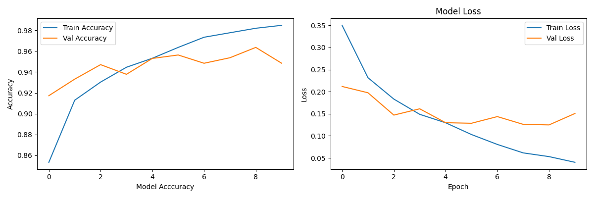
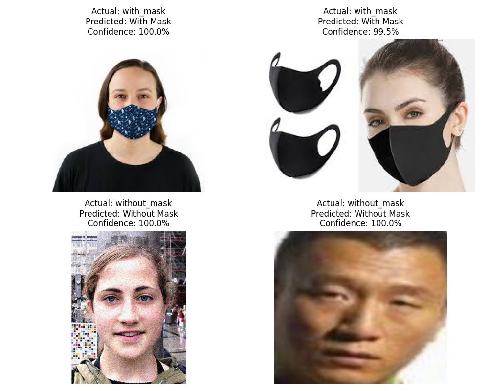

# 😷 Face Mask Detection using CNN & OpenCV

## 📌 Overview

This project detects whether a person is wearing a face mask or not, using a Convolutional Neural Network (CNN) built from scratch with TensorFlow/Keras, combined with OpenCV for real-time webcam-based detection. It was built as part of GirlScript Summer of Code 2026 (GSSoC'26).

## ❓ Problem Statement

There was no beginner-friendly yet practical Computer Vision project in this repo demonstrating real-time face detection combined with image classification. This project fills that gap by showing how CNNs and OpenCV can be combined for a real-world use case: mask detection.

## 📁 Folder Structure
```
Face_Mask_Detection/
├── Face_Mask_Detection.ipynb
├── webcam_detection.py
├── README.md
├── training_results.png
├── sample_predictions.png
├── dataset/
└── model/
```

## 🛠️ Tech Stack

- Python
- TensorFlow / Keras
- OpenCV
- NumPy
- Matplotlib
- scikit-learn

## 📊 Dataset

[Face Mask Dataset – Kaggle](https://www.kaggle.com/datasets/omkargurav/face-mask-dataset)

- Total images: 7553
- With mask: 3725
- Without mask: 3828

> Note: Due to size, the dataset isn't committed to this repo. Download it from the Kaggle link above and place it inside a `dataset/with_mask` and `dataset/without_mask` folder structure before running the notebook.

## 🧠 Model Architecture

A CNN built from scratch (not transfer learning) consisting of:
- Convolutional layers with ReLU activation for feature extraction
- MaxPooling layers for downsampling
- Dropout layers to reduce overfitting
- Fully connected Dense layers
- Final Dense layer with sigmoid/softmax activation for binary classification (`with_mask` / `without_mask`)

## 🚀 Usage

### 1. Install dependencies
```bash
pip install tensorflow opencv-python numpy matplotlib scikit-learn
```

### 2. Train the model
Open `Face_Mask_Detection.ipynb` and run all cells in order. This will:
- Load and preprocess the dataset
- Build and train the CNN
- Plot training/validation accuracy and loss
- Save the trained model to `model/mask_detector.h5`

### 3. Run real-time webcam detection
```bash
cd Face_Mask_Detection
python webcam_detection.py
```
Press **Q** to quit the webcam window.

## 📈 Model Performance

- Training Accuracy: **97.7%**
- Validation Accuracy: **95.2%**

## 🖼️ Results




## 📝 Notes / Limitations

- The model performs best on clear, frontal face images.
- Performance may degrade on cropped, occluded, or side-profile faces.
- Lighting conditions can affect real-time detection accuracy.

## 🔮 Future Improvements

- Use transfer learning (e.g., MobileNetV2) for improved accuracy
- Add multi-face detection support in a single frame
- Deploy as a web app using Flask/Streamlit

## 🙋 Author

Contributed by [@vibeetroot](https://github.com/vibeetroot) as part of **GirlScript Summer of Code 2026 (GSSoC'26)**.
