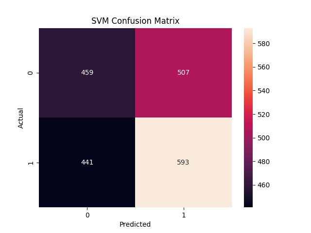
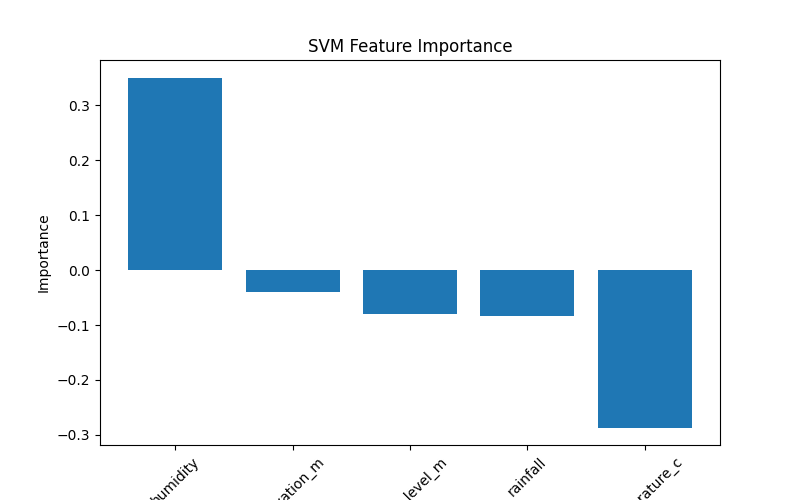
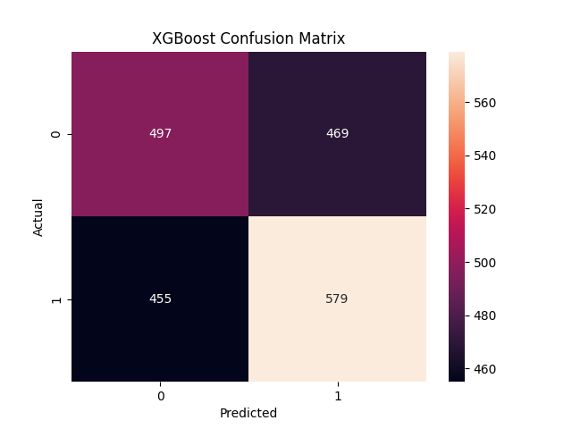
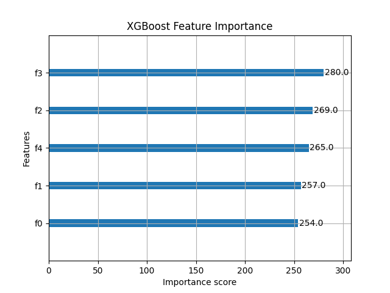
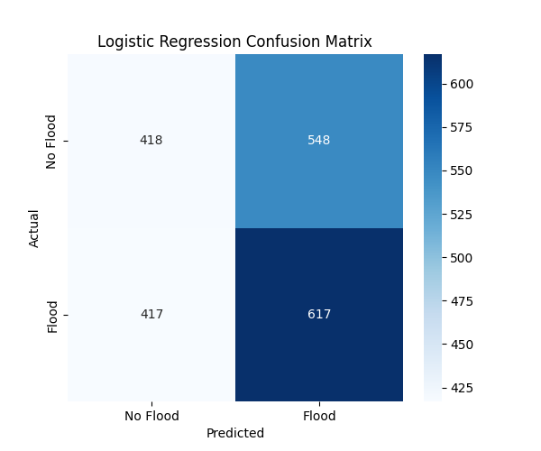
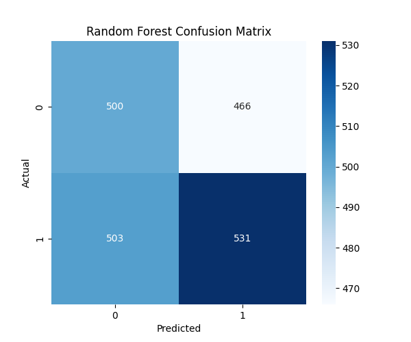
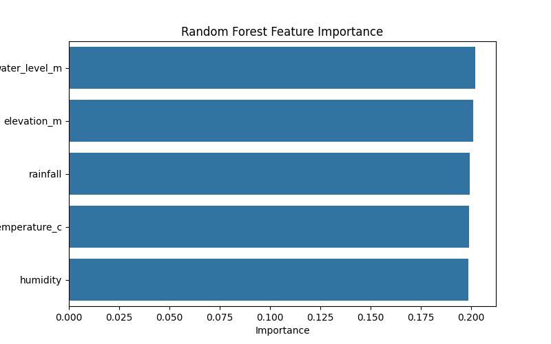
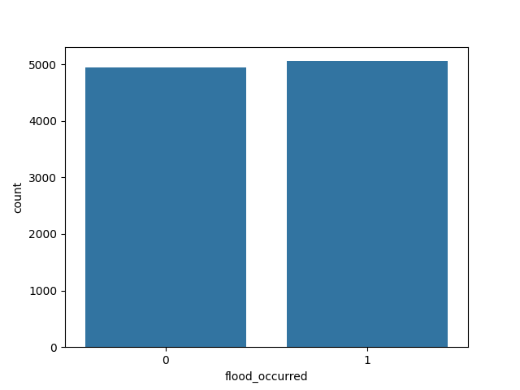

# Flood Prediction System using Comparative Machine Learning Models

A Machine Learning based flood prediction and comparative analysis system that evaluates multiple classification algorithms for predicting flood occurrence using environmental parameters.

The project compares:

- Support Vector Machine (SVM)
- XGBoost
- Random Forest
- Logistic Regression

to analyze their prediction capabilities, feature importance, and classification performance.

---

# Project Objective

The main objective of this project is to:

- Predict flood occurrence using ML classification models
- Compare different machine learning algorithms
- Analyze classification performance
- Visualize confusion matrices and feature importance
- Understand model behavior on environmental datasets
- Explore ways to improve prediction accuracy

---

# Features Used

The models are trained using the following environmental parameters:

- Rainfall
- Temperature
- Humidity
- Water Level
- Elevation

Target Variable:

- `flood_occurred`
    - `1` → Flood likely
    - `0` → Flood not likely

---

# Machine Learning Models Implemented

| Model | Purpose |
|---|---|
| SVM | Hyperplane-based classification |
| XGBoost | Boosted ensemble classification |
| Random Forest | Tree ensemble classification |
| Logistic Regression | Probabilistic linear classification |

---

# Project Structure

```bash
FLOOD-PRED/
│
├── data/
│   └── flood.csv
│
├── models/
│   ├── svm_model.joblib
│   ├── svm_scaler.joblib
│   ├── xgboost_model.joblib
│   ├── xgboost_scaler.joblib
│   ├── random_forest_model.joblib
│   ├── random_forest_scaler.joblib
│   ├── logistic_regression_model.joblib
│   └── logistic_regression_scaler.joblib
│
├── outputs/
│   ├── svm/
│   ├── xgboost/
│   ├── random_forest/
│   └── logistic_regression/
│
├── scripts/
│   ├── svm/
│   ├── xgboost/
│   ├── random_forest/
│   └── logistic_regression/
│
├── notebooks/
│
├── requirements.txt
├── README.md
└── LICENSE
```

---

## SVM Results

<p align="center">
  
  
</p>

---

## XGBoost Results

<p align="center">
  
  
</p>

---

## Logistic Regression Results

<p align="center">
  
  
</p>

---

## Random Forest Results

<p align="center">
  
  
</p>

---

## Dataset Class Distribution

<p align="center">
  
</p>

---

# Visual Outputs

Each model generates:

- Confusion Matrix
- Feature Importance Graph
- Classification Report
- Accuracy Metrics

Saved inside:

```bash
outputs/
```

---

 <!--
  # Model Performance Comparison

| Model | Accuracy |
|---|---|
| SVM | 52.60% |
| XGBoost | 53.70% |
| Random Forest | 51.55% |
| Logistic Regression | 51.75% |

---
-->
# Observations

- All models achieved accuracies in the range of 51–53%.
- XGBoost performed slightly better than other models.
- The models are currently unable to learn strong predictive patterns from the dataset.
- Correlation analysis showed very weak relationships between the input features and the target variable.
- This indicates that the dataset may contain:
    - weak predictive signals,
    - synthetic/random patterns,
    - insufficient real-world feature relationships,
    - or missing important environmental factors.

Because of this, even advanced models like XGBoost and Random Forest are unable to achieve high accuracy.

---

# Current Improvements in Progress

The project is actively being improved using:

- Better feature engineering
- Hyperparameter tuning
- Improved feature scaling
- Model optimization
- Dataset analysis and cleaning
- Additional visualizations
- Better feature selection strategies

Future versions aim to improve prediction performance using more realistic datasets and advanced ML techniques.

---

# Installation

Clone the repository:

```bash
git clone https://github.com/YOUR_USERNAME/FLOOD-PRED.git
```

Move into the project folder:

```bash
cd FLOOD-PRED
```

Install dependencies:

```bash
pip install -r requirements.txt
```

---

# Running the Models

## SVM

Training:

```bash
py scripts/svm/svm_training.py
```

Prediction:

```bash
py scripts/svm/svm_prediction.py
```

---

## XGBoost

Training:

```bash
py scripts/xgboost/xgboost_training.py
```

Prediction:

```bash
py scripts/xgboost/xgboost_prediction.py
```

---

## Random Forest

Training:

```bash
py scripts/random_forest/rf_training.py
```

Prediction:

```bash
py scripts/random_forest/rf_prediction.py
```

---

## Logistic Regression

Training:

```bash
py scripts/logistic_regression/lr_training.py
```

Prediction:

```bash
py scripts/logistic_regression/lr_prediction.py
```

---

# Technologies Used

- Python
- Pandas
- NumPy
- Scikit-learn
- XGBoost
- Matplotlib
- Seaborn
- Joblib

---

# Educational Purpose

This repository is also designed as a one-stop learning resource for understanding major Machine Learning classification algorithms.

It provides:

- End-to-end training pipelines
- Prediction scripts
- Feature scaling workflows
- Confusion matrix analysis
- Feature importance visualization
- Model comparison techniques
- Practical implementation of:
  - SVM
  - XGBoost
  - Random Forest
  - Logistic Regression

This project can help beginners and intermediate learners understand how different ML classification models behave on the same dataset and how to structure real-world ML projects professionally.

---

# Future Improvements

- Use real-world flood datasets
- Add deep learning models
- Improve data preprocessing
- Hyperparameter optimization
- Build Flask/FastAPI deployment
- Add real-time flood prediction dashboard
- Add model comparison dashboards

---

# Author

Varshith N

GitHub:
https://github.com/v4rshh

---

# License

This project is licensed under the MIT License.
