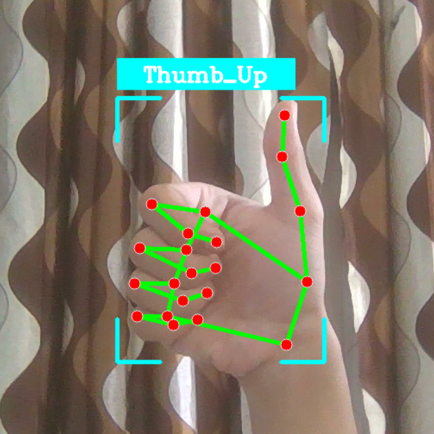
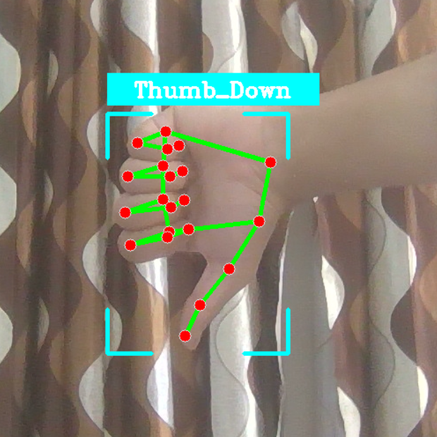
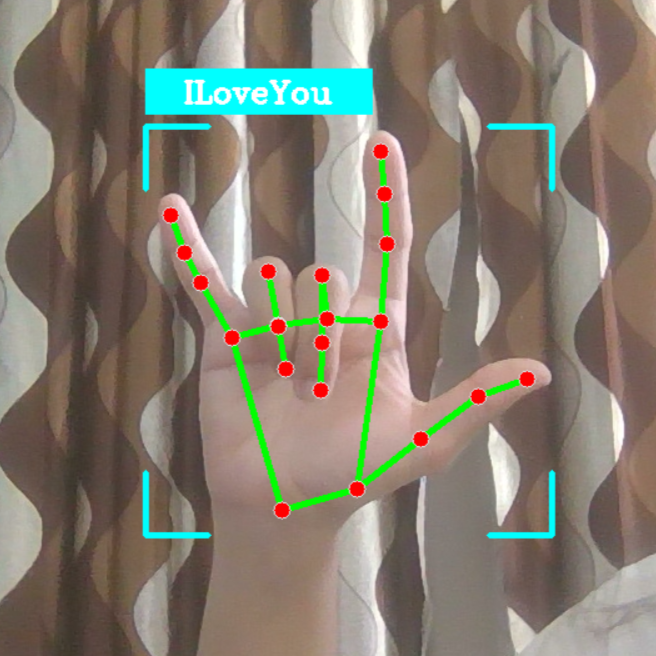
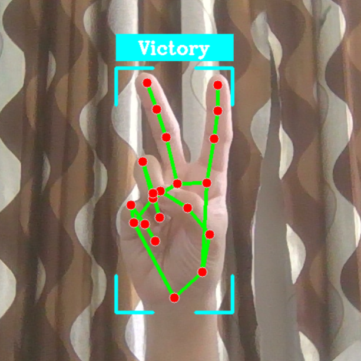
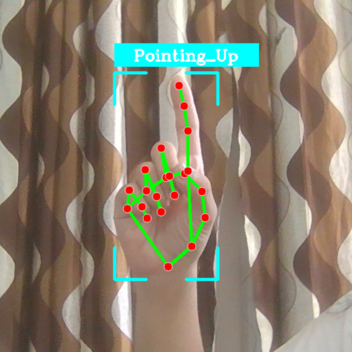
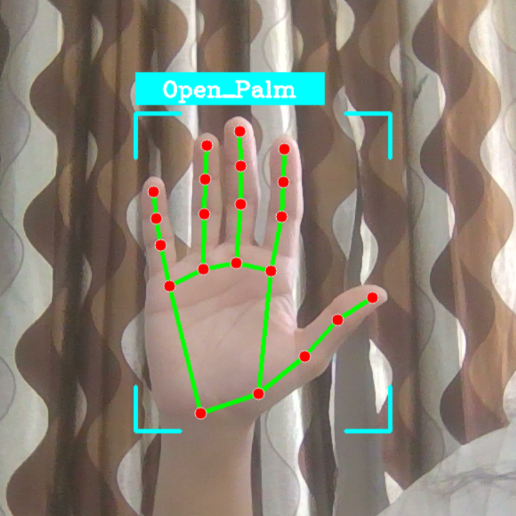
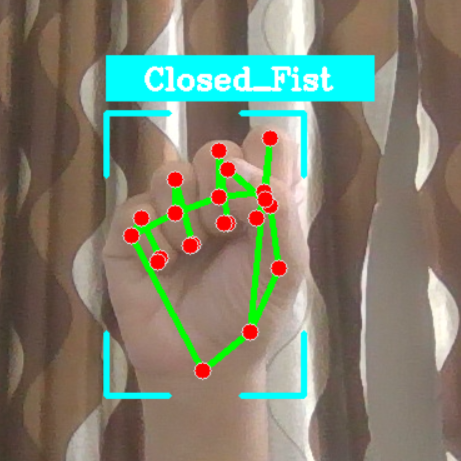
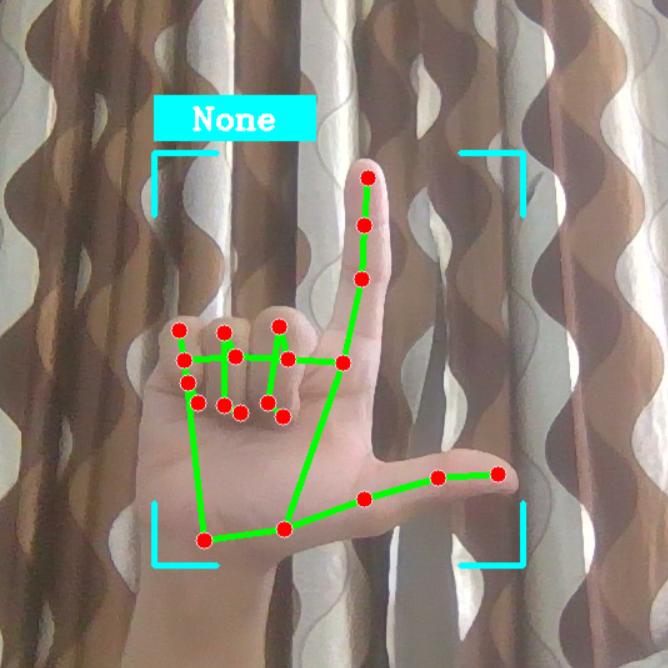

# 🖐️ Hand Gesture Recognition

Real-time hand gesture recognition using MediaPipe.

## 🚀 Demo

<table style="width:100%; table-layout:fixed; border-collapse:collapse;">
  <tr>
    <td style="padding:8px; vertical-align:top; width:50%;">
      <h4>Thumbs Up</h4>
      </img>
    </td>
    <td style="padding:8px; vertical-align:top; width:50%;">
      <h4>Thumbs Down</h4>
      </img>
    </td>
  </tr>

  <tr>
    <td style="padding:8px; vertical-align:top; width:50%;">
      <h4>ILoveU</h4>
      </img>
    </td>
    <td style="padding:8px; vertical-align:top; width:50%;">
      <h4>Victory</h4>
      </img>
    </td>
  </tr>

  <tr>
    <td style="padding:8px; vertical-align:top; width:50%;">
      <h4>Pointing Up</h4>
      </img>
    </td>
     <td style="padding:8px; vertical-align:top; width:100%;">
      <h4>Open Palm</h4>
      </img>
    </td>
  </tr>

  <tr>
    <td style="padding:8px; vertical-align:top; width:50%;">
      <h4>Closed Fist</h4>
      </img>
    </td>
     <td style="padding:8px; vertical-align:top; width:100%;">
      <h4>None</h4>
      </img>
    </td>
  </tr>
</table>

## 🎯 Features

- **8 Hand Gestures**: 👍, 👎, ✌️, ☝️, ✊, 👋, 🤟, None
- **Dual Hand Detection**: Recognize 2 hands simultaneously
- **Real-time Video Processing**: 1280×720 @ 30 FPS

## 🚀 Quick Start

### 1️⃣ Installation

```bash
pip install -r requirements.txt
```

### 2️⃣ Run Real-time Classification

```bash
python app.py
```

- Point camera at your hand
- Press `Q` to exit

## 📂 Project Structure

```
├── app.py       # Real-time gesture recognition
├── models/      # Pre-trained .task models
├── demo/        # demo output images
```

## 🔧 Key Components

| Module      | Purpose                   |
| ----------- | ------------------------- |
| `MediaPipe` | Hand landmark detection   |
| `OpenCV`    | Video capture & rendering |
| `NumPy`     | Landmark processing       |

## 📊 Model Architecture

- **Gesture Model**: Classifies static hand poses

## ⚙️ Configuration

Edit `app.py` to customize:

- Max hands: `MAX_HANDS = 2`
- Input resolution: `IMAGE_SHAPE = (1280, 720)`
- Model paths

## 📝 Notes

- Requires webcam input
- Optimal lighting recommended

## 👤 Author

Made with 💻 and ☕ by [@udham2511]("https://www.github.com/udham2511")
