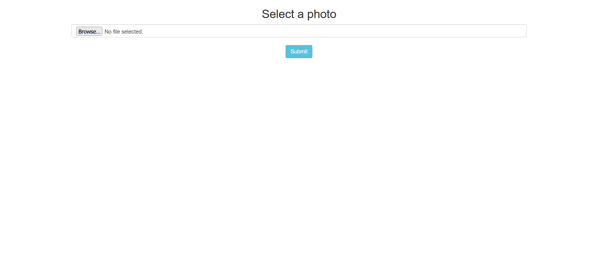
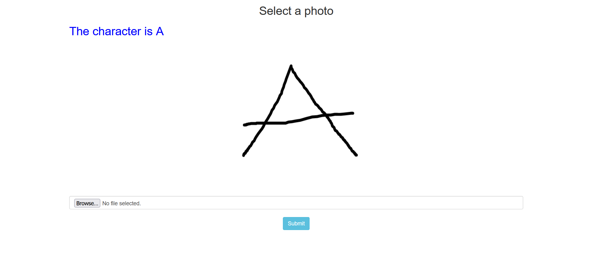

# HAND-WRITTEN CHATACTER RECOGNITION

## Technology used:
- opencv
- tensorflow
- matplotlib
- sklearn
- numpy
- pandas
- flask
- gunicorn
- html
- css
- java script

## Steps:
1. Import libraries
2. Load data from zip file
3. Analysis the data
4. Create CNN model
5. Train the model
6. Save model as .h5 file
7. Deploy model using flask

## Deployment process:
- Create a Heroku Account
- Log in using email and password
- Create a heroku application
- From deployment method choose connect to github
- Provide github repository link
- Wait untill successful building and deploying
- Open your web application

## How to get data?
Download data as zip file from the link below and save it as "A_Z Handwritten Data.zip"

https://www.kaggle.com/sachinpatel21/az-handwritten-alphabets-in-csv-format

## Webapp link:
https://handwritten-character-recog.herokuapp.com/

## Screenshots:

## Demo video:
https://youtu.be/VuDJ0JwNakQ
