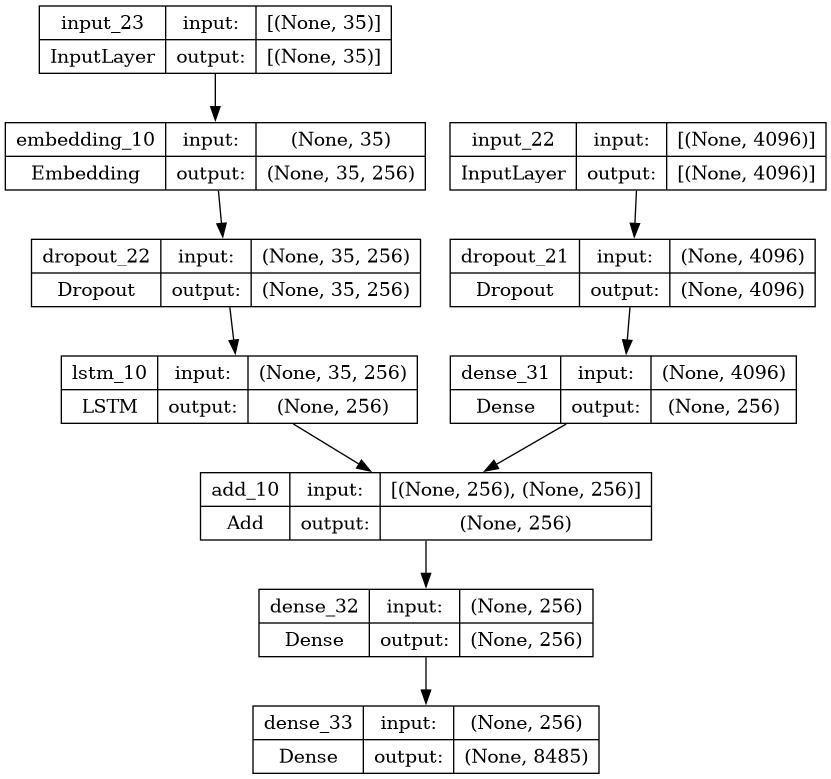
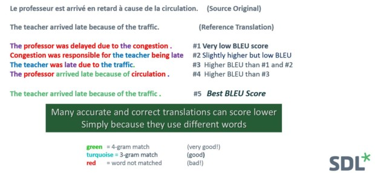

# Image Captioning

Image caption generator is a process of recognizing the context of an image and annotating it with relevant captions using deep learning and computer vision.

This involves image processing and feature extraction along side text processing.

In this repo , we'll be using a VGG16 model architecture to extract the features of images.
Then we'll create a tokenizer for the textual data.
And finally a Deep Learning architecture that gets trained over these images (features) and texts (tokenized).

This model can then take an image as an input ans annotate it / generate a caption in context of that image.

## Table of Contents
- [Overview](#overview)
- [Installation/Getting Started](#installation)
- [Dataset](#dataset)
- [Model Architecture](#model-architecture)
- [Evaluation](#evaluation)
## Overview

I've sectioned the process into 4 stages.

1. **Image Processing**: Utilizing VGG16 model architecture to extract features from images.
2. **Text Processing**: Creating a tokenizer for textual data to prepare it for the model.
3. **Model Creation & Training**: Training a deep learning model on the extracted image features and tokenized text data to generate captions.
4. **Pipelining**: Creating the pipeline , i.e. the flow of how an image can be taken as an input and a caption can be genrated. 

Once trained, the model can take an image as input and generate a relevant caption describing the content of the image.

## Installation

* Clone the repo or download the files.
* To clone , run the following in cmd.

```
git clone <link here>
```

* To get started ensure you've all the libraries installed.
* You can do so by installing libraries as u go or just run the following.

```
pip install -r requirements.txt
```

## Dataset
You can download the data from here:
https://www.kaggle.com/datasets/adityajn105/flickr8k

!For convenience run the notebook over Kaggle.

## Model Architecture

### Prerequisite
What is CNN?
CNN is a subfield of Deep learning and specialized deep neural networks used to recognize and classify images. It processes the data represented as 2D matrix-like images. CNN can deal with scaled, translated, and rotated imagery. It analyzes the visual imagery by scanning them from left to right and top to bottom and extracting relevant features. Finally, it combines all the parts for image classification.

What is LSTM?
Being a type of RNN (recurrent neural network), LSTM (Long short-term memory) is capable of working with sequence prediction problems. It is mostly used for the next word prediction purposes, as in Google search our system is showing the next word based on the previous text. Throughout the processing of inputs, LSTM is used to carry out the relevant information and to discard non-relevant information.

### The Architecture we've used.

* To let the model generate caption on images , we obviously need to give it the image and the caption , both as in input to be trained on.
* This is done by concatinating the two. You can see how its dont in the notebook using the 'add()' function.



### Evaluation: BLEU Score for Machine Translation

**BLEU Score** serves as a vital evaluation metric for assessing the quality of Machine Translation tasks in Natural Language Processing (NLP).

#### Computing the BLEU Score

Let's illustrate the computation process using two reference translations, R1 and R2, generated by human experts, and a candidate translation, C1, produced by our translation system.

Reference Translations:
R1: The cat is on the mat.
R2: There is a cat on the mat.

Candidate Translation:
C1: The cat and the dog.

To quantify the quality of our translation using a metric, we count how many words in the candidate translation C1 match those in the reference translations R1 and R2. We then divide this count by the total number of words in C1 to obtain a percentage. This metric, which we'll denote as BLEU*, ranges from 0.0 (worst) to 1.0 (perfect).

In C1, three words ("the", "cat", "the") match those in the reference translations. Thus:

**BLEU*(C1) = 3 / 5 = 0.6**

This score indicates that the candidate translation achieves a BLEU* score of 0.6, indicating room for improvement.

To learn more: https://medium.com/nlplanet/two-minutes-nlp-learn-the-bleu-metric-by-examples-df015ca73a86

* Here is another reference example


