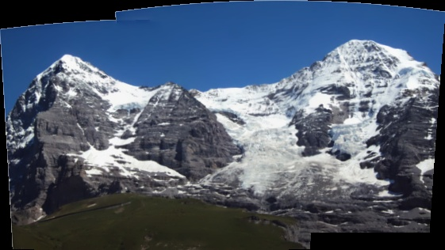
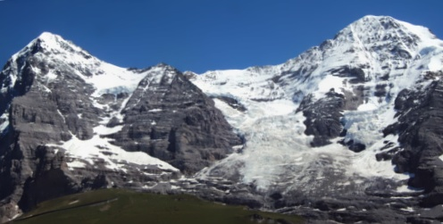

# Image Stitching using OpenCV library

## Project Overview

This project demonstrates how to stitch multiple images together using the OpenCV library in Python. It involves loading images from a dataset, stitching them together, and post-processing the stitched image to remove any unwanted borders.

## Process Details
Load Images: Reads all images from the specified dataset folder.
Image Stitching: Uses OpenCV's stitching functionality to combine the images into a panorama.
Post-Processing: Adds a black border to the stitched image, converts it to grayscale, applies a threshold, and finds the largest contour to remove any black borders.
Save Results: Saves the stitched image and the post-processed image in the Result/ directory.

Example:
If you have images in the Dataset/Glacier folder, set dataset_name = 'Glacier' in the script. The resulting images will be saved in the Result/Glacier folder as output1.jpg (stitched image) and output2.jpg (processed image).

## Directory Structure

The project directory is organized as follows:

- `Dataset/`: Contains the input images for different datasets (e.g., Glacier, Mountain).
- `Result/`: Stores the stitched images and the post-processed images for different datasets.
- `stitching.py`: The main script that performs the image stitching and border removal.
- `README.md`: This file, containing the project description and usage instructions.

## Requirements

Make sure you have the following packages installed:

- numpy
- opencv-python
- imutils
- glob
- os

You can install the required packages using the pip command

## Usage

### Dataset Preparation:

Place the images you want to stitch together in a folder under the Dataset/ directory.
Ensure the images are in JPG format. If they are not, you can either convert them to jpg or change the extension, used in the code, to the extension you want.

### Running the Script:

Update the dataset_name variable in stitching.py to the name of the folder containing your images.
Adjust the threshold variable if necessary (default is 0.97). 
Run the stitching.py script

## Results:

The stitched image and the post-processed image will be saved in the corresponding folder under the Result/ directory.
The script will also display the images using OpenCV's imshow function.

