# 🤖 Interactive ML Algorithm Recommendation Guide for Beginners

Welcome to the **Interactive Machine Learning Algorithm Recommendation Guide**! 

Choosing the right machine learning algorithm for a problem can be overwhelming for beginners. This interactive guide features a **decision-tree flowchart**, **domain-specific categorization**, **beginner-friendly explanations**, **visual examples**, and **comparison tables** to help you select the best algorithm for your dataset and use case.

---

## 🧭 Interactive Decision-Tree Flowchart

Use the interactive flowchart below to answer key questions about your data and task, guiding you directly to the recommended ML algorithm!

```mermaid
flowchart TD
    Start([What type of problem are you solving?]) --> ChoiceType{Is your data labeled?}

    %% Supervised Path
    ChoiceType -- Yes: Supervised Learning --> TargetType{What is your Target Variable?}

    %% Classification Branch
    TargetType -- Categorical / Discrete --> ClassData{What is your dataset scale & priority?}
    ClassData -- Fast & Linear Baseline --> LogReg[Logistic Regression]
    ClassData -- Simple & Probabilistic / Text --> NB[Naive Bayes]
    ClassData -- Non-linear / Intuitive Rules --> DT[Decision Tree]
    ClassData -- High Accuracy & Tabular Data --> RF[Random Forest / XGBoost]
    ClassData -- High Dimensional / Complex Boundary --> SVM[Support Vector Machine - SVM]
    ClassData -- Distance-based / Small Data --> KNN[k-Nearest Neighbors - k-NN]

    %% Regression Branch
    TargetType -- Continuous / Numerical --> RegData{What is the relationship in your data?}
    RegData -- Linear Trend / Simple Baseline --> LinReg[Linear Regression]
    RegData -- Non-linear / Complex Relationships --> RegTree[Random Forest Regressor / XGBoost]
    RegData -- High Dimensional / Regularized --> RidgeLasso[Ridge / Lasso Regression]
    RegData -- Complex Non-linear Boundary --> SVR[Support Vector Regressor - SVR]

    %% Unsupervised Path
    ChoiceType -- No: Unsupervised Learning --> UnsupGoal{What is your primary goal?}
    UnsupGoal -- Grouping / Clustering --> ClusterData{Do you know the number of clusters?}
    ClusterData -- Yes: Fixed K --> KMeans[K-Means Clustering]
    ClusterData -- No: Arbitrary Shapes & Noise --> DBSCAN[DBSCAN]
    ClusterData -- Hierarchical Hierarchy --> AggClust[Hierarchical Clustering]

    UnsupGoal -- Dimensionality Reduction --> RedGoal{Feature Reduction or Visualization?}
    RedGoal -- Linear Variance Preservation --> PCA[Principal Component Analysis - PCA]
    RedGoal -- 2D/3D Visualization --> TSNE[t-SNE / UMAP]

    %% Specialized Domains Path
    ChoiceType -- Unstructured Data: NLP / Vision --> DomainType{What is the data modality?}
    DomainType -- Text / Sequence Data --> TextTask{Task Complexity?}
    TextTask -- Basic Sentiment / Topic --> TFIDF[TF-IDF + Naive Bayes / Logistic Regression]
    TextTask -- Sequential / Contextual --> RNN[LSTM / GRU / RNN]
    TextTask -- State-of-the-Art / Semantics --> Trans[Transformers - BERT / GPT]

    DomainType -- Images / Video --> VisionTask{Task Complexity?}
    VisionTask -- Image Classification --> CNN[Convolutional Neural Networks - CNN]
    VisionTask -- Object Detection --> YOLO[YOLO / DETR]
    VisionTask -- Generative / Style Transfer --> GAN[GANs / Diffusion Models]

    DomainType -- Sequential / Time Series --> TimeTask{Forecasting Horizon?}
    TimeTask -- Classical Statistical --> ARIMA[ARIMA / Prophet]
    TimeTask -- Deep Learning Sequence --> LSTM[LSTM / Temporal Fusion Transformer]

    %% Styling
    classDef default fill:#1f2937,stroke:#6366f1,stroke-width:2px,color:#fff;
    classDef LogReg,NB,DT,RF,SVM,KNN,LinReg,RegTree,RidgeLasso,SVR,KMeans,DBSCAN,AggClust,PCA,TSNE,TFIDF,RNN,Trans,CNN,YOLO,GAN,ARIMA,LSTM fill:#312e81,stroke:#818cf8,stroke-width:2px,color:#EEF2FF;
```



---

## 🗂️ Algorithm Categorization & Explanations

Here is a breakdown of algorithms categorized by domain, complete with beginner-friendly explanations, key characteristics, and visual representations.

---

### 1. 🎯 Classification Algorithms
Classification is used when the outcome variable is **categorical** (e.g., Spam vs. Not Spam, Disease vs. Healthy).

```
   Dataset: [Age, Income, Credit Score] ---> [ Model ] ---> Class: Approved / Rejected
```

| Algorithm | Beginner Explanation | Best Used For | Real-World Use Case |
|-----------|----------------------|---------------|---------------------|
| **Logistic Regression** | Fits a sigmoid curve to predict the probability of a binary outcome (0 to 1). | Quick baseline, linearly separable data | Email Spam Detection, Credit Approval |
| **Decision Tree** | Splits data like a flowchart of IF-THEN rules based on features. | Easy interpretability, mixed feature types | Customer Churn Prediction, Medical Diagnosis |
| **Random Forest** | Combines predictions from hundreds of decision trees (Bagging) to avoid overfitting. | Tabular data, high accuracy needed | Bank Fraud Detection, Disease Risk Assessment |
| **Naive Bayes** | Calculates probabilities using Bayes' Theorem assuming features are independent. | Text classification, fast training | News Topic Classification, Spam Filtering |
| **Support Vector Machine (SVM)** | Finds the optimal hyper-plane that maximizes the margin between classes. | High-dimensional data, clear margins | Image Classification, Gene Expression Data |
| **k-Nearest Neighbors (KNN)** | Classifies data points based on the majority class of their $k$ closest neighbors. | Small datasets, simple distance metrics | Recommendation Systems, Handwriting Recognition |

---

### 2. 📈 Regression Algorithms
Regression is used when the outcome variable is **continuous** (e.g., Housing Prices, Temperature, Stock Value).

```
   Dataset: [Square Feet, Bedrooms, Location] ---> [ Model ] ---> Output: $350,000
```

| Algorithm | Beginner Explanation | Best Used For | Real-World Use Case |
|-----------|----------------------|---------------|---------------------|
| **Linear Regression** | Fits a straight line ($y = mx + c$) through data points to minimize squared errors. | Simple linear relationship baseline | House Price Prediction, Sales Forecasting |
| **Ridge / Lasso Regression** | Regularized Linear Regression that penalizes large coefficients to prevent overfitting. | Multicollinear features, feature selection | Financial Risk Analysis, Genomic Studies |
| **Random Forest Regressor / XGBoost** | Ensembles decision trees to model complex non-linear relationships. | Tabular datasets, non-linear patterns | Demand Forecasting, Stock Volatility |
| **Support Vector Regressor (SVR)** | Fits an envelope (margin of tolerance) around data points to predict values. | Complex non-linear continuous outputs | Energy Consumption Prediction |

---

### 3. 🧩 Clustering & Dimensionality Reduction
Unsupervised learning discovers hidden patterns, groupings, or compressed representations in unlabeled data.

```
   Unlabeled Points: (• • • • • •) ---> [ Clustering ] ---> Group 1: (•••)  Group 2: (•••)
```

| Algorithm | Beginner Explanation | Best Used For | Real-World Use Case |
|-----------|----------------------|---------------|---------------------|
| **K-Means Clustering** | Partitions data into $K$ clusters by iteratively updating cluster centroids. | Fast clustering when $K$ is known | Customer Market Segmentation |
| **DBSCAN** | Groups dense regions of data points while marking sparse isolated points as noise. | Arbitrary cluster shapes, noisy data | Geospatial Anomaly Detection |
| **Hierarchical Clustering** | Builds a tree of clusters (Dendrogram) by iteratively merging or splitting clusters. | Small datasets requiring hierarchy | Biological Taxonomy, Document Hierarchy |
| **PCA (Principal Component Analysis)** | Reduces feature dimension by projecting data onto orthogonal axes of maximum variance. | High-dimensional visualization, feature reduction | Image Compression, Preprocessing |

---

### 4. 🔤 Natural Language Processing (NLP)
NLP algorithms process, comprehend, and generate human language text.

```
   Raw Text: "Great product!" ---> [ Tokenization & Embedding ] ---> Model ---> Positive (98%)
```

| Algorithm | Beginner Explanation | Best Used For | Real-World Use Case |
|-----------|----------------------|---------------|---------------------|
| **TF-IDF + Classifier** | Weighs word frequencies against corpus uniqueness for statistical text modeling. | Lightweight text classification | Document Categorization |
| **Recurrent Neural Networks (LSTM/GRU)** | Processes text sequentially using internal memory cells to capture long-range context. | Sequential text and time-series | Machine Translation, Text Summarization |
| **Transformers (BERT / GPT)** | Uses self-attention mechanisms to process full sequences in parallel with context depth. | State-of-the-art text understanding & generation | LLMs, Chatbots, Q&A Systems |

---

### 5. 👁️ Deep Learning & Computer Vision
Deep learning uses multi-layer neural networks for processing unstructured visual and audio spatial data.

```
   Input Image [28x28] ---> [ Conv -> Pool -> FC ] ---> Class: Cat (94%)
```

| Algorithm | Beginner Explanation | Best Used For | Real-World Use Case |
|-----------|----------------------|---------------|---------------------|
| **Convolutional Neural Networks (CNN)** | Applies sliding spatial filters to extract hierarchical features (edges -> shapes -> objects). | Image classification & feature extraction | Medical X-ray Diagnosis, Facial Recognition |
| **Object Detection (YOLO / DETR)** | Simultaneously predicts bounding box coordinates and object classes in real time. | Real-time video/image object tracking | Autonomous Driving, Surveillance |
| **Generative Adversarial Networks (GANs)** | Pit a Generator (creates fake data) against a Discriminator (detects fake data) to generate realistic samples. | Synthetic image generation & style transfer | Deepfake Detection, Image Super-Resolution |

---

## ⚖️ Algorithm Comparison Table

| Algorithm | Data Type | Interpretability | Training Speed | Handles Non-Linear Data? | Robust to Outliers? | Memory Footprint |
|-----------|-----------|------------------|----------------|--------------------------|--------------------|------------------|
| **Logistic Regression** | Tabular / Text | ⭐⭐⭐⭐⭐ (Very High) | ⚡ Fast | ❌ No | ⚠️ Moderate | 🟢 Low |
| **Decision Tree** | Tabular | ⭐⭐⭐⭐⭐ (Very High) | ⚡ Fast | ✅ Yes | ⚠️ Sensitive | 🟢 Low |
| **Random Forest** | Tabular | ⭐⭐⭐ (Moderate) | 🐢 Medium | ✅ Yes | ✅ Robust | 🟡 Medium |
| **XGBoost / LightGBM** | Tabular | ⭐⭐⭐ (Moderate) | ⚡ Fast (GPU) | ✅ Yes | ✅ Robust | 🟡 Medium |
| **Support Vector Machine (SVM)** | Tabular / Image | ⭐⭐ (Low) | 🐢 Slow ($O(n^3)$) | ✅ Yes (Kernels) | ⚠️ Sensitive | 🔴 High |
| **k-Nearest Neighbors (KNN)** | Tabular | ⭐⭐⭐⭐ (High) | ⚡ Instant (Lazy) | ✅ Yes | ❌ Sensitive | 🔴 High |
| **Naive Bayes** | Text / Discrete | ⭐⭐⭐⭐ (High) | ⚡ Extremely Fast | ❌ No | ✅ Robust | 🟢 Low |
| **K-Means Clustering** | Tabular | ⭐⭐⭐⭐ (High) | ⚡ Fast | ❌ Convex only | ❌ Sensitive | 🟢 Low |
| **CNN / Deep Learning** | Images / Audio | ⭐ (Black Box) | 🐢 Slow (Needs GPU) | ✅ Yes | ✅ Robust | 🔴 High |
| **Transformers / LLMs** | Text / Multimodal | ⭐ (Black Box) | 🐢 Very Slow | ✅ Yes | ✅ Robust | 🔴 Very High |

---

## 💡 Practical Decision Checklist for Beginners

When starting a new ML project, ask yourself these 5 quick questions:

1. **What is your target label?**
   - *Categorical* $\rightarrow$ Classification
   - *Continuous number* $\rightarrow$ Regression
   - *No label* $\rightarrow$ Clustering / Unsupervised

2. **How much data do you have?**
   - *Small ($< 1,000$ samples)* $\rightarrow$ Naive Bayes, Logistic/Linear Regression, KNN
   - *Medium ($1,000 - 100,000$ samples)* $\rightarrow$ Decision Trees, Random Forest, XGBoost, SVM
   - *Large ($> 100,000$ samples / Unstructured)* $\rightarrow$ Deep Learning (CNNs, LSTMs, Transformers), LightGBM

3. **Do you need to explain model decisions to non-technical stakeholders?**
   - *Yes* $\rightarrow$ Linear Regression, Logistic Regression, Decision Trees
   - *No (pure performance matters)* $\rightarrow$ XGBoost, Ensembles, Neural Networks

4. **Are features linear or non-linear?**
   - *Linear* $\rightarrow$ Linear/Logistic Regression, Naive Bayes, Linear SVM
   - *Non-linear* $\rightarrow$ Random Forest, XGBoost, RBF SVM, Neural Networks

5. **Is your dataset balanced?**
   - *Balanced* $\rightarrow$ Standard Accuracy / Mean Squared Error
   - *Imbalanced (e.g. Fraud 1%)* $\rightarrow$ Use tree ensembles with class weights, metric: PR-AUC, F1-Score

---

## 🔗 Related Projects in ML-CaPsule

Explore hands-on code implementations of these algorithms across the repository:

- 📂 [Classification Algorithms](../Classification%20Algorithms)
- 📂 [Clustering Algorithms](../Clustering%20Algorithms)
- 📂 [Ensemble Methods in ML](../Ensemble%20Methods%20in%20ML)
- 📂 [Model Selection Tool](../Model%20Selection%20Tool)
- 📂 [Basics of ML and DL](../Basics%20of%20ML%20and%20DL)
- 📂 [Feature-Engineering](../Feature-Engineering)
