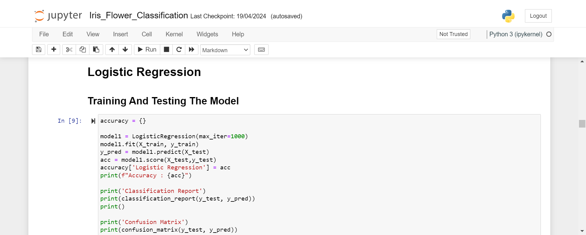
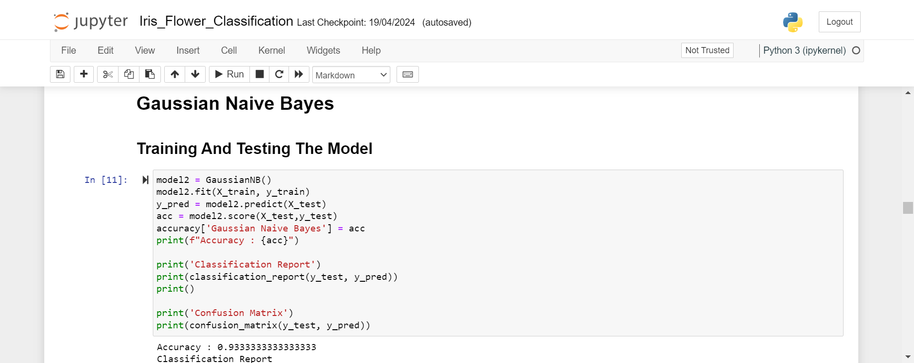
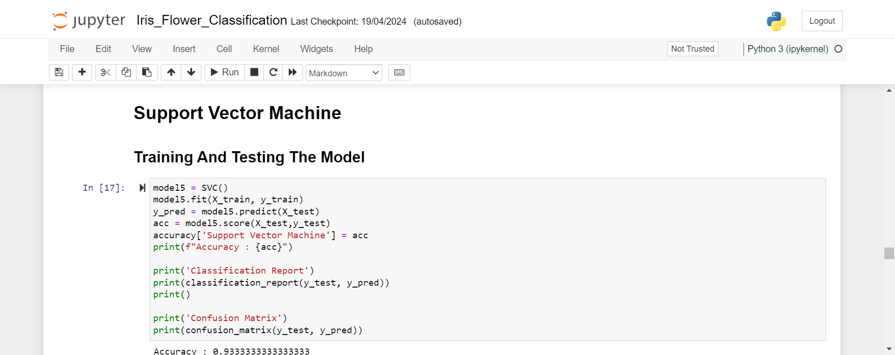
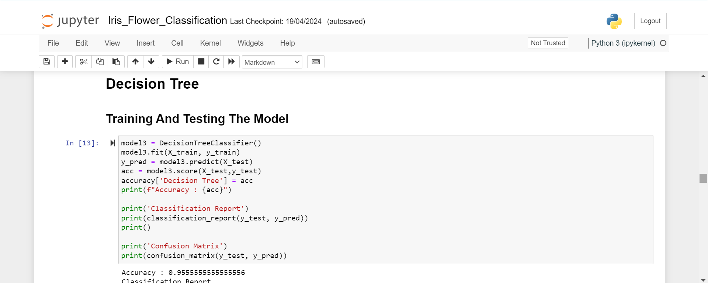
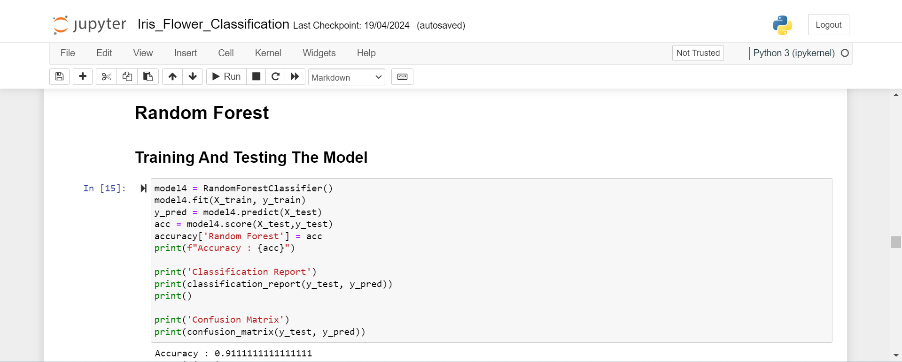
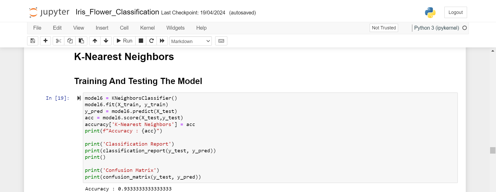
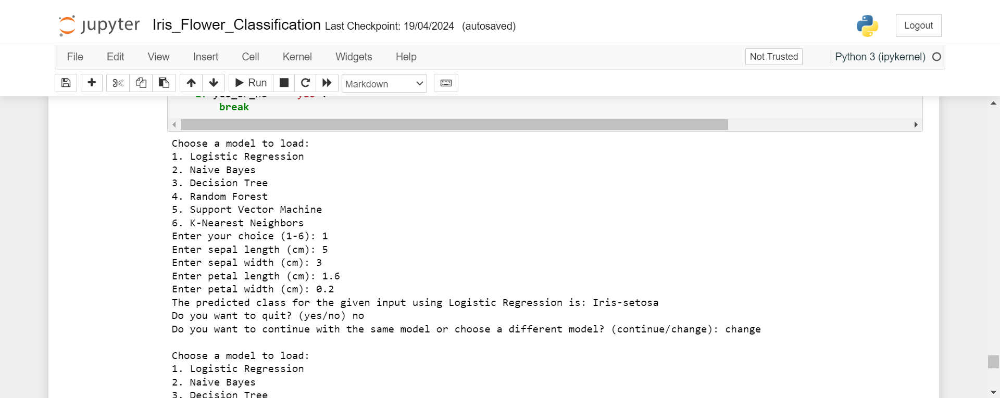

# Iris Flower Classification Project

## Overview

This project aims to build machine learning models for classifying iris flowers into three species based on their sepal and petal measurements. The project utilizes the famous Iris dataset, containing 150 samples with measurements for four features: sepal length, sepal width, petal length, and petal width. The target variable is the species of iris flower.

## Models Used
   - Logistic Regression
   - Gaussian Naive Bayes
   - Decision Trees
   - Random Forests
   - k-Nearest Neighbors
   - Support Vector Machine

## Screenshots

**Logistic Regression**

**Gaussian Naive Bayes**

**Support Vector Machine**

**Decision Tree**

**Random Forest**

**k-Nearest Neighbors**

**Taking user-input**

  
