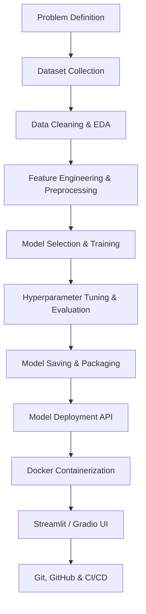

# 🗺️ End-to-End Machine Learning Project Roadmap for Beginners

Welcome to the **End-to-End Machine Learning Project Roadmap**! This guide is designed for beginners who understand basic machine learning algorithms but struggle to build, structure, and deploy complete real-world projects. 

Instead of focusing solely on `model.fit()`, this roadmap covers the entire lifecycle of a production-ready machine learning system:



---

## 📑 Table of Contents
1. [Problem Definition](#1-problem-definition)
2. [Dataset Collection](#2-dataset-collection)
3. [Data Cleaning](#3-data-cleaning)
4. [Exploratory Data Analysis (EDA)](#4-exploratory-data-analysis-eda)
5. [Feature Engineering](#5-feature-engineering)
6. [Data Preprocessing](#6-data-preprocessing)
7. [Model Selection](#7-model-selection)
8. [Model Training](#8-model-training)
9. [Hyperparameter Tuning](#9-hyperparameter-tuning)
10. [Model Evaluation](#10-model-evaluation)
11. [Model Saving](#11-model-saving)
12. [Model Deployment using Flask/FastAPI](#12-model-deployment-using-flaskfastapi)
13. [Docker Containerization](#13-docker-containerization)
14. [Streamlit/Gradio Demo](#14-streamlitgradio-demo)
15. [Git & GitHub Best Practices](#15-git--github-best-practices)
16. [CI/CD Basics](#16-cicd-basics)
17. [Project Folder Structure](#17-project-folder-structure)
18. [Common Beginner Mistakes](#18-common-beginner-mistakes)
19. [Recommended Learning Resources](#19-recommended-learning-resources)

---

## 1. Problem Definition

### Explanation
Before writing code or collecting data, you must clearly frame the problem. A well-defined machine learning task translates a business or research goal into a technical ML formulation:
- **Supervised Learning**: Predict a target variable.
  - **Regression**: Continuous target (e.g., predicting house prices).
  - **Classification**: Discrete labels (e.g., predicting spam vs. ham).
- **Unsupervised Learning**: Discover hidden patterns.
  - **Clustering**: Grouping similar customers.
  - **Dimensionality Reduction**: Visualizing complex high-dimensional data.

### Best Practices
- **Define the metric for success** before starting (e.g., "Achieve 95% recall for fraudulent transactions").
- **Establish a baseline**: What is the simplest heuristic you can use as a benchmark? (e.g., guessing the most frequent class).
- Assess if machine learning is even needed, or if a simple rule-based system is sufficient.

### Practical Example
*Goal*: Reduce churn for a SaaS application.
*ML Task*: Binary Classification (Class `1` = Churned, Class `0` = Retained) based on historical user activity datasets.

### Useful Tools and Libraries
- [Jira](https://www.atlassian.com/software/jira) / [Trello](https://trello.com/) (For task tracking)
- Confluence / Notion (For documenting project scope)

### References
- [Google's Rules of Machine Learning](https://developers.google.com/machine-learning/guides/rules-of-ml)

---

## 2. Dataset Collection

### Explanation
To train a model, you need data. Datasets can be acquired in several ways:
- **Public Repositories**: Premade datasets for learning.
- **Web Scraping**: Gathering data from websites programmatically.
- **APIs**: Fetching real-time/structured data from web services.
- **Databases**: Querying SQL or NoSQL databases.

### Best Practices
- Verify the license and terms of service before using or sharing a dataset.
- Keep raw datasets separate from processed datasets; **never modify the raw data files directly**.
- Document dataset schema, size, source, and versioning.

### Practical Example
Fetching data from a public API using Python:
```python
import requests
import pandas as pd

# Fetch weather forecast data
url = "https://api.open-meteo.com/v1/forecast?latitude=52.52&longitude=13.41&hourly=temperature_2m"
response = requests.get(url)
data = response.json()

# Convert to DataFrame
df_weather = pd.DataFrame(data['hourly'])
print(df_weather.head())
```

### Useful Tools and Libraries
- **Libraries**: `requests`, `urllib`, `beautifulsoup4`, `scrapy`
- **Repositories**: [Kaggle](https://www.kaggle.com/), [Hugging Face Datasets](https://huggingface.co/datasets), [UCI Machine Learning Repository](https://archive.ics.uci.edu/)

### References
- [Kaggle Datasets Guide](https://www.kaggle.com/docs/datasets)

---

## 3. Data Cleaning

### Explanation
Raw data is almost always messy. Data cleaning is the process of detecting and correcting (or removing) corrupt, inaccurate, missing, or irrelevant records from a dataset.

### Best Practices
- **Never drop missing rows blindly**: Analyze why the data is missing (MCAR, MAR, MNAR) and apply appropriate imputation techniques.
- Ensure data types are correct (e.g., date strings converted to datetime objects).
- Remove true duplicates, but verify that they aren't identical valid entries.

### Practical Example
Cleaning a dataset using Pandas:
```python
import pandas as pd
import numpy as np

# Sample data
data = {
    'age': [25, np.nan, 30, 25, 120],  # 120 is an outlier
    'salary': [50000, 60000, np.nan, 50000, 80000]
}
df = pd.DataFrame(data)

# 1. Drop exact duplicates
df = df.drop_duplicates()

# 2. Impute missing numeric values using the median
df['age'] = df['age'].fillna(df['age'].median())
df['salary'] = df['salary'].fillna(df['salary'].median())

# 3. Filter out unrealistic outliers
df = df[df['age'] < 100]
print(df)
```

### Useful Tools and Libraries
- **Libraries**: `pandas`, `numpy`, `missingno` (for visualizing missing data)

### References
- [Pandas Handling Missing Data Guide](https://pandas.pydata.org/pandas-docs/stable/user_guide/missing_data.html)

---

## 4. Exploratory Data Analysis (EDA)

### Explanation
EDA is the process of examining a dataset to understand its characteristics, discover patterns, spot anomalies, and test hypotheses using summary statistics and graphical representations.

### Best Practices
- Start with univariate analysis (one variable at a time), then proceed to bivariate and multivariate relationships.
- Use correlation matrices to spot potential multi-collinearity issues.
- Check target class distributions to check for class imbalance.

### Practical Example
Plotting distributions and correlations with Seaborn:
```python
import pandas as pd
import seaborn as sns
import matplotlib.pyplot as plt

# Load sample dataset
df = sns.load_dataset("iris")

# 1. Pairplot to see feature relationships
sns.pairplot(df, hue="species")
plt.show()

# 2. Correlation heatmap for numeric attributes
sns.heatmap(df.corr(numeric_only=True), annot=True, cmap="coolwarm")
plt.show()
```

### Useful Tools and Libraries
- **Libraries**: `matplotlib`, `seaborn`, `plotly`
- **Automated EDA**: `ydata-profiling` (formerly `pandas-profiling`), `sweetviz`

### References
- [Exploratory Data Analysis: A Practical Guide](https://towardsdatascience.com/exploratory-data-analysis-a-practical-guide-and-template-for-structured-data-abfbf3ee3d2a)

---

## 5. Feature Engineering

### Explanation
Feature engineering involves transforming raw data into features that better represent the underlying problem to predictive models, thereby improving model accuracy.

### Best Practices
- Avoid **Data Leakage**: Do not use target statistics or future information in your features (e.g., fit scaling parameters *only* on the training set).
- Keep transformations simple. Too many engineered features can lead to overfitting.
- Handle categorical columns using One-Hot Encoding (for nominal data) or Ordinal Encoding (for ordered data).

### Practical Example
Engineering features in Pandas:
```python
import pandas as pd

df = pd.DataFrame({
    'timestamp': ['2026-07-19 12:00:00', '2026-07-20 18:30:00'],
    'category': ['High', 'Low']
})

# 1. Parse datetime features
df['timestamp'] = pd.to_datetime(df['timestamp'])
df['hour'] = df['timestamp'].dt.hour
df['day_of_week'] = df['timestamp'].dt.dayofweek

# 2. Categorical Encoding
df = pd.get_dummies(df, columns=['category'], drop_first=True)
print(df)
```

### Useful Tools and Libraries
- **Libraries**: `scikit-learn`, `feature-engine`, `category_encoders`

### References
- [Feature Engineering Handbook](https://scikit-learn.org/stable/modules/preprocessing.html)

---

## 6. Data Preprocessing

### Explanation
Data preprocessing prepares the clean, engineered features for the machine learning algorithms. This includes scaling numeric values, handling highly imbalanced targets, and building reusable transformation pipelines.

### Best Practices
- **Scale features** (using Standard or Min-Max scaling) for distance-based models (KNN, SVM) and gradient-based models (Neural Networks, Logistic Regression). Tree-based models (Random Forest, XGBoost) generally do not require feature scaling.
- Create automated `Pipeline` architectures to ensure consistency across training and serving.

### Practical Example
Using Scikit-Learn Pipelines for preprocessing:
```python
from sklearn.pipeline import Pipeline
from sklearn.preprocessing import StandardScaler
from sklearn.impute import SimpleImputer
import numpy as np

# Sample numerical array
X = np.array([[1.0, 2.0], [np.nan, 3.0], [5.0, 6.0]])

# Define a pipeline containing imputation and scaling
num_pipeline = Pipeline([
    ('imputer', SimpleImputer(strategy='median')),
    ('scaler', StandardScaler())
])

X_preprocessed = num_pipeline.fit_transform(X)
print(X_preprocessed)
```

### Useful Tools and Libraries
- **Libraries**: `scikit-learn`, `imbalanced-learn` (for SMOTE, downsampling)

### References
- [Scikit-Learn Pipelines Tutorial](https://scikit-learn.org/stable/modules/compose.html)

---

## 7. Model Selection

### Explanation
Model selection is the task of choosing the most appropriate machine learning algorithm(s) for your dataset. This involves running quick benchmarks on multiple model families.

### Best Practices
- Start with a simple **baseline model** (e.g., Logistic Regression or a Decision Tree).
- Choose models based on constraint factors: interpretability, prediction latency, memory footprint, and data size.
- Do not jump straight to Deep Learning unless simple tabular models fail to meet requirements.

### Practical Example
Benchmarking multiple models on a classification task:
```python
from sklearn.datasets import make_classification
from sklearn.model_selection import cross_val_score
from sklearn.linear_model import LogisticRegression
from sklearn.ensemble import RandomForestClassifier
from xgboost import XGBClassifier

# Generate synthetic dataset
X, y = make_classification(n_samples=1000, n_features=20, random_state=42)

# Define models
models = {
    "Logistic Regression": LogisticRegression(),
    "Random Forest": RandomForestClassifier(),
    "XGBoost": XGBClassifier(use_label_encoder=False, eval_metric='logloss')
}

# Cross-validate models
for name, model in models.items():
    scores = cross_val_score(model, X, y, cv=5, scoring='accuracy')
    print(f"{name}: Mean Accuracy = {scores.mean():.4f}")
```

### Useful Tools and Libraries
- **Libraries**: `scikit-learn`, `xgboost`, `lightgbm`, `catboost`
- **AutoML Tools**: `lazypredict`, `pycaret`

### References
- [Choosing the Right Estimator in Scikit-Learn](https://scikit-learn.org/stable/tutorial/machine_learning_map/index.html)

---

## 8. Model Training

### Explanation
Model training is the phase where the chosen machine learning algorithm learns patterns from your training dataset.

### Best Practices
- Partition your dataset into **Train, Validation, and Test sets** (typically 70/15/15 or 80/20 train/test split).
- **Never train on the test set**. The test set should only be evaluated once, at the very end.
- Use early stopping to prevent models from overfitting during iterative training.

### Practical Example
Training a Random Forest Classifier:
```python
from sklearn.model_selection import train_test_split
from sklearn.ensemble import RandomForestClassifier
from sklearn.datasets import load_iris

# Load data
iris = load_iris()
X, y = iris.data, iris.target

# Split data
X_train, X_test, y_train, y_test = train_test_split(X, y, test_size=0.2, random_state=42)

# Train model
model = RandomForestClassifier(n_estimators=100, random_state=42)
model.fit(X_train, y_train)
print("Model trained successfully.")
```

### Useful Tools and Libraries
- **Libraries**: `scikit-learn`, `PyTorch`, `TensorFlow`
- **Experiment Tracking**: `mlflow`, `weights-biases` (W&B), `neptune.ai`

### References
- [Train, Validation, and Test Sets Explained](https://towardsdatascience.com/train-validation-and-test-sets-72cb40c0cd02)

---

## 9. Hyperparameter Tuning

### Explanation
Hyperparameters are parameters configured before training (e.g., number of trees in Random Forest, learning rate). Hyperparameter tuning searches for the optimal values to yield the best evaluation scores.

### Best Practices
- Avoid tuning hyper-parameters on the test set, as this causes data leakage. Always use validation datasets or K-fold Cross-Validation.
- Start with a broad, coarse search (Random Search), then refine with a narrower search (Grid Search or Bayesian Optimization).

### Practical Example
Tuning hyperparameters with Optuna:
```python
import optuna
from sklearn.ensemble import RandomForestClassifier
from sklearn.model_selection import cross_val_score
from sklearn.datasets import load_iris

X, y = load_iris(return_X_y=True)

def objective(trial):
    # Suggest hyperparameter bounds
    n_estimators = trial.suggest_int('n_estimators', 10, 100)
    max_depth = trial.suggest_int('max_depth', 2, 10)
    
    # Instantiate and score model
    clf = RandomForestClassifier(n_estimators=n_estimators, max_depth=max_depth, random_state=42)
    score = cross_val_score(clf, X, y, n_jobs=-1, cv=3).mean()
    return score

# Perform optimization study
study = optuna.create_study(direction='maximize')
study.optimize(objective, n_trials=20)
print(f"Best Trial: Accuracy = {study.best_value:.4f}, Config = {study.best_params}")
```

### Useful Tools and Libraries
- **Libraries**: `scikit-learn` (`GridSearchCV`, `RandomizedSearchCV`), `optuna`, `ray-tune`

### References
- [Introduction to Optuna](https://optuna.org/#code-explain)

---

## 10. Model Evaluation

### Explanation
Model evaluation calculates metrics on the validation and test datasets to determine how well the model generalizes to unseen data.

### Best Practices
- **For Imbalanced Classification**: Never rely on Accuracy alone. Use F1-Score, Precision, Recall, Precision-Recall AUC, and confusion matrices.
- **For Regression**: Always cross-reference metrics like RMSE or MAE with the standard deviation of your target variable to assess context.

### Practical Example
Evaluating classification metrics:
```python
from sklearn.metrics import classification_report, confusion_matrix, roc_auc_score
from sklearn.ensemble import RandomForestClassifier
from sklearn.model_selection import train_test_split
from sklearn.datasets import make_classification

X, y = make_classification(n_samples=1000, weights=[0.9, 0.1], random_state=42) # Imbalanced
X_train, X_test, y_train, y_test = train_test_split(X, y, test_size=0.2, random_state=42)

model = RandomForestClassifier(random_state=42).fit(X_train, y_train)
y_pred = model.predict(X_test)
y_prob = model.predict_proba(X_test)[:, 1]

print("Classification Report:")
print(classification_report(y_test, y_pred))
print(f"ROC-AUC Score: {roc_auc_score(y_test, y_prob):.4f}")
```

### Useful Tools and Libraries
- **Libraries**: `scikit-learn` (`sklearn.metrics`), `yellowbrick` (for visualization)

### References
- [Understanding Machine Learning Evaluation Metrics](https://towardsdatascience.com/metrics-to-evaluate-your-machine-learning-algorithm-f10ba6e38234)

---

## 11. Model Saving

### Explanation
Once trained and evaluated, the model must be written to disk to allow running inference on new data without retraining.

### Best Practices
- Always serialize your data preprocessing objects (e.g., scalers, encoders) alongside the model.
- Keep track of the model version, dependencies, and environment definitions to prevent mismatch issues when running in production.

### Practical Example
Saving and loading models with `joblib`:
```python
import joblib
from sklearn.ensemble import RandomForestClassifier
from sklearn.datasets import load_iris

# Train
X, y = load_iris(return_X_y=True)
model = RandomForestClassifier().fit(X, y)

# Save the model
joblib.dump(model, "random_forest_model.joblib")
print("Model saved to disk.")

# Load the model
loaded_model = joblib.load("random_forest_model.joblib")
predictions = loaded_model.predict([[5.1, 3.5, 1.4, 0.2]])
print(f"Predictions: {predictions}")
```

### Useful Tools and Libraries
- **Serialization Libraries**: `joblib`, `pickle`, `onnx` (highly interoperable), `mlflow.models`

### References
- [Model Persistence - Scikit-Learn](https://scikit-learn.org/stable/modules/model_persistence.html)

---

## 12. Model Deployment using Flask/FastAPI

### Explanation
Deployment exposes the saved model as a web service API that accepts HTTP requests (containing features) and returns predictions (inferences).

### Best Practices
- Prefer **FastAPI** over Flask for new projects due to automatic validation, speed, and asynchronous request support.
- Document input and output payloads using standard schemas (e.g., Pydantic models).

### Practical Example
Exposing a model API with FastAPI:
```python
from fastapi import FastAPI
from pydantic import BaseModel
import joblib
import numpy as np

# 1. Define FastAPI application
app = FastAPI(title="Iris Prediction API")

# 2. Define input data schema
class IrisInput(BaseModel):
    sepal_length: float
    sepal_width: float
    petal_length: float
    petal_width: float

# 3. Load model mock or real model
# For execution safety, we define a fallback dummy prediction if file is missing
try:
    model = joblib.load("random_forest_model.joblib")
except Exception:
    model = None

@app.post("/predict")
def predict(data: IrisInput):
    features = np.array([[data.sepal_length, data.sepal_width, data.petal_length, data.petal_width]])
    if model:
        prediction = int(model.predict(features)[0])
    else:
        prediction = 0  # Fallback dummy class
    return {"prediction": prediction}
```

To run this application locally:
```bash
pip install fastapi uvicorn
uvicorn app:app --reload
```

### Useful Tools and Libraries
- **APIs**: `fastapi`, `uvicorn`, `flask`
- **WSGI/ASGI Servers**: `gunicorn`, `uvicorn`

### References
- [FastAPI Tutorial: First Steps](https://fastapi.tiangolo.com/tutorial/first-steps/)

---

## 13. Docker Containerization

### Explanation
Docker packages an application (the API and model) alongside all its dependencies and OS libraries into a lightweight container, ensuring it runs identically on any server environment.

### Best Practices
- Use official, lightweight python base images (e.g., `python:3.10-slim`).
- Do not run container processes as root in production.
- Use `.dockerignore` files to exclude heavy local folders (`.venv`, data files, `.git`).

### Practical Example
A sample `Dockerfile` for our FastAPI model application:
```dockerfile
# Use a lightweight official Python runtime as a parent image
FROM python:3.10-slim

# Set the working directory in the container
WORKDIR /app

# Copy dependency definition
COPY requirements.txt .

# Install dependencies
RUN pip install --no-cache-dir -r requirements.txt

# Copy application code and models
COPY app.py .
COPY random_forest_model.joblib .

# Expose port
EXPOSE 8000

# Command to run the FastAPI app via Uvicorn
CMD ["uvicorn", "app:app", "--host", "0.0.0.0", "--port", "8000"]
```

Build and run commands:
```bash
docker build -t iris-prediction-app .
docker run -p 8000:8000 iris-prediction-app
```

### Useful Tools and Libraries
- [Docker Desktop](https://www.docker.com/products/docker-desktop/)

### References
- [Dockerizing Python Applications Guide](https://docs.docker.com/language/python/)

---

## 14. Streamlit/Gradio Demo

### Explanation
Streamlit and Gradio enable you to build clean web frontends for your machine learning models in pure Python, making it easy to showcase your work to non-technical stakeholders.

### Best Practices
- Cache model loading using decorators to prevent reading model weights from disk on every interaction.
- Add user-friendly input controls (sliders, select boxes, file upload interfaces) to prevent invalid configurations.

### Practical Example
A simple `streamlit_app.py`:
```python
import streamlit as st
import numpy as np
import joblib

st.title("🌸 Iris Flower Classifier")

# Load model with caching
@st.cache_resource
def load_model():
    try:
        return joblib.load("random_forest_model.joblib")
    except Exception:
        return None

model = load_model()

# Sliders for user input
sl = st.slider("Sepal Length", 4.0, 8.0, 5.4)
sw = st.slider("Sepal Width", 2.0, 5.0, 3.4)
pl = st.slider("Petal Length", 1.0, 7.0, 1.5)
pw = st.slider("Petal Width", 0.1, 3.0, 0.2)

if st.button("Predict"):
    if model:
        prediction = model.predict([[sl, sw, pl, pw]])[0]
        classes = ["Setosa", "Versicolor", "Virginica"]
        st.success(f"Prediction: {classes[prediction]}")
    else:
        st.error("Model file not found. Please train and save the model first.")
```

Run command:
```bash
pip install streamlit
streamlit run streamlit_app.py
```

### Useful Tools and Libraries
- **UIs**: [Streamlit](https://streamlit.io/), [Gradio](https://gradio.app/)

### References
- [Streamlit Get Started Guide](https://docs.streamlit.io/library/get-started)

---

## 15. Git & GitHub Best Practices

### Explanation
Version control tracks code changes and coordinates team projects. Using structured practices helps keep code clean and deployable.

### Best Practices
- **Always write a `.gitignore`** file to exclude credential files, local environments (`.venv`), heavy datasets (`.csv`), and model weights (`.joblib`, `.h5`).
- Keep commits focused on logical changes; write concise, descriptive commit messages.
- Never push straight to the main/master branch; create a feature branch and submit a Pull Request.

### Practical Example
A standard `.gitignore` file for Python ML projects:
```
# Environments
.venv/
env/
__pycache__/
*.pyc

# Data & Models
data/
*.csv
*.joblib
*.pkl
*.onnx

# IDEs and OS files
.idea/
.vscode/
.DS_Store
```

### Useful Tools and Libraries
- [Git](https://git-scm.com/)
- [GitHub CLI](https://cli.github.com/)

### References
- [GitHub Guides on Version Control](https://github.com/git-guides)

---

## 16. CI/CD Basics

### Explanation
Continuous Integration (CI) and Continuous Deployment (CD) automatically test, lint, format, and deploy your code whenever updates are pushed to version control.

### Best Practices
- Run automated unit tests on data processing steps (like null checks or shape assertions).
- Automatically scan code for formatting consistency using Linters (`flake8`, `black`, `pylint`).

### Practical Example
A GitHub Actions workflow configuration (`.github/workflows/ci.yml`):
```yaml
name: Python CI

on:
  push:
    branches: [ master, main ]
  pull_request:
    branches: [ master, main ]

jobs:
  build-and-test:
    runs-on: ubuntu-latest

    steps:
    - name: Check out repository
      uses: actions/checkout@v3

    - name: Set up Python
      uses: actions/setup-python@v4
      with:
        python-version: '3.10'

    - name: Install dependencies
      run: |
        python -m pip install --upgrade pip
        pip install flake8 pytest -r requirements.txt

    - name: Lint code
      run: |
        # stop the build if there are Python syntax errors or undefined names
        flake8 . --count --select=E9,F63,F7,F82 --show-source --statistics

    - name: Run unit tests
      run: |
        pytest
```

### Useful Tools and Libraries
- **CI platforms**: GitHub Actions, GitLab CI, CircleCI
- **Code validation**: `pytest`, `flake8`, `black`

### References
- [Introduction to GitHub Actions](https://docs.github.com/en/actions/learn-github-actions/understanding-github-actions)

---

## 17. Project Folder Structure

### Explanation
A consistent project directory structure makes code readable, maintainable, and simple to productionize.

### Recommended Layout
```
my-ml-project/
├── .github/
│   └── workflows/
│       └── ci.yml             # GitHub Actions configurations
├── data/
│   ├── raw/                   # Immutable raw datasets
│   └── processed/             # Cleaned, split data
├── models/
│   └── random_forest.joblib   # Saved model files
├── src/                       # Main source code package
│   ├── __init__.py
│   ├── preprocess.py          # Data cleaning and scaling
│   ├── train.py               # Model training script
│   └── predict.py             # Inference functions
├── tests/
│   └── test_preprocess.py     # Unit tests for preprocessing
├── app.py                     # FastAPI API app definition
├── streamlit_app.py           # Streamlit dashboard
├── Dockerfile                 # Docker configuration
├── .dockerignore              # Files ignored by Docker
├── .gitignore                 # Files ignored by Git
├── requirements.txt           # Package dependencies
└── README.md                  # Project documentation
```

### Best Practices
- Keep notebooks in a separate folder (e.g. `notebooks/`) and use them only for research or EDA. Production pipelines should always reside in standard Python scripts (`.py`).
- Avoid absolute paths. Always use relative imports or path libraries (like Python's built-in `pathlib`).

---

## 18. Common Beginner Mistakes

### Explanation
Understanding what *not* to do is just as important as knowing how to do it. Here are key common mistakes beginners make in ML projects:

1. **Data Leakage**: Preprocessing features using statistics from the validation or test sets. Remember: **Fit scaling transformers only on training sets**, then apply (`transform`) to others.
2. **Ignoring Class Imbalance**: Relying on accuracy metrics for highly skewed datasets. A model predicting 99% accuracy on a dataset where 99% of values are normal is completely useless.
3. **Overcomplicating the Model**: Defaulting directly to complex Deep Learning architectures without running standard simple baselines.
4. **Hardcoding Paths**: Hardcoding local paths like `C:\Users\Name\Desktop\data.csv`. This will crash instantly when run on another system or container.
5. **No Version Control**: Tracking progress by saving files like `model_v1.pkl`, `model_v2_final.pkl`, `model_v2_final_v2.pkl`.

---

## 19. Recommended Learning Resources

### Books
- *Hands-On Machine Learning with Scikit-Learn, Keras, and TensorFlow* by Aurélien Géron.
- *Designing Machine Learning Systems* by Chip Huyen.

### Online Courses
- **Machine Learning Zoomcamp** (Free, Practical, and Hands-on course by DataTalks.Club).
- **DeepLearning.AI Machine Learning Specialization** by Andrew Ng (Coursera).

### Video Content & YouTube Channels
- [StatQuest with Josh Starmer](https://www.youtube.com/@statquest) (Visual explanations of ML concepts).
- [Kris Naik](https://www.youtube.com/@krishnaik06) (End-to-end ML project walkthroughs).
- [FreeCodeCamp](https://www.youtube.com/@freecodecamp) (Detailed programming courses).

---

🚀 **Happy Coding!** Build robust, end-to-end projects and share them with the community.
