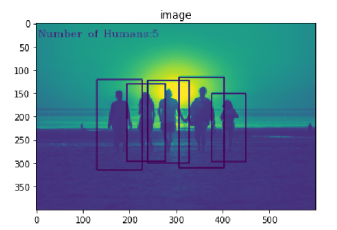

# Number of people counter project

This code detects the presence of human and also counts the number of humans present in the frame.

For this project, the python libraries required are-
* OpenCV
* Imutils

Moreover, we have used **HOGDescriptor** for detection of humans.Histogram of oriented gradients(HOG) is an object detector used to detect objects in computer vision.The technique counts occurrence of gradient orientation in localized portions of an image.The cv2.HOGDescriptor() method creates the HOG descriptor,then the hog.setSVMDetector() method sets coefficients for linear SvM classifier, the hog.detectMultiscale() method detects objects of different sizes in the input image.
For more information about **HOG** ,you may visit [HistogramOfOrientedGradients](https://learnopencv.com/histogram-of-oriented-gradients/)

**The Output of the project gives the number of humans in the frame.**

