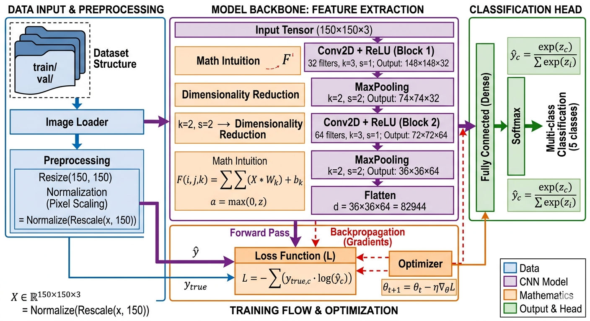
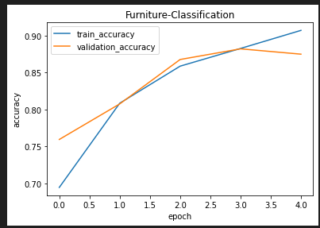
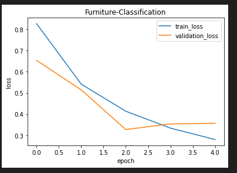

# 🧠 Object Detection Pipeline using CNN (TensorFlow / Keras)

  


  

> A complete, production-style deep learning pipeline for image classification using Convolutional Neural Networks (CNNs), built with TensorFlow/Keras.

> Covers the full lifecycle: **data ingestion → preprocessing → model design → training → evaluation → visualization**

  

---

  

## 📌 Overview

This repository presents an end-to-end implementation of an **image classification system** (often loosely referred to as object detection in beginner contexts) using deep learning.

The project is designed not just as a model, but as a **structured machine learning pipeline**, demonstrating how raw image data is transformed into a trained predictive system.

Unlike minimal tutorials, this implementation emphasizes:

- Reproducibility
- Clear pipeline separation
- Model interpretability
- Training diagnostics
- Scalable design principles

--- 

## Objective

Given an input image:

$X \in R^{(150,150,3)}$ Learn a mapping function: $f(X : \theta)  \to y$

Where:

- $\theta$ = trainable parameters of the CNN
- $y$ = predicted class label (multi-class classification)
---
## 🧩 System Pipeline
The project follows a standard deep learning workflow:
```
Raw Dataset
↓
Data Loading (Directory-based)
↓
Preprocessing (Resizing, Normalization)
↓
CNN Feature Extraction
↓
Dense Classification Head
↓
Training (Backpropagation + Optimization)
↓
Evaluation (Metrics & Loss Analysis)
↓
Visualization (Graphs & Predictions)
```
---
## 📂 Project Structure
```
├── object_detection.ipynb # Core implementation notebook
├── model_plot.png # Visualized model architecture
├── dataset/
│ ├── train/ # Training images
│ └── validation/ # Validation images
├── assets/
│ ├── training_graph.png
│ └── sample_output.png
├── Object Detection with YOLO v8 and Single Stage architectures/ #Contains streamlit app and YOLO v8 architecture related notebooks!
├── requirements.txt
└── README.md
```
---


## 📊 Dataset Description

- **Domain**: Furniture Image Classification
- **Type**: Multi-class supervised learning
- **Input Size**: 150 × 150 × 3 (RGB images)

  

### 📁 Organization

```

dataset/
├── train/
│ ├── class_1/
│ ├── class_2/
│ └── ...
├── validation/
│ ├── class_1/
│ ├── class_2/
│ └── ...

``
  

### 🔍 Key Characteristics
- Folder-based labeling (implicit labels)

- Balanced / semi-balanced classes

- Real-world variability (lighting, angle, background)
---

## ⚙️ Environment Setup
### 1. Clone Repository
```bash
git clone https://github.com/your-username/object-detection.git
cd object-detection
```
### 2. Install Dependencies
```
pip install -r requirements.txt
```
Or manually:
```
pip install tensorflow keras numpy matplotlib opencv-python
```
### 3. Run Notebook

```
jupyter notebook object_detection.ipynb
```

# Model Architecture



The model is a Convolutional Neural Network (CNN) designed to extract hierarchical spatial features.

  

### 🔬 Architecture Design

```
Input Layer (150x150x3)
↓
Conv2D → ReLU
↓
MaxPooling
↓
Conv2D → ReLU
↓
MaxPooling
↓
Flatten
↓
Dense Layer
↓
Softmax Output Layer
```

  

### ⚙️ Mathematical Insight

- **Convolution Operation:**

$$FeatureMap(i,j) = \sum\sum (Input × Kernel)$$
- Activation Function
$$ReLU(x) = \max(0, x)$$

### Loss Function

Categorical Crossentropy:

$$L = - \sum y_{true} log(y_{pred})$$

  

### Architecture Visualization

📈 Training Configuration

```
Parameter, Value
Epochs: 5
Batch Size: 32
Optimizer: Adam
Loss Function: Categorical Crossentropy
Metrics: Accuracy
```
### ⚡ Training Dynamics
The model is trained using adam optimizer where gradients are computed and weights updated:

$$m_t = \beta_1m_{t-1} + (1-\beta_1)\nabla L$$
$$v_t = \beta_2v_{t-1} + (1 - \beta_2)(\nabla L)^2$$
$$\hat{v_t} = \frac{v_t}{\sqrt{1 - \beta_2^{t}}} $$
$$\hat{m_t} = \frac{m_t}{\sqrt{1 - \beta_1^{t}}}$$
$$\theta = \theta - \frac{\eta \hat{m_t}}{\sqrt{\hat{v_t}  + \epsilon}}$$

Where:
- $\eta$ = learning rate
- $\nabla L$ = gradient of loss
- $m_t$ = Momentum at time t
- $v_t$ = Variance at time t
---

### Results & Performance

The model demonstrates:
- Strong convergence behavior
- Increasing training accuracy
- Stable validation performance
---
### Training Curves





---

### Model Evaluation

Key observations:

- No severe overfitting observed
- Validation accuracy follows training trend
- Loss decreases consistently

  

### Visualization

The project includes visual diagnostics:

- Training samples inspection
- Class-wise distribution
- Prediction outputs

---

For Sub folder `Object Detection/Object Detection with YOLO v8 and Single Stage architectures`

---
# Object Detection
#### **What could be an architecture to do this task?**

A straight-forward approach to this task is training a Convolutional Neural Network (CNN) with a multi-headed output: one head for classification and another for localization.

The Workflow:
- Train a CNN model.
- Extract the flattened layer feature map.
- Pass the features simultaneously through the classification and localization heads.
- Verify that the classification and localization outputs correspond correctly to the same object.

The above mentioned basic CNN architecture , YOLO(You Only Look Once) , SSD(Single Shot Multi-Box Detector) all come under Single - Stage Detector Architectures simply because they detect the object in a single forward pass.

**Note** : Single - Stage detector architectures are fast but they can struggle with precision, particularly on small or overlapping objects.

#### **How Do We Prioritize Precision**?
Single-stage detectors often struggle with precision, which indirectly creates a lot of false positives. To overcome the problem of false positives, you can implement the following strategies:

**1.Control the Confidence Level**
You can filter out low-certainty predictions by raising the model's confidence threshold. By demanding a higher confidence score before a bounding box is displayed, you eliminate noisy, incorrect detections.

**2.Add a Rechecking Head (Two-Stage Architecture)**
You can introduce a dedicated "rechecking head" by moving to a two-stage detector architecture (like Faster R-CNN).

- Stage 1 : acts as a quick filter to propose potential object regions.

- Stage 2 : acts as the rechecking mechanism, meticulously evaluating only those proposed regions to confirm exactly what and where the objects are.

#### **What can we do to improvise the previous architecture?**

The previous architecture we designed can track only upto one object in an image what if we had more than one object? 

The primary limitation of a standard global regression architecture is its inability to detect multiple objects simultaneously, as it is mathematically constrained to output a single set of coordinates per image.

To resolve this, we can discretize the input image into a localized grid of smaller, uniform sub-regions (or 'cells'). By shifting the network's objective from a single global prediction to multiple localized predictions, each individual cell becomes responsible for detecting at most one object whose center falls within its boundaries. If a sub-region contains no object, it is simply classified as background. This grid-based approach effectively transforms a complex, multi-object detection task into parallel, single-object regression problems.

#### **How do we create Grid Division?**

### How Convolutional Layers Enable Multi-Object Detection

Using a Convolutional Neural Network (CNN) for object detection allows us to predict a specific number of variables per grid cell. The total number of predicted variables equals:

$$\text{Total Variables} = 1 \text{ (Object Confidence)} + 4 \text{ (Bounding Box Coordinates)} + N \text{ (Number of Classes)}$$

According to your configuration file, the dataset has exactly $N = 6$ classes (`nc: 6`). Substituting this into the formula gives:

$$\text{Total Variables} = 1 + 4 + 6 = 11$$

Instead of predicting one global set of coordinates for the entire image, the convolutional backbone processes the image while maintaining spatial conservation, effectively treating the output as a grid of smaller localized regions. This allows us to construct an output tensor of shape:

$$\mathbf{(S, S, 11)}$$

In this architecture, the channels inside each individual $(x, y)$ grid cell represent the object's presence, its local bounding coordinates, its dimensions, and its specific classification probabilities.

---

### Channel Mapping Example

For your model trained to detect these 6 specific classes, the channel breakdown for every single cell in the $S \times S$ grid maps out exactly like this:

* **Channel 0 $\to$ Object Confidence:** The probability that an object's center falls inside this specific grid cell (bounded between 0.0 and 1.0).
* **Channel 1 $\to$ Box Center X ($x_c$):** The horizontal center of the bounding box, calculated relative to the boundaries of the current cell.
* **Channel 2 $\to$ Box Center Y ($y_c$):** The vertical center of the bounding box, calculated relative to the boundaries of the current cell.
* **Channel 3 $\to$ Box Width ($w$):** The total width of the bounding box, scaled relative to the dimensions of the entire image.
* **Channel 4 $\to$ Box Height ($h$):** The total height of the bounding box, scaled relative to the dimensions of the entire image.
* **Channel 5 $\to$ Probability:** pistol
* **Channel 6 $\to$ Probability:** smartphone
* **Channel 7 $\to$ Probability:** knife
* **Channel 8 $\to$ Probability:** monedero (purse/wallet)
* **Channel 9 $\to$ Probability:** billete (banknote/bill)
* **Channel 10 $\to$ Probability:** tarjeta (card)

---

### Spatial Overlap Resolution

By organizing the channels this way, the final $1 \times 1$ convolutional layer acts as an array of parallel detectors. If a person is holding a **smartphone** in their hand (activating a grid cell in the center) while a **tarjeta** is sitting on a table in the bottom-right corner, the corresponding spatial cells will activate and output their respective coordinates and probabilities simultaneously without interfering with one another.

#### **NOTE : Convolutional layer preserve spactial data**

So the above method is similar to creating grids

#### **You must have noted that we predict box center why do we do that?**

We have different objects in our image but image a grid cell that has 50% of class 0 and 50% of class 1 what will the grid cell be forced to predict? Also note that we predict Box width and Box Height relative to the size of image so forcing a grid cell to predict center is more practical then forcing indivisual cells to predict indivisually

The box width and height are predicted using sigmoid .. listening to the word sigmoid you must have noted that this can cause vansishing gradients problem because the $$ \text{derivative of sigmoid(x)} = \text{sigmoid(x)(1 - sigmoid(x))}$$ The maximum of this function can be 0.25. So this causes the vanishing gradient problem in the architecture.

#### **ANCHOR BOXES**
**Anchor Boxes (Handling Scale Diversity)**

If a single cell is responsible for a giant object, how does it know how to calculate those massive shapes cleanly without its gradients exploding or vanishing? It uses Anchor Boxes (or prior boxes).

Instead of making the network guess box dimensions completely from scratch, engineers look at the training dataset beforehand and calculate the most common object shapes (e.g., small square boxes for finger fractures, tall skinny boxes for forearm fractures, and giant wide boxes for shoulders).

Every grid cell is given a set of these pre-defined shapes as templates:
- **Anchor 1:** Small Square (Fingers)
- **Anchor 2:** Medium Vertical Rectangle (Forearm)
- **Anchor 3:** Large Horizontal Rectangle (Shoulder/Humerus)

Instead of predicting raw sizes, the cell simply predicts a scaling factor to tweak the closest-matching anchor template:

$$ \text{Final Width} = \text{Anchor Width} \times e^{\text{predicted scale}} $$

If a massive object is present, the cell naturally selects its largest anchor template and scales it up slightly, allowing it to easily capture objects much larger than the cell itself.

### Non-Maximum Suppression (NMS)

Because large objects cover so much territory, a side effect occurs: multiple adjacent grid cells might get confused and all attempt to predict a bounding box for the same giant object. To clean up this mess, **Non-Maximum Suppression (NMS)** filters the final outputs at the very end of the pipeline.


NMS operates through the following algorithmic steps:

1. **Identify the Highest Confidence Box:** It reviews all predicted boxes across the entire grid and selects the one with the absolute highest **Object Confidence** score.
2. **Measure the Overlap (IoU):** It calculates how much the other neighboring boxes overlap with this top-performing box using a metric called **Intersection over Union (IoU)**:

$$\text{IoU} = \frac{\text{Area of Intersection}}{\text{Area of Union}}$$

3. **Suppress the Duplicates:** If a nearby box overlaps with the best box by more than a pre-defined threshold (e.g., more than $50\%$ overlap), NMS assumes they are targeting the same object and aggressively deletes the weaker box.
4. **Repeat:** This loop repeats for the remaining boxes until no overlapping duplicates are left.

This process eliminates the clutter, leaving you with exactly one clean, perfectly fitted bounding box around the massive fracture.

## [Dataset & Mode Weights] 

Please download the dataset and place it in folder `./weapon-detection` and model weights in `.`

**Source:** [Dataset](https://www.kaggle.com/datasets/mehmetcubukcu/weapon-detection)
**Trained Model** [Weights](https://www.kaggle.com/models/divvelaashish/ml-capsule)


Directory Structure 
---
```
.
├── app.py
├── Overview.md
├── pipeline.ipynb
└── requirements.txt
```

Dataset Configuration — weapon-detection/data.yaml
---
Detects 6 classes of items typically found in pockets or bags (nc: 6):

- 0 — pistol · Handguns / Firearms
- 1 — smartphone · Mobile Devices
- 2 — knife · Bladed Weapons
- 3 — monedero · Purse / Wallet
- 4 — billete · Banknotes / Paper Currency
- 5 — tarjeta · Credit / Debit Cards


Setup & Installation
---
Requires Python 3.10+. Clone the repository, then run this command to install dependencies:

```
pip install -r requirements.txt
```

Dependency stack:
---

- torch / torchvision — Deep learning backend
- ultralytics — YOLOv8 framework
- streamlit — Dashboard UI
- matplotlib / pillow — Visualization & image I/O
- tqdm / ipython — Progress tracking & interactive utilities

Dashboard app
---
Use the new `app.py` Streamlit dashboard to upload a test image and see predictions with bounding boxes and class names.

Start the dashboard:

```
streamlit run app.py
```

Then use the sidebar to select a model weight file, choose a confidence threshold, and upload an image.

Architectural Concepts
---
1. Basic Single-Stage Localization
Basic-Single-Stage-ObjectDetection.ipynb
Covers the transition from image classification to bounding box regression. A standard regression head outputs four coordinates $[x_c,\ y_c,\ w,\ h]$
to localize a single primary object within an image.
2. Multi-Object Grid Discretization
YOLOv8-and-problems-in-creating-such-architectures.ipynb
Covers scaling up to handle multiple overlapping targets. The input image is discretized into an S×SS \times S
S×S grid, transforming global regression into parallelized local predictions.
For this 6-class dataset, each grid cell produces an 11-channel output tensor:

- Ch. 0 · confidence — Objectness score (0.0 – 1.0)
- Ch. 1–4 · box — Bounding box coordinates $[x_c , y_c , w , \textit{h} ]$
- Ch. 5–10 · classes — pistol · smartphone · knife · monedero · billete · tarjeta

### Future Improvements
This baseline can be extended significantly:
- Model Enhancements
- Transfer Learning (VGG16, ResNet50)
- ~~Fine-tuning deeper layers~~
- Regularization (Dropout, BatchNorm)
- ~~Add YOLO Single Phase Architecture details~~
- Data Improvements
- Data Augmentation
- Class balancing
- Larger datasets
- Deployment
- REST API (Flask / FastAPI)
- ~~Web App (Streamlit)~~
- Model serving (TensorFlow Serving)

### Contribution Guidelines

We welcome contributions to improve:
- Code quality
- Documentation
- Model performance
- Feature additions

### Open Source Contribution (GSSoC)

This project is enhanced under GirlScript Summer of Code (GSSoC) with a focus on:

- Professional documentation
- Beginner accessibility
- Structured deep learning pipeline

---

## Author

Shubham Saini
⭐ Support
If you found this project useful:
- ⭐ Star the repository
- 🍴 Fork and contribute
- 📢 Share with others

Enhanced By 
Ashish Divvela
