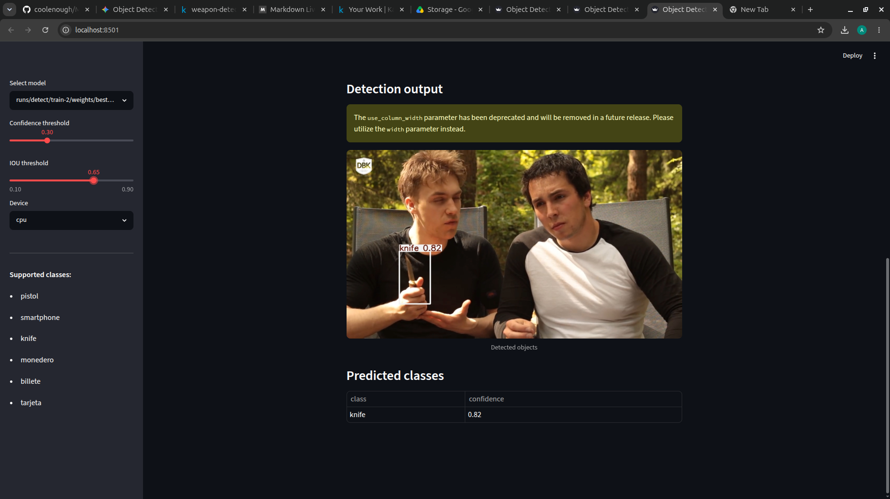

# Object Detection

## Dataset & Model Weights
- Source: Kaggle
- You need to download the dataset and model weights to run the pipeline
- Steps to follow for downloading dataset

> - **Visit Kaggle Dataset and download it** : [Dataset](https://www.kaggle.com/datasets/mehmetcubukcu/weapon-detection)
> - **Create a folder called** `weapon-detection` in current directory

- Steps to download model weights

> - **Visit Kaggle Model Card and download the latest version** : [Weights](https://www.kaggle.com/models/divvelaashish/ml-capsule)
>- Copy the weights into the same folder as project

This project analyzes over a 5k images to detect these classes Pistol, Smartphone, Knife, Purse, Bill (Currency), Card (Credit/Debit Card)

## Key Features
1. Confidence Threshold Visualizations
2. Explains YOLOv8 backend in detail
3. Explains impact of NMS
4. Explains bounding box metrics such as IoU

 ## Tech Stack
- ultralytics (YOLO backend)
- matplotlib (Visualizations)
- pillow (Image Editing Module)
- ipython
- tqdm
- streamlit(Dashboard)

## Usage
1. Once you've downloaded the dataset and weights to the expected directories.
2. Read Overview.pdf to understand the basics of YOLO and backend we are going to simulate.
3. Open `pipeline.ipynb` to understand training process
4. Once you have understood that you can go through the app.py to understand the backend of dashboard
5. Then run `streamlit run app.py` in terminal to start the dashboard
6. You will land into a dashboard like this

