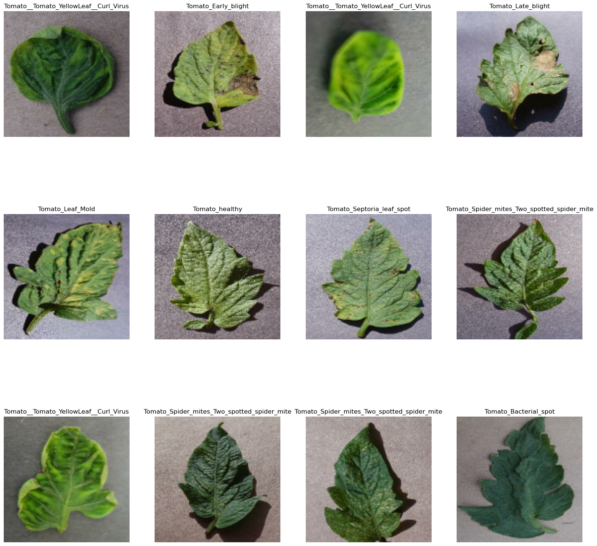
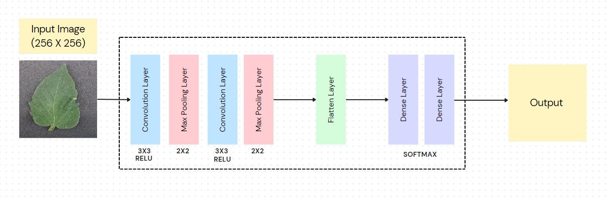
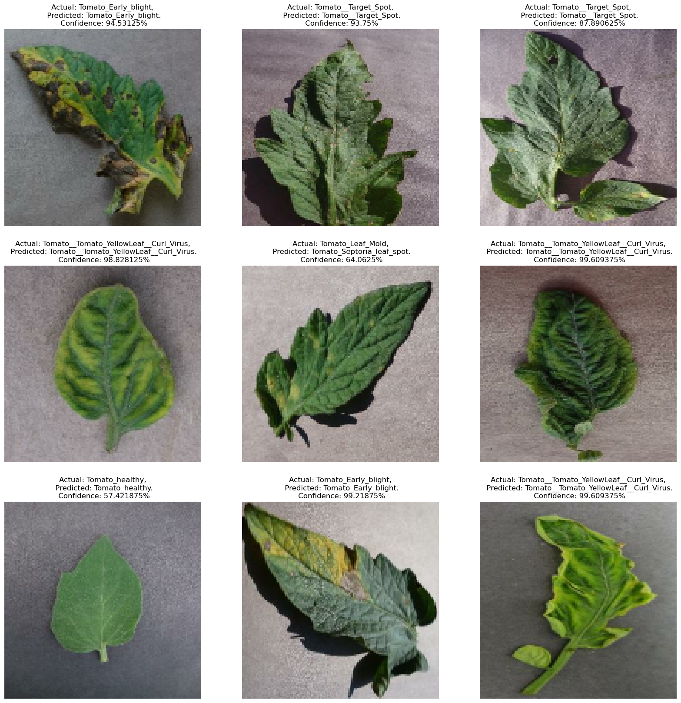

# Tomato Plant Disease Detection using TinyML

## Description
This project develops a lightweight machine learning model using TinyML techniques to detect tomato plant diseases from leaf images in real-time. By leveraging TensorFlow Lite and Edge Impulse, the model runs directly on edge devices, providing immediate insights for agricultural decision-making. With a dataset of 16,011 images across 10 disease categories, the model undergoes rigorous preprocessing, augmentation, and optimization. Real-world testing validates its effectiveness, offering farmers a convenient tool for on-site disease diagnosis, potentially revolutionizing agricultural practices.

### Dataset Used - [Plant Disease](https://www.kaggle.com/datasets/emmarex/plantdisease)

## Input

## Model

## Output

## Technology Stack
- TensorFlow
- TensorFlow Lite
- Edge Impulse
- Python

## How to Use
- Clone the repository
- Download the dataset.
- Install required dependencies.
- Run the `jupiter notebook`.
- Upload `tf_lite_quantized_model.tflite` file on `Edge Impulse` and Build the model.

<b>Feel free to explore the project further and contribute to its development!</b>
