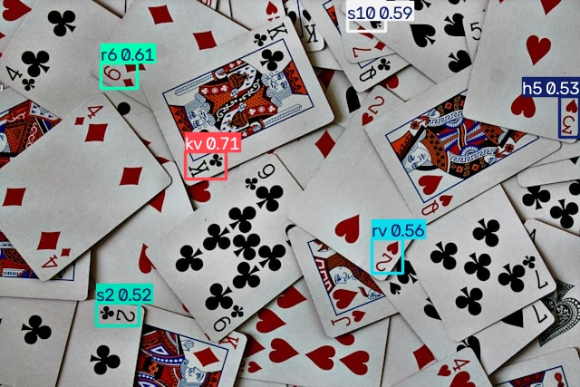

# Real-Time Playing Card Detection using YOLOv8

Real-time object detection system that identifies playing cards (rank + suit) from a live webcam feed using a custom-trained YOLOv8 model.

## Overview
This project trains a YOLOv8n model on a custom 55-class playing card dataset and runs real-time inference on webcam video, drawing bounding boxes with class labels, confidence scores, and live FPS.

## Tech Stack
- Python
- Ultralytics YOLOv8
- OpenCV
- PyTorch

## Files
| File | Description |
|---|---|
| `download_dataset.py` | Downloads the playing card dataset from Roboflow |
| `playing_card_detection.ipynb` | Full pipeline: trains the model and runs real-time webcam detection |

## Dataset
Custom playing card dataset (55 classes: ranks 2-10, J, Q, K, A across all 4 suits, plus face-up/face-down pile classes), sourced from Roboflow.

## Model Weights
Trained weights (`best.pt`) are not committed to the repo (`.gitignore` excludes `*.pt` files). Download them from the release attached to the PR and place `best.pt` in this folder before running the notebook.

## Results
| Metric | Score |
|---|---|
| mAP50 | 0.600 |
| mAP50-95 | 0.361 |
| Precision | 0.576 |
| Recall | 0.589 |

Trained for 50 epochs on a Tesla T4 GPU (~37 minutes).

## Sample Detection

## How to Run
1. Install dependencies: `pip install ultralytics opencv-python`
2. Download the dataset: run `download_dataset.py`, or download `Playing-cards-10.zip` manually and extract into this folder
3. Download `best.pt` (from the release) and place it in this folder
4. Open `playing_card_detection.ipynb` and run all cells to train and/or run detection

## Notes
Webcam inference logic follows standard Ultralytics real-time detection patterns.
