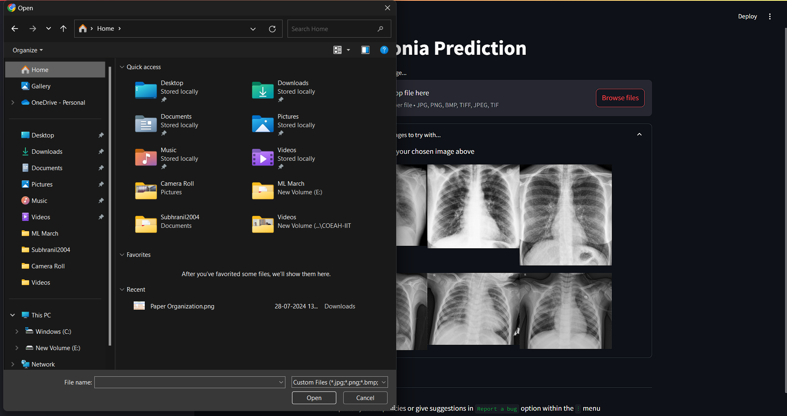
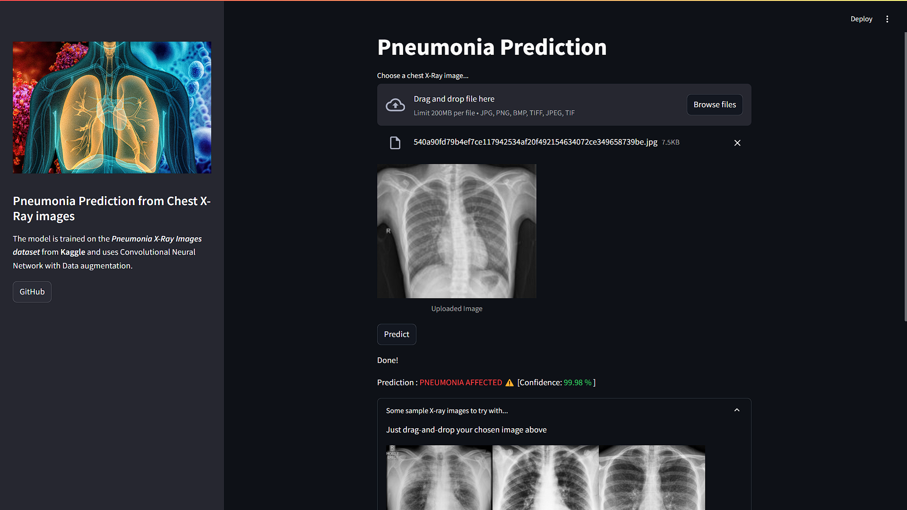
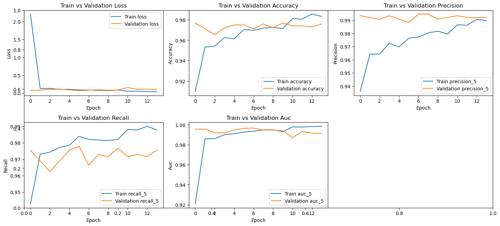
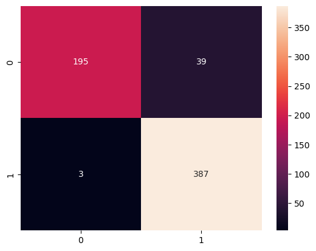
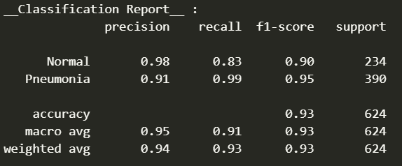

# Pneumonia Classification using Chest X-Ray

  

## 🎯Goal

  

This project implements different ways of pneumonia prediction from Chest X-Ray images. Used custom built CNN model as well as various pre-trained models. The details of the performances of the above models can be found in the `Models` directory.  The best-fitting model is used for prediction in the web app.

  

## 🧵 **Dataset**

  
### Dataset  [Kaggle Link](https://www.kaggle.com/datasets/pcbreviglieri/pneumonia-xray-images/data), by Paulo Breviglieri

*Adapted version of Paul Mooney's 'Chest X-Ray Images (Pneumonia)' [dataset](https://www.kaggle.com/paultimothymooney/chest-xray-pneumonia), where the amount of observations for training and validation purposes was redistributed to allow for a more balanced machine learning exercise.
  

## 🧮 **What I had done!**

  

-  **Data Augmentation:** Used `ImageDataGenerator` class for augmenting images with the following params whose ranges were supplied:
    - brightness_range : Varies brightness
    - height_shift_range : Shifts the image vertically to a random value
    - width_shift_range : Shifts the image horizontally to a random value
    - rotation_range : Rotates the image to a random degree
    - zoom_range : Zooms the image to a random degree

    - preprocessing_function : Passed the preprocessing function of the respective pretrained model being used.
-  **Built custom CNN model**
-  **Transfer Learning Techniques:** VGG-16, ResNet50V2, MobileNet and Xception

-  **Model Evaluation:** Used classification metrics and graphs for visualization

## Live Demo

- **For running on localhost** : Prepare the environment by installing all the requirements from `requirements.txt` 
Then type the following command in the terminal : `streamlit run app.py`

## Screenshots of app
### Homepage

### Locally browse images 

### Prediction along with class probabilities

## 📚 **Libraries Needed**

- tensorflow~=2.15.0
- keras~=2.15.0
- matplotlib
- opencv-python
- pillow
- numpy
- scikit-learn
- seaborn

 
 *Available in the `requirements.txt` file*

## 📈  **Performance of the Models based on the Accuracy Scores**

`VGG 16` was performing the best among the other pre-trained models.
  
**VGG 16 classification metrics with graphs :**

  

|  |
|:--: |
| *Loss and Accuracy curves* |

|  |  |
|:--: |:--:|
| *Confusion matrix* | *Classification report* |

## 💻 **Steps for running this project locally**

- I have originally used Python version `3.11` for this project.

- Install the required packages from the `requirements.txt` file by using one of the following commands in the terminal:

  

-  `pip install -r requirements.txt` (for `pip` environment)

-  `conda install --yes --file requirements.txt` (for `conda` environment)

  

## 📢 **Future Scope**

  
The model accuracy could be improved so as to become fairly acceptable for clinical trials and real-life usage. 
The `Pneumonia` class can be further classified into `Bacterial Pneumonia` or `Viral Pneumonia`. 
  

## ✒️ **Signature**

  

`Subhranil Nandy`  `GSSoC 2024 contributor`

  

Connect with me :)

-  `LinkedIn` : [subhranil-nandy](https://www.linkedin.com/in/subhranil-nandy/)

-  `GitHub` : [Subhranil2004](https://github.com/Subhranil2004)
