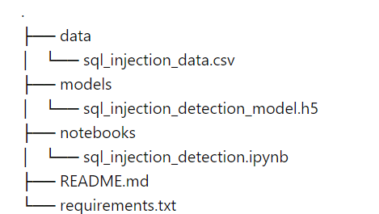

SQL Injection Detection Using Deep Learning(2D CNN):

What is SQL injection detection?

SQL injection detection involves identifying malicious SQL queries that aim to manipulate or compromise a database. These attacks exploit vulnerabilities in web applications by injecting malicious SQL code into input fields, potentially leading to unauthorized data access, data loss, or corruption. Effective SQL injection detection is crucial for maintaining data integrity and protecting sensitive information.

Why solve this problem?

SQL injection remains one of the most prevalent and dangerous security vulnerabilities in web applications. By exploiting this weakness, attackers can manipulate database queries, leading to unauthorized access, data breaches, and potentially severe financial and reputational damage. Traditional security measures often fail to detect sophisticated SQL injection patterns. Motivated by the need for a more robust and automated solution, this project leverages deep learning to detect SQL injection attempts effectively, thereby enhancing the security posture of web applications.

Methodology:
Project Overview:

This project aims to build a deep learning model using a 2D Convolutional Neural Network (CNN) to classify input queries as either SQL injection attempts or normal user inputs. The project involves several key steps: data collection and preprocessing, model architecture design, training and evaluation, and deployment. 
Steps Involved:

Data Collection and Preprocessing:
Data Source: The dataset consists of labeled examples of normal user inputs and SQL injection queries. Preprocessing: Tokenization: Converting text inputs into sequences of tokens. Padding: Ensuring all input sequences have a uniform length by padding shorter sequences with zeros.

Model Architecture Design: Architecture: Embedding Layer: Converts input sequences into dense vectors.
Convolutional Layer: Applies convolutional filters to capture local patterns.

GlobalMaxPooling Layer: Reduces the dimensionality and retains important features.

LSTM Layer: Captures long-range dependencies within the sequences.

Dense Layer: Fully connected layer for final classification.

Training and Evaluation: Training: Train the model using the training data and validate its performance using the test data.
Evaluation: Evaluate the model's accuracy and loss on the test set.

Deployment: Save Model: Save the trained model for future use.
Load Model: Load the model for inference.

Results: The trained model demonstrated high accuracy in detecting SQL injection attempts, significantly reducing the risk of unauthorized database access and data breaches. This project showcases the potential of deep learning in enhancing web application security.

Future Work: 
1. Model Improvement: Experiment with different architectures, hyperparameters, and preprocessing techniques to further improve detection accuracy. 
2. Real-time Integration: Integrate the model into web application firewalls (WAFs) and intrusion detection systems (IDS) for real-time SQL injection detection. Adversarial Robustness: Enhance the model's robustness against adversarial attacks and sophisticated evasion techniques.

Repository structure:



How to Run:

1. **Clone the Repository**:
   ```bash
   git clone https://github.com/yourusername/sql-injection-detection.git
   cd sql-injection-detection
   ```

2. **Install Dependencies**:
   ```bash
   pip install -r requirements.txt
   ```

3. **Train the Model**:
   Open the `sql_injection_detection.ipynb` notebook and run the cells to preprocess the data, train the model, and evaluate its performance.

4. **Evaluate the Model**:
   After training, the model's performance on the test set can be evaluated using the provided notebook.

5. **Make Predictions**:
   Use the trained model to make predictions on new input queries by loading the saved model and running inference in the notebook.

PS:check the requirements.txt file before executing it.

This project presents an effective deep learning-based solution for detecting SQL injection attacks, leveraging the power of 2D CNNs to enhance web application security. The successful implementation demonstrates the potential of deep learning in cybersecurity, providing a foundation for further research and development in this critical area.
