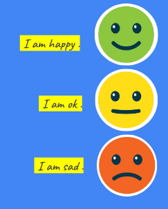

# Sentiment Analysis on IMDb reviews 😊 😐 😔 😡

 

 

## Short description 👇

Instead of using IMDb dataset available on net, I have fetched the reviews using IMDb API. I have then used NLP libraries to analyze sentiments out of the reviews.

 

**Process**          
**Step1** : Create IMDb account and get free API key   
**Step2** : Fetch reviews using a combination of 2 APIs    
**Step3** : Pass the reviews into model of your choice and get analysis in return    
**Step4** : Show result   

 

**Models/Libraries implemented**
1. TextBlob
2. Vader
3. Flair
4. text2emotion

 

### Note :-
The colab notebook contains a detailed explanation about every step from making account on IMDb API to generating api key to creating requests in python to creating model functions and much more. 

**By any chance if you are facing issues while installing packages on colab, just restart the runtime and run again. It should work.**

*Also the graphs are not visible in the preview of colab on Github.*

 

## A small snip of output 👇

<h3 align="center">Hope you like it </h3>

## Author
<a href="https://github.com/GaganpreetKaurKalsi">Gaganpreet Kaur Kalsi<a/>
