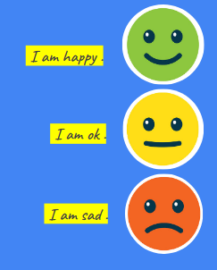

# Sentiment Analysis on IMDb Reviews 😊 😐 😔 😡

<br>
<div align="center">
  
</div>

<br>

## Short Description 👇

This project demonstrates sentiment analysis on movie reviews using multiple NLP libraries.

The original implementation is provided as a **Jupyter Notebook**, which fetches movie reviews using the **IMDb API**. Additionally, a **Streamlit web application** has been added to provide an interactive interface. Since the original IMDb API is no longer available, the Streamlit application uses the **TMDB API** for fetching movie information and reviews.

<br>

## Process 🚀

### Jupyter Notebook

* Create an IMDb account and generate an API key.
* Fetch movie reviews using the IMDb API.
* Analyze sentiments using the selected NLP library.
* Visualize the results.

### Streamlit Application

* Search for a movie using the TMDB API.
* Retrieve movie details and available reviews.
* Analyze sentiments using the selected NLP model.
* Display results through an interactive web interface.

<br>

## Models/Libraries Implemented 📚

1. TextBlob
2. Vader
3. Flair
4. text2emotion
5. Transformer — DistilBERT fine-tuned on SST-2 (Hugging Face)

<br>

## Traditional vs Transformer 🤖

TextBlob and VADER are **lexicon based**: every word carries a fixed score and the scores are
added up. A transformer reads the sentence as a whole, so word order, negation and sarcasm
change the answer.

`compare_models.py` runs all three over the same labelled reviews from the IMDb test split:

```bash
python compare_models.py --sample 200
```

| Model | Accuracy | Time for 200 reviews |
|-------|:--------:|:--------------------:|
| TextBlob | 62.0% | 0.2 s |
| VADER | 69.5% | 0.2 s |
| **DistilBERT (SST-2)** | **86.5%** | 36.5 s |

*200 reviews from the IMDb test split, seed 42.*

The accuracy comes at a cost: the transformer is roughly **180× slower** and downloads about
250 MB the first time. For short, plainly worded text the lexicon models are often enough.

### Where the lexicon models break

Three real reviews from that run, and what each model said:

**Sarcasm** — *"This movie spends most of its time preaching that it is the script that makes
the movie, but apparently there was no script when they shot this waste of time!"*
True: **Negative**. TextBlob: Positive · VADER: Positive · DistilBERT: **Negative**

**A positive review about a sad subject** — *"This is a really sad, and touching movie! It
deals with the subject of child abuse."*
True: **Positive**. TextBlob: Negative · VADER: Positive · DistilBERT: **Positive**
TextBlob sees "sad" and "abuse" and stops there.

**Negation** — *"Don't pay any attention to the rave reviews of this film here. It is the
worst Van Damme film..."*
True: **Negative**. TextBlob: Negative · VADER: Positive · DistilBERT: **Negative**
VADER scores "rave" positively and misses that the sentence rejects it.

> DistilBERT SST-2 is a binary model. When its confidence falls below 0.6 the app reports
> **Neutral**, so its output matches the labels the other analysers return.

<br>

## Streamlit Web Application 🚀

A Streamlit interface has been added as an alternative way to interact with the project without running the notebook.

### Features

* Search movies through TMDB
* Interactive web interface
* Select a sentiment analysis model
* View movie details
* Analyze reviews
* Visualize sentiment distribution
* Display review predictions

### Environment Variables

Create a `.env` file in the project root and add your TMDB API key:

```env
TMDB_API_KEY=your_tmdb_api_key
```

Install dependencies:

```bash
pip install -r requirements.txt
```

Run the Streamlit app:

```bash
streamlit run app.py
```

> **Note:** The Streamlit application requires a valid **TMDB API Key**. Please add your own API key before running the application. Do **not** commit your personal API key.

<br>

## Project Structure

```text
.
├── Sentiment_Analysis_on_IMDb_reviews.ipynb
├── app.py
├── api.py
├── sentiment.py
├── requirements.txt
├── image.PNG
└── README.md
```

<br>

## Notes 📌

* The **Jupyter Notebook** demonstrates the original workflow using the IMDb API.
* The **Streamlit application** uses the TMDB API because the original IMDb API used by the notebook is no longer actively available.
* Graphs may not be visible in GitHub's notebook preview.
* If you encounter dependency issues in Colab, restart the runtime and run the notebook again.

<br>


## Streamlit Version Output


<br>

<h3 align="center">
Hope you like it

</h3>

## Author

<a href="https://github.com/GaganpreetKaurKalsi">Gaganpreet Kaur Kalsi</a>
