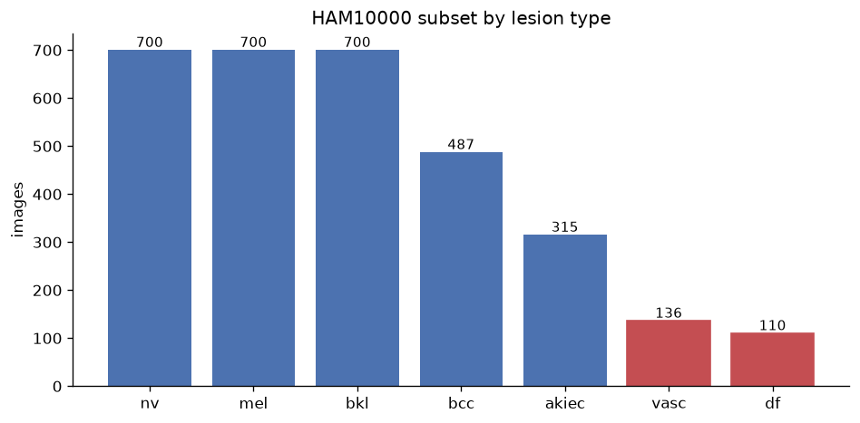
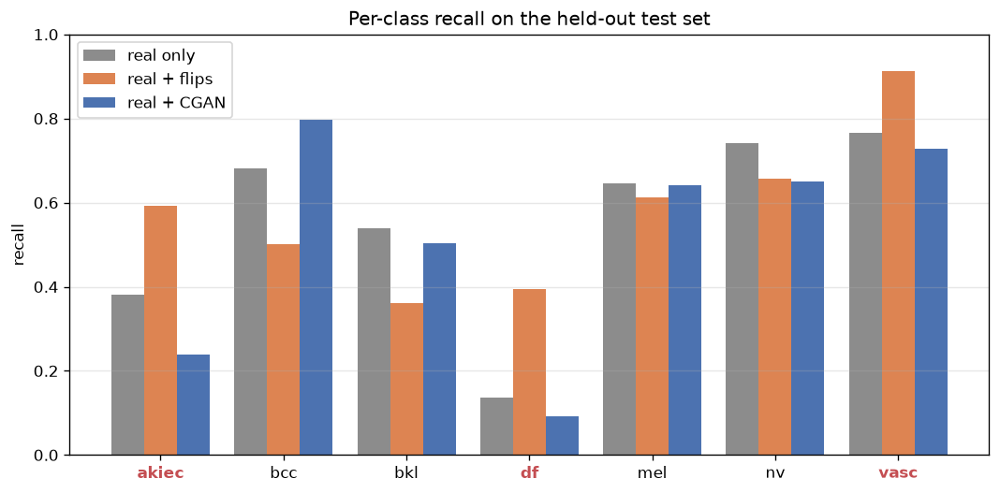
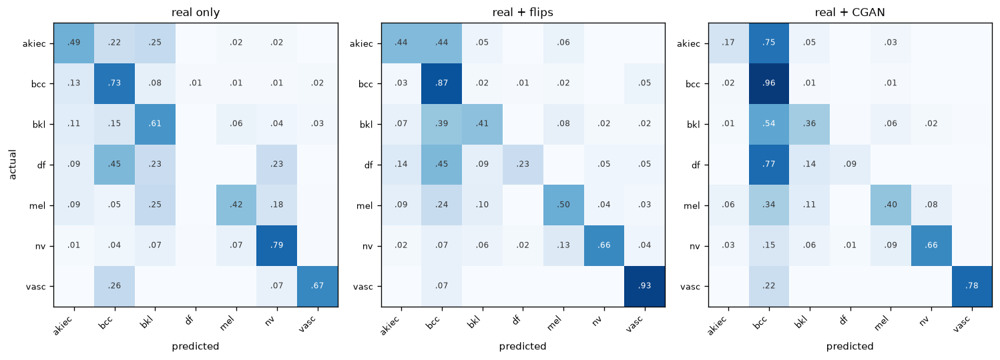
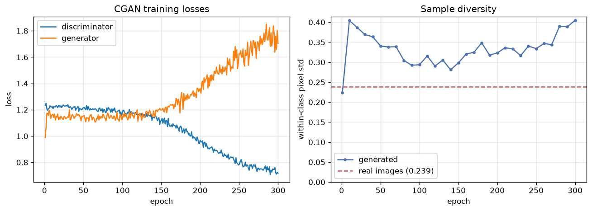
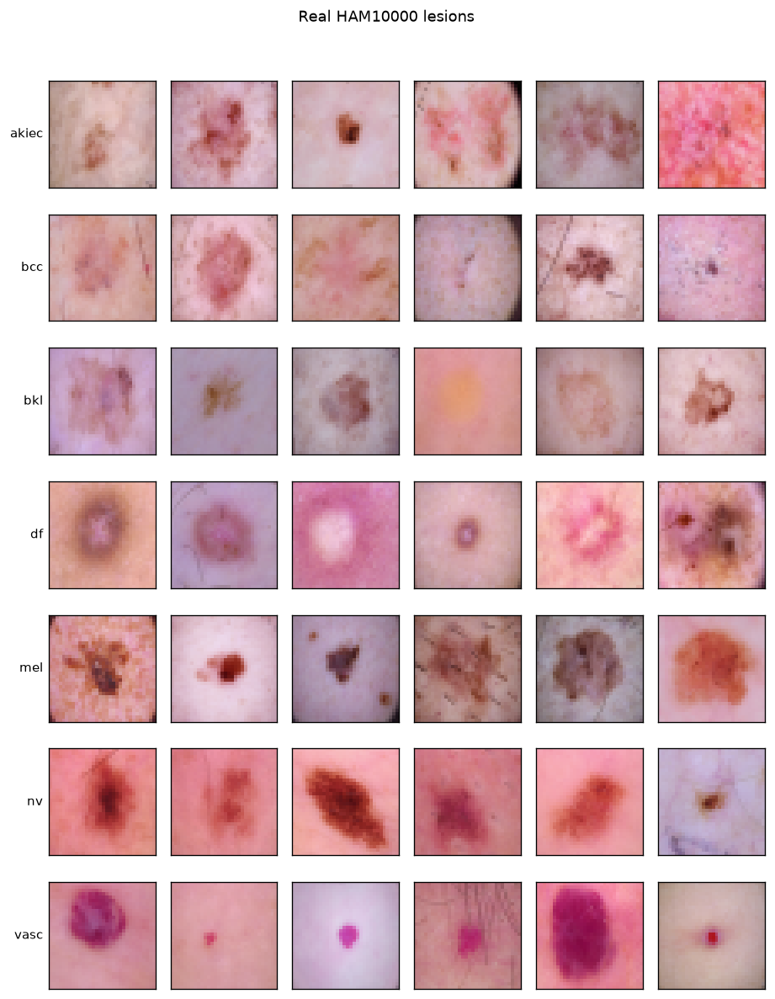
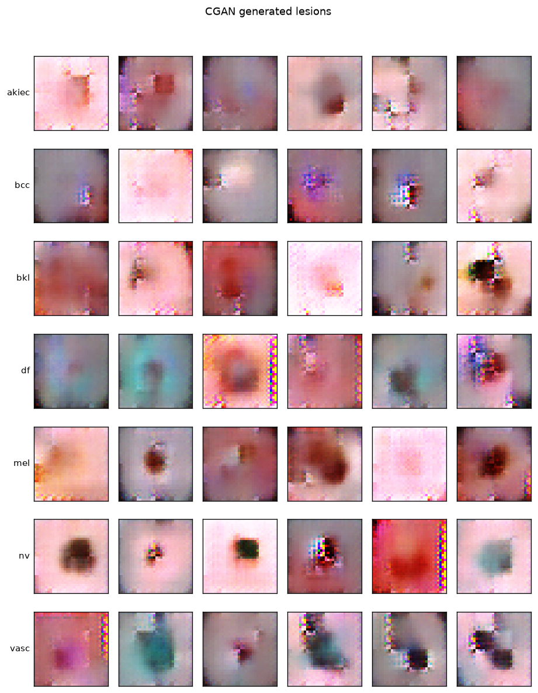

# SkinGen — conditional GAN augmentation for rare skin lesions

Rare skin cancers are the ones a classifier is most likely to miss, because there are so few
examples to learn from. In HAM10000 the largest class has roughly **58x** as many images as the
smallest.

This project trains a **conditional GAN** on HAM10000, generates extra images of the rare
classes, and then measures whether that actually helps a classifier — against both a real-only
baseline and a classical augmentation baseline.

Built for [Issue #1669](https://github.com/Niketkumardheeryan/ML-CaPsule/issues/1669).

---

## The question

Most GAN-augmentation demos stop at "look, the samples resemble the real thing". This one asks
the harder question: **does the synthetic data beat flips and rotations?** Classical
augmentation is nearly free, so it is the bar synthetic data has to clear.

Three classifiers, identical architecture, identical epochs, identical seeds. The only
difference is what gets added to the rare classes:

| Arm | Rare classes topped up with |
|---|---|
| real only | nothing |
| real + flips | classical augmentation (flips, rotations, brightness) |
| real + CGAN | conditional GAN samples |

Both augmented arms add the **same number** of images (2,519 → 3,570). The test set is **real
images only**. Every arm is trained three times with different seeds and the metrics averaged —
on a 629-image test set a single seed moves accuracy by two to three points on its own.

The subset caps the common classes at 700 images and keeps every image of the rare ones, which
softens the imbalance without hiding it — 6.4x between the largest and smallest class:



---

## Results

### Did the synthetic data help? No — and the reason is the interesting part.

| Arm | Accuracy | Macro F1 | Mean rare-class recall |
|---|---|---|---|
| real only | **0.609** | **0.548** | 0.428 |
| real + flips | 0.553 | 0.528 | **0.633** |
| real + CGAN | 0.580 | 0.528 | 0.352 |

**Classical augmentation is the clear winner on the metric that matters here**, lifting mean
recall on the three rare classes from 0.428 to **0.633**. It pays for that with overall
accuracy (0.609 → 0.553), which is the expected trade: the model stops defaulting to the
common classes. If missing a rare cancer is the expensive mistake, that is the trade you want.

**The CGAN arm did not help** — rare-class recall of 0.352 is *below* doing nothing at all.

Per-class recall on the held-out real test set (`*` marks the rare classes that were topped up):

| class | test images | real only | real + flips | real + CGAN |
|---|---|---|---|---|
| akiec * | 63 | 0.381 | **0.593** | 0.238 |
| bcc | 97 | 0.680 | 0.502 | **0.797** |
| bkl | 140 | **0.538** | 0.362 | 0.502 |
| df * | 22 | 0.136 | **0.394** | 0.091 |
| mel | 140 | **0.645** | 0.612 | 0.640 |
| nv | 140 | **0.740** | 0.657 | 0.650 |
| vasc * | 27 | 0.765 | **0.914** | 0.728 |

Read the three starred rows together: on exactly the classes the GAN was built to help, it is
the *worst* of the three arms.





### Why it did not help

This took **two** full runs to answer, because the first explanation turned out to be the wrong
one.

**Run 1 — the generator collapsed.** It learned to ignore its noise vector entirely: six
samples of one class came out nearly pixel-identical. Measured as within-class pixel spread,
diversity peaked in the first epoch and decayed monotonically to **6% of the real-image
figure**. The obvious conclusion was that fixing the collapse would fix the result.

**Run 2 — the collapse was fixed, and the result did not improve.** Adding mode-seeking
regularisation held diversity up for all 300 epochs:

| | epoch 1 | epoch 300 | vs. real (0.239) |
|---|---|---|---|
| run 1, no mode seeking | 0.075 | 0.014 | 6% |
| run 2, mode seeking | 0.224 | 0.405 | 170% |



The samples became genuinely varied and lesion-shaped — and rare-class recall got *worse*
(0.404 → 0.352). Diversity was never the binding constraint.

**The actual blocker: the synthetic rare-class images do not read as their class.** Showing the
real-only classifier 700 generated images and asking how often it agrees with the label they
were generated under — then putting that next to what the CGAN arm did to each class's recall:

| class | real training images | agreement on generated | recall change vs. baseline |
|---|---|---|---|
| vasc * | 109 | 0.590 | 0.765 → 0.728 (−0.04) |
| mel | 560 | 0.530 | 0.645 → 0.640 (−0.01) |
| nv | 560 | 0.400 | 0.740 → 0.650 (−0.09) |
| bcc | 390 | 0.240 | 0.680 → 0.797 (+0.12) |
| bkl | 560 | 0.130 | 0.538 → 0.502 (−0.04) |
| akiec * | 252 | 0.040 | 0.381 → **0.238** (−0.14) |
| df * | 88 | **0.000** | 0.136 → **0.091** (−0.05) |
| **overall** | | **0.276** (chance = 0.143) | |

Overall agreement is roughly double chance, so the conditioning genuinely works — this is a
real conditional generator, not a noise machine. But look at the bottom two rows. For `akiec`
and `df`, almost nothing the generator draws reads as that class, and those are exactly the two
classes whose recall the CGAN arm damaged most. The arm added 248 synthetic `akiec` and 412
synthetic `df` images that a classifier does not recognise as `akiec` or `df`. That is
mislabelled training data, and it does precisely what mislabelled training data does.

**A caution against the tidy explanation.** The obvious story is "too few training images", and
`df` (88 images, 0.000) fits it. But `vasc` has only 109 images and scores the *highest* of any
class at 0.590, while `bkl` has 560 and manages 0.130. Sample count alone does not predict it —
`vasc` lesions are large, bright and high-contrast, so a coarse 32x32 generator can capture
them, whereas `df` and `akiec` are subtle textural diagnoses that survive neither the
resolution nor the sample size. The honest conclusion is narrower than "GANs need more data":
**this generator reproduced the classes whose appearance is coarse enough to survive 32x32, and
failed on the ones that are not** — and the rare classes it failed on are the ones the whole
exercise was for.

Real lesions, one row per class:



What the generator produced, same layout. The six samples within each row are genuinely
different from one another — that is the mode-seeking fix working. Note also that the two
rows with the least real data, `df` and `vasc`, carry artefacts (teal casts, saturated edge
stripes) that no other class shows:



---

## Pipeline

| Stage | File |
|---|---|
| Load HAM10000 at 32x32, cap common classes, keep all rare ones | `data.py` |
| Conditional DCGAN, spectrally normalised discriminator, CNN classifier | `models.py` |
| GAN training, mode-seeking regulariser, diversity metric, sampling | `train_cgan.py` |
| Differentiable augmentation + the classical baseline | `augment.py` |
| Classifier training, multi-seed repeats, per-class metrics | `train_classifier.py` |
| Figures | `plots.py` |
| Everything end to end | `skingen.ipynb` |

Data comes from the `marmal88/skin_cancer` mirror of HAM10000, so **no Kaggle credentials are
needed** — it downloads and caches on first run.

---

## The part worth reading: how the GAN was debugged

The generator failed three times, and each failure needed a different fix. Every number below
is from a real run in this repository.

### Failure 1 — not enough generator updates

| Attempt | Setup | Generator updates | Result |
|---|---|---|---|
| 1 | 64x64, batch 128, 40 epochs | ~760 | noise |
| 2 | 32x32, batch 64, 200 epochs | ~7,800 | noise |

**Budget compute in generator updates, not epochs.** With ~2,500 images an epoch is only ~39
batches, so 40 epochs is 760 updates — nowhere near enough for a DCGAN. Dropping to 32x32 buys
roughly four times the updates for the same wall clock.

### Failure 2 — the discriminator memorises 2,500 images

More updates alone did not help, because the discriminator was winning outright: `d_loss` fell
toward 0.5 while `g_loss` climbed past 5 and never came back. A discriminator with only 2,500
images to memorise stops producing a useful gradient long before the generator learns anything.

Two standard fixes, each measured at 40 epochs:

| Discriminator | `d_loss` / `g_loss` at 40 epochs | Verdict |
|---|---|---|
| plain + [DiffAugment](https://arxiv.org/abs/2006.10738) | 0.52 / 5.06 | still diverging |
| + [spectral normalisation](https://arxiv.org/abs/1802.05957) | 1.30 / 0.99 | stable equilibrium |

Spectral normalisation bounds the discriminator's Lipschitz constant, and it is what turned a
diverging run into a stable one. **That part is solved** — in the final run the two losses hold
their equilibrium for roughly 150 epochs, where earlier attempts diverged within 5. The
discriminator does slowly regain the upper hand after that (`d_loss` 1.12 → 0.72 over the last
150 epochs), which is a reason to stop earlier or decay its learning rate.

### Failure 3 — stable losses, and still one image per class

This is the failure worth writing down, because **the losses said everything was fine.**

Losses cannot see a generator ignoring its noise vector, so this project measures it directly
(`train_cgan.sample_diversity`): draw several samples of one class, take the per-pixel standard
deviation across them, and compare against the same figure for real images.

| Configuration (40 epochs) | within-class pixel std | fraction of real |
|---|---|---|
| real images (reference) | 0.219 | — |
| DiffAugment only | 0.026 | 12% |
| + spectral normalisation | 0.022 | 10% |
| + minibatch standard deviation | 0.024 | 11% |

Two hypotheses were tested and rejected along the way:

* **A BatchNorm sampling artefact.** DCGAN generators are full of BatchNorm, and sampling under
  `eval()` uses running statistics that can degenerate. Sampling the same generator both ways
  gave 0.034 (eval) against 0.034 (train) — no difference. The collapse was real.
* **Minibatch standard deviation would catch it.** It did not, and there is a reason worth
  knowing: `diff_augment` randomises brightness, translation and cutout *per sample* before the
  discriminator sees the batch. That injected variation inflates the batch standard deviation,
  so the very layer meant to detect a collapsed batch is handed pre-randomised data and cannot
  see the collapse. The two techniques interfere with each other.

### The fix — regularise the generator, not the discriminator

The mechanism that finally worked is
[mode-seeking regularisation](https://arxiv.org/abs/1903.05628), and it works precisely because
it acts on the **generator output directly**, where no amount of augmentation can hide the
collapse. Two noise vectors go through the generator with the same label, and the generator is
rewarded for the resulting images being far apart relative to the distance between the vectors:

```python
spread = (fake_a - fake_b).abs().mean() / (noise_a - noise_b).abs().mean()
loss_g = adversarial + ms_weight / (spread + 1e-5)
```

The effect on the metric that mattered, measured over 60 epochs:

| | diversity at epoch 1 | at epoch 60 | trend |
|---|---|---|---|
| without mode seeking | 0.075 | 0.024 | decaying to collapse |
| with mode seeking, weight 1.0 | 0.236 | 0.467 | holds, overshoots |
| with mode seeking, weight 0.3 | 0.224 | 0.341 | holds, settling |

One caveat found by measuring rather than assuming: the penalty is `1 / spread`, which has no
target value — it pushes diversity up without bound. At `ms_weight=1.0` it overpowers the
adversarial loss and settles at roughly **twice** the diversity of real images, which shows up
as saturated colour artefacts. The weight has to be tuned against the real-image reference
rather than simply switched on; 0.3 is the default here for that reason.

**And it still did not rescue the downstream result.** That is worth stating plainly, because
the tempting conclusion after fixing a bug this clearly is that the problem is solved. The
generator got measurably better and the classifier got no better, which is what sent the
investigation to the label-fidelity check above — the measurement that actually explained the
outcome.

---

## What transfers to any GAN project

1. **Budget in generator updates, not epochs.** Epoch counts are misleading on small datasets.
2. **A stable loss curve is not evidence that a GAN is working.** Track a diversity statistic
   next to the losses. It is about ten lines of code, and it is the only thing here that caught
   a generator quietly ignoring its noise vector.
3. **Check that conditional samples carry their label.** Running a classifier trained on real
   data over the generated images turns "do these look right?" into a number — and here it was
   the measurement that actually explained the result, after the more obvious one misled.
4. **Fixing the bug you found is not the same as fixing the problem.** Mode collapse was real,
   was diagnosed, and was fixed; the downstream metric still did not move. A fix is only
   validated by the metric you actually care about.
5. **Benchmark against the cheap baseline.** Flips and rotations cost nothing, so synthetic data
   has to beat *them*, not just beat doing nothing. Here it did not.
6. **Synthetic data is only as good as its labels.** The classes where the generator's output
   did not read as its class are exactly the classes the augmented arm damaged. Verify label
   fidelity before training on synthetic data, not after.

---

## Running it

```bash
cd SkinGen_CGAN_Skin_Cancer
pip install -r requirements.txt
jupyter notebook skingen.ipynb
```

The notebook runs end to end in roughly **95 minutes** on an Apple Silicon GPU (MPS) — about 80
of those are the 300-epoch GAN training (11,700 generator updates), the rest the nine
classifier trainings and the figures. A CUDA GPU is considerably faster. The dataset downloads
once and is cached, so later runs skip it.

---

## Honest limitations

* **32x32 is far below diagnostic resolution.** These images are training signal, not something
  a clinician would look at. Resolution was traded for convergence: at 64x64 the same time
  budget gave a tenth of the generator updates and never left the noise stage.
* **Sample quality is scored by a diversity proxy, not FID.** Within-class pixel spread catches
  mode collapse, which is what went wrong here, but it does not measure realism. A fuller study
  would add FID against a held-out real set.
* **The augmented arms see more gradient steps per epoch** simply because they hold more images.
  That is inherent to adding data rather than a flaw in the comparison, but it is a reason to
  read the classical arm, not the real-only arm, as the meaningful baseline.
* **One GAN configuration is not a verdict on GAN augmentation.** The finding here is that
  *this* generator, at this resolution and compute budget, produced data that did not help.
  Published work that trains far longer at higher resolution reports gains.
* **Diversity now overshoots.** At 170% of the real figure the generator is more varied than
  the data it is imitating, which is its own kind of wrong and shows up as colour artefacts.
  A weight below 0.3, or a schedule that decays it, is the obvious next thing to try.
* **This is not a medical device.** It is a study of class imbalance that happens to use
  medical data.

## Next steps

Higher resolution with a stabilised objective (WGAN-GP), FID for sample realism, and a
comparison against class-weighted loss, which is cheaper than either augmentation strategy.

---

## Author

Contributed to **ML-CaPsule** under **GSSoC** by [Anijesh](https://github.com/Anijesh) — resolves issue #1669.
