# ML Benchmarking Framework

A standardized, reproducible benchmarking framework for comparing sklearn-compatible
classification and regression models across datasets — with automated metric tables,
confusion matrices, and visualization dashboards.

---

## Repository Structure

```
Standardized Benchmarking Framework for Classification & Regression Models/
├── metrics_utils.ipynb              # Shared utilities (timers, memory, dataclasses)
├── classification_benchmark.ipynb   # Classification pipeline, metrics & plots
├── regression_benchmark.ipynb       # Regression pipeline, metrics & plots
└── sample_results/                  # Auto-generated CSVs and figures
    ├── classification_breast_cancer.csv
    ├── classification_iris.csv
    ├── regression_diabetes.csv
    ├── regression_synthetic.csv
    └── *.png  (13 figures)
```

---

## Installation

```bash
pip install scikit-learn numpy pandas matplotlib seaborn jupyter nbconvert
```

---

## Running the Notebooks

Open each notebook in Jupyter Lab / Notebook and run all cells, or execute headlessly:

```bash
jupyter nbconvert --to notebook --execute --inplace metrics_utils.ipynb
jupyter nbconvert --to notebook --execute --inplace classification_benchmark.ipynb
jupyter nbconvert --to notebook --execute --inplace regression_benchmark.ipynb
```

> **Note:** Run `metrics_utils.ipynb` first — it writes `metrics_utils.py` to disk,
> which the other two notebooks import.

---

## Metrics Reference

### Classification

| Metric | Description |
|---|---|
| Accuracy | Fraction of correctly classified samples |
| Precision | Weighted-average positive predictive value |
| Recall | Weighted-average true positive rate |
| F1-Score | Harmonic mean of precision & recall |
| ROC-AUC | Area under ROC curve (one-vs-rest, weighted avg) |
| Train time | Wall-clock `fit()` duration (seconds) |
| Predict time | Wall-clock `predict()` duration (seconds) |
| Peak memory | `tracemalloc` peak during training (KiB) |

### Regression

| Metric | Description |
|---|---|
| MAE | Mean Absolute Error |
| MSE | Mean Squared Error |
| RMSE | Root Mean Squared Error |
| R² | Coefficient of Determination (higher = better) |
| Train time | Wall-clock `fit()` duration (seconds) |
| Predict time | Wall-clock `predict()` duration (seconds) |
| Peak memory | `tracemalloc` peak during training (KiB) |

---

## Results

> All experiments use an 80/20 stratified train-test split with `random_state=42`.
> ★ marks the best value in each column.

---

### Classification — Breast Cancer (binary, 569 samples, 30 features)

| Model | Accuracy | Precision | Recall | F1-Score | ROC-AUC | Train (s) | Predict (s) | Memory (KB) |
|---|---|---|---|---|---|---|---|---|
| Logistic Regression | **0.9649** ★ | **0.9595** ★ | **0.9861** ★ | **0.9726** ★ | **0.9954** ★ | 2.3463 | 0.000421 | 68.8 |
| Decision Tree | 0.9123 | 0.9559 | 0.9028 | 0.9286 | 0.9157 | 0.0253 | 0.000674 | 91.8 |
| Random Forest | 0.9561 | 0.9589 | 0.9722 | 0.9655 | 0.9937 | 2.8332 | 0.014852 | 188.3 |
| Gradient Boosting | 0.9561 | 0.9467 | 0.9861 | 0.9660 | 0.9907 | 1.4289 | 0.001405 | 150.1 |
| K-Nearest Neighbours | 0.9123 | 0.9429 | 0.9167 | 0.9296 | 0.9559 | **0.0031** ★ | 3.005321 | 71.9 |
| Support Vector Machine | 0.9298 | 0.9211 | 0.9722 | 0.9459 | 0.9696 | 0.0462 | 0.003145 | 181.3 |
| Gaussian Naive Bayes | 0.9386 | 0.9452 | 0.9583 | 0.9517 | 0.9878 | 0.0083 | **0.000421** ★ | **68.8** ★ |

**Key findings:**
- Logistic Regression achieves the best Accuracy (0.9649), F1 (0.9726) and ROC-AUC (0.9954).
- KNN is the fastest to train (0.003s) but has the slowest inference (3.0s) — not ideal for production.
- Decision Tree and KNN tie for lowest accuracy (0.9123), indicating underfitting on this dataset.
- Gaussian Naive Bayes uses the least memory (68.8 KB) — tied with Logistic Regression.

---

### Classification — Iris (multiclass, 150 samples, 4 features)

| Model | Accuracy | Precision | Recall | F1-Score | ROC-AUC | Train (s) | Predict (s) | Memory (KB) |
|---|---|---|---|---|---|---|---|---|
| Logistic Regression | 0.9667 | 0.9697 | 0.9667 | 0.9666 | **1.0000** ★ | 0.0619 | 0.000427 | 42.0 |
| Decision Tree | 0.9333 | 0.9333 | 0.9333 | 0.9333 | 0.9500 | 0.0099 | 0.000273 | 20.5 |
| Random Forest | 0.9000 | 0.9024 | 0.9000 | 0.8997 | 0.9867 | 3.4279 | 0.015439 | 125.3 |
| Gradient Boosting | 0.9667 | 0.9697 | 0.9667 | 0.9666 | 0.9900 | 3.0022 | 0.002641 | 169.4 |
| K-Nearest Neighbours | **1.0000** ★ | **1.0000** ★ | **1.0000** ★ | **1.0000** ★ | **1.0000** ★ | **0.0071** ★ | 0.005108 | **11.5** ★ |
| Support Vector Machine | 0.9667 | 0.9697 | 0.9667 | 0.9666 | 0.9967 | 0.0185 | **0.000497** ★ | 15.8 |
| Gaussian Naive Bayes | 0.9667 | 0.9697 | 0.9667 | 0.9666 | 0.9900 | 0.0061 | 0.000425 | 11.4 |

**Key findings:**
- KNN achieves perfect scores (1.0) across all metrics on this small, well-separated dataset.
- Random Forest is the weakest performer — ensemble overhead hurts on tiny datasets.
- Logistic Regression, Gradient Boosting, SVM, and GNB all converge to the same accuracy (0.9667).
- KNN also wins on speed (0.007s) and memory (11.5 KB), making it the clear winner on Iris.

---

### Regression — Diabetes (89 test samples, 10 features)

| Model | MAE | MSE | RMSE | R² | Train (s) | Predict (s) | Memory (KB) |
|---|---|---|---|---|---|---|---|
| Linear Regression | 42.7941 | 2900.19 | 53.8534 | 0.4526 | 0.0095 | 0.000370 | 76.7 |
| Ridge | 46.1389 | 3077.42 | 55.4745 | 0.4192 | 0.0079 | 0.000264 | 61.6 |
| Lasso | 42.8544 | **2798.19** ★ | **52.8980** ★ | **0.4719** ★ | 0.0076 | 0.000276 | 62.7 |
| ElasticNet | 63.7059 | 5311.21 | 72.8781 | -0.0025 | **0.0050** ★ | **0.000245** ★ | **61.5** ★ |
| Decision Tree | 54.5281 | 4976.80 | 70.5464 | 0.0607 | 0.0185 | 0.000427 | 35.2 |
| Random Forest | 44.0530 | 2952.01 | 54.3324 | 0.4428 | 2.9094 | 0.019746 | 101.0 |
| Gradient Boosting | 44.6033 | 2898.44 | 53.8371 | 0.4529 | 0.8700 | 0.001120 | 94.9 |
| K-Nearest Neighbours | **42.7708** ★ | 3019.08 | 54.9461 | 0.4302 | 0.0080 | 0.002770 | 38.2 |
| Support Vector Machine | 56.0237 | 4333.29 | 65.8277 | 0.1821 | 0.0188 | 0.016146 | 58.6 |

**Key findings:**
- Lasso achieves the best R² (0.4719), MSE, and RMSE — L1 regularization suits this sparse medical dataset.
- ElasticNet severely underfits (R² ≈ 0) despite fastest training; its default alpha is too aggressive here.
- KNN ties Lasso on MAE (42.77) while using only 38.2 KB memory — a surprisingly competitive baseline.
- Gradient Boosting tracks closely with Lasso on R² (0.4529) with acceptable overhead.
- All R² values are moderate (≤ 0.47), reflecting the inherent difficulty of disease progression prediction.

---

### Regression — Synthetic (100 test samples, 20 features, noise=10)

| Model | MAE | MSE | RMSE | R² | Train (s) | Predict (s) | Memory (KB) |
|---|---|---|---|---|---|---|---|
| Linear Regression | 8.0437 | 96.86 | 9.8418 | 0.9948 | 0.0082 | 0.000398 | 153.3 |
| Ridge | 8.1279 | 98.57 | 9.9281 | 0.9947 | 0.0070 | 0.000446 | 131.6 |
| Lasso | **8.0182** ★ | **95.39** ★ | **9.7667** ★ | **0.9949** ★ | 0.0063 | 0.000623 | 131.6 |
| ElasticNet | 41.4719 | 2845.32 | 53.3415 | 0.8476 | **0.0057** ★ | **0.000410** ★ | 131.6 |
| Decision Tree | 69.2163 | 8221.53 | 90.6727 | 0.5597 | 0.0309 | 0.000452 | 68.9 |
| Random Forest | 55.1397 | 4626.68 | 68.0197 | 0.7522 | 5.2401 | 0.035250 | 118.2 |
| Gradient Boosting | 36.9942 | 2229.97 | 47.2225 | 0.8806 | 1.0126 | 0.000764 | 108.5 |
| K-Nearest Neighbours | 72.6967 | 8344.55 | 91.3485 | 0.5531 | 0.0022 | 2.383450 | **65.9** ★ |
| Support Vector Machine | 103.0090 | 17743.34 | 133.2041 | 0.0498 | 0.0611 | 0.014239 | 128.5 |

**Key findings:**
- Linear models (Linear Regression, Ridge, Lasso) dominate with R² > 0.99, confirming truly linear data.
- SVR fails completely (R² = 0.05) — the default RBF kernel struggles on high-dimensional linear data.
- KNN uses only 65.9 KB memory — the lightest model for regression on this dataset.
- Gradient Boosting is the best non-linear model (R² = 0.88), useful when the data-generating process is unknown.

---

## Visualizations

### Classification — Breast Cancer

**Metric comparison (grouped bar)**
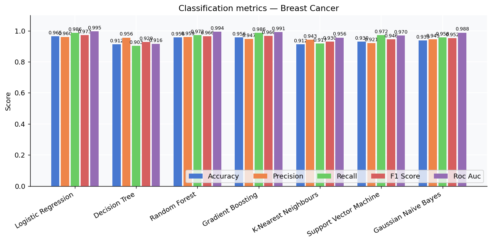

**Normalised rank heatmap**
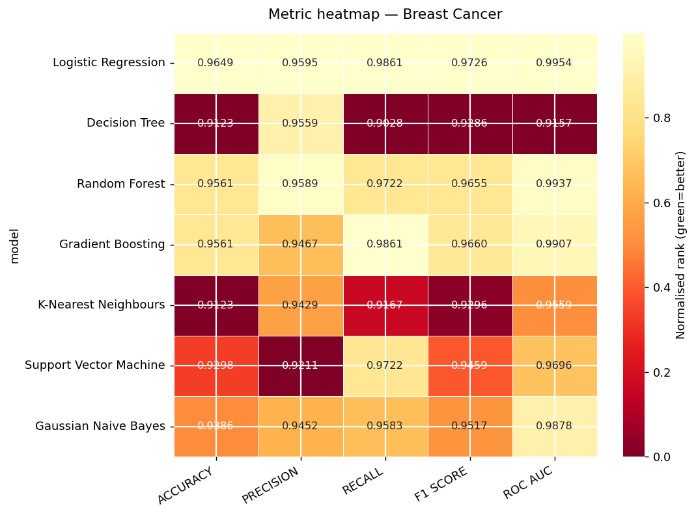

**Confusion matrices**
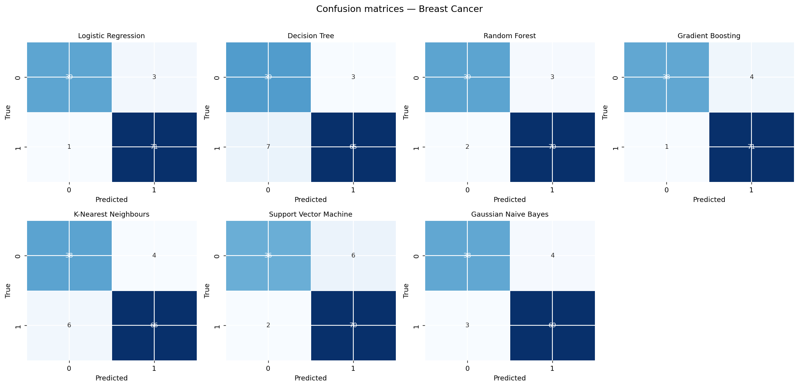

**Speed vs Accuracy**
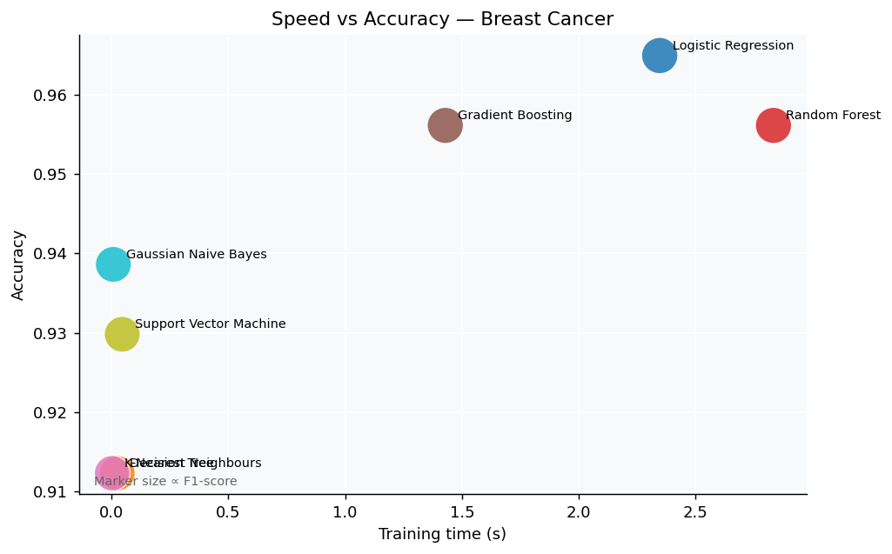

**Performance overhead**
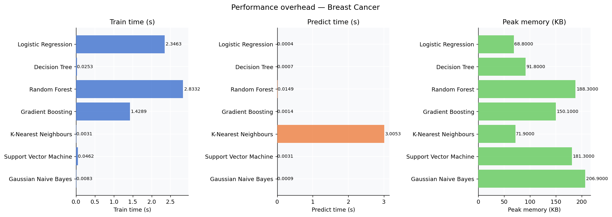

---

### Classification — Iris

**Metric comparison (grouped bar)**
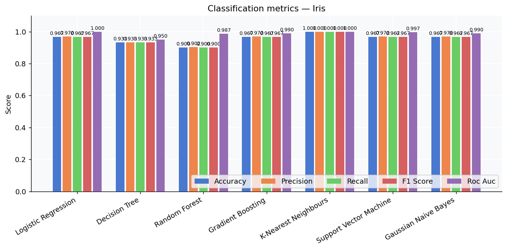

**Normalised rank heatmap**
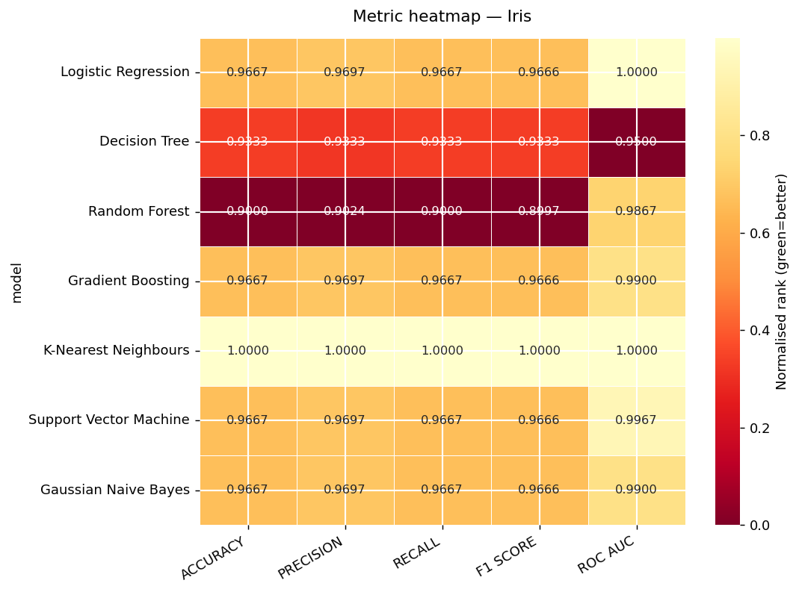

---

### Regression — Diabetes

**Metric comparison (grouped bar)**
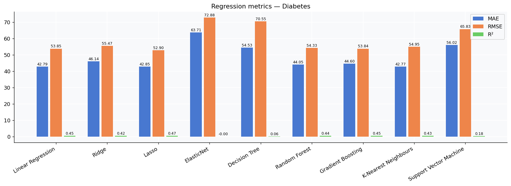

**Normalised rank heatmap**
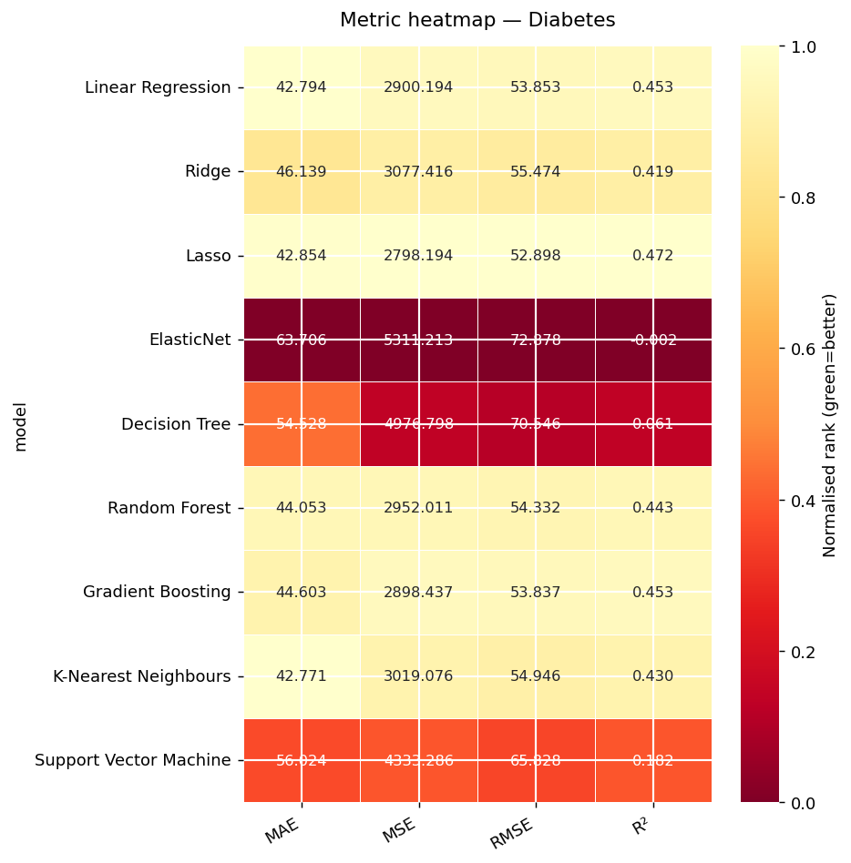

**Speed vs R²**
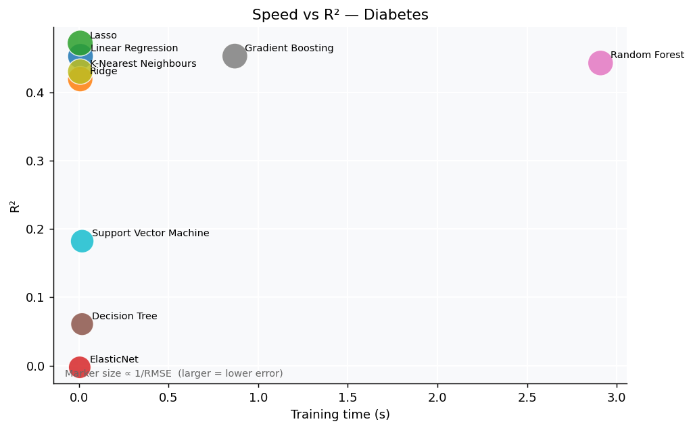

**Performance overhead**
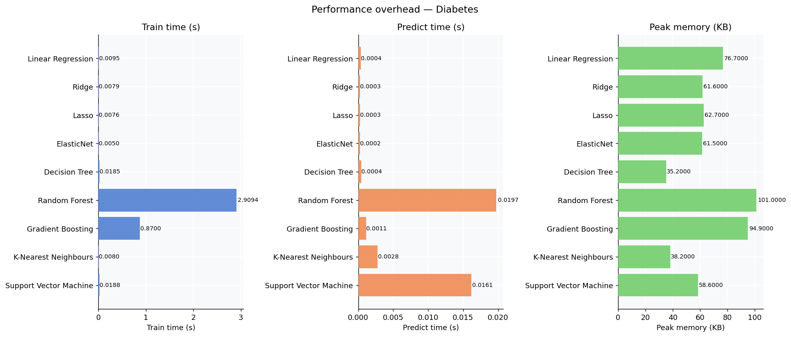

---

### Regression — Synthetic

**Metric comparison (grouped bar)**
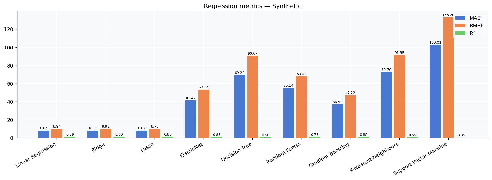

**Normalised rank heatmap**
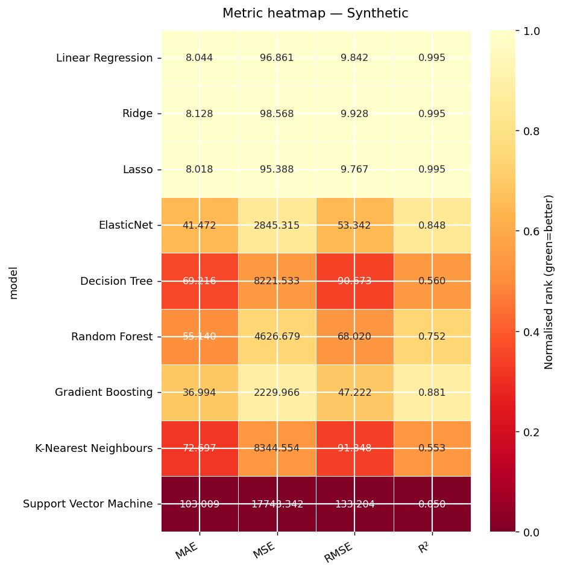

---

## Summary

| Task | Dataset | Best Model | Best Metric |
|---|---|---|---|
| Classification | Breast Cancer | Logistic Regression | F1=0.9726, AUC=0.9954 |
| Classification | Iris | K-Nearest Neighbours | Perfect score (1.0) |
| Regression | Diabetes | Lasso | R²=0.4719 |
| Regression | Synthetic | Lasso | R²=0.9949 |
