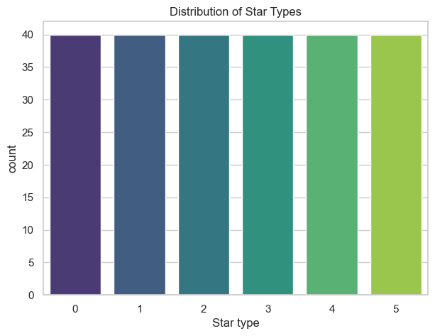
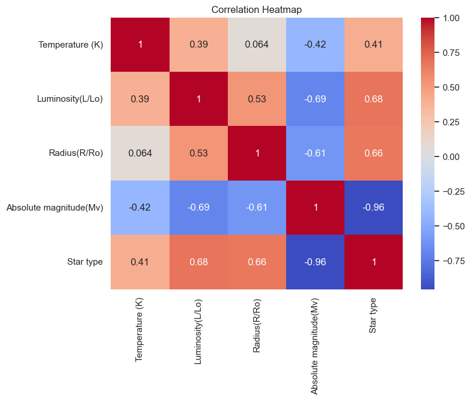
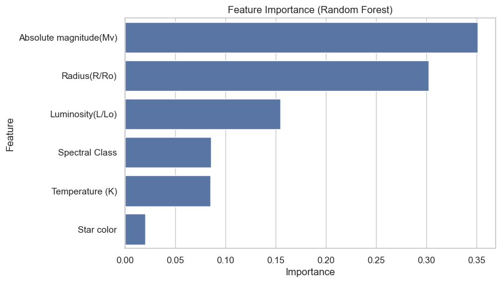
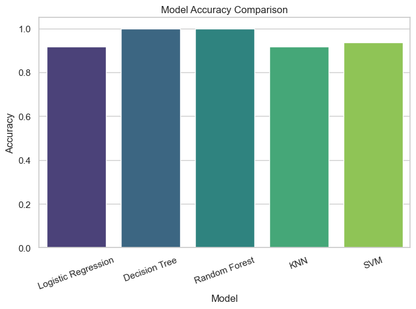

# ⭐ Star Classification using Machine Learning

## Overview

This project classifies stars into different stellar types using supervised machine learning algorithms based on their physical properties.

The notebook demonstrates the complete machine learning workflow, including preprocessing, visualization, model training, evaluation, and comparison.

---

## Dataset

Dataset: Star Classification Dataset

Features:

- Temperature (K)
- Luminosity (L/Lo)
- Radius (R/Ro)
- Absolute Magnitude (Mv)
- Star Color
- Spectral Class

Target:

- Star Type

---

## Technologies Used

- Python
- Pandas
- NumPy
- Matplotlib
- Seaborn
- Scikit-learn

---

## Machine Learning Models

- Logistic Regression
- Decision Tree
- Random Forest
- K-Nearest Neighbors
- Support Vector Machine (SVM)

---

## Workflow

1. Load dataset
2. Data cleaning
3. Exploratory Data Analysis (EDA)
4. Feature Encoding
5. Feature Scaling
6. Train-Test Split
7. Model Training
8. Model Evaluation
9. Performance Comparison

---

## Results

| Model               |    Accuracy |
| ------------------- | ----------: |
| Decision Tree       | **100.00%** |
| Random Forest       | **100.00%** |
| SVM                 |      93.75% |
| Logistic Regression |      91.67% |
| KNN                 |      91.67% |

---

## Visualizations

### Star Type Distribution



### Correlation Heatmap



### Feature Importance



### Model Comparison



---

## Conclusion

This project demonstrates an end-to-end multiclass classification pipeline for stellar classification. Among all the evaluated models, Decision Tree and Random Forest achieved the highest accuracy on this dataset.

---

## Installation

```bash
pip install -r requirements.txt
```

---

## Run

Open the notebook:

```bash
jupyter notebook Star_Classification.ipynb
```
