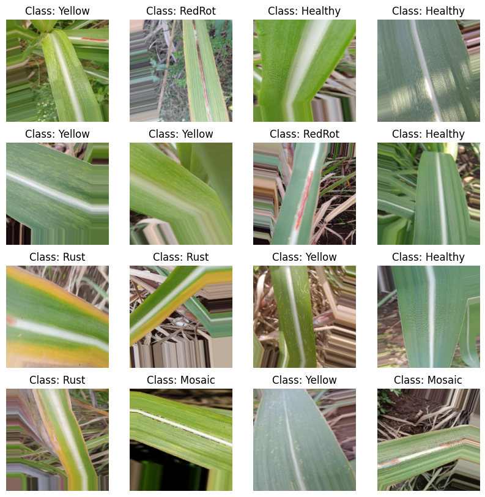
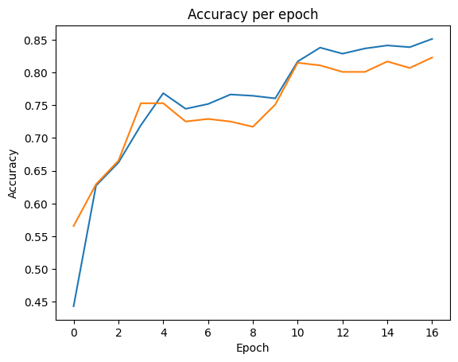
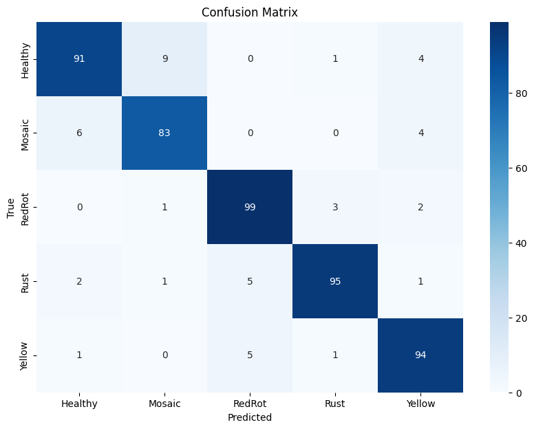
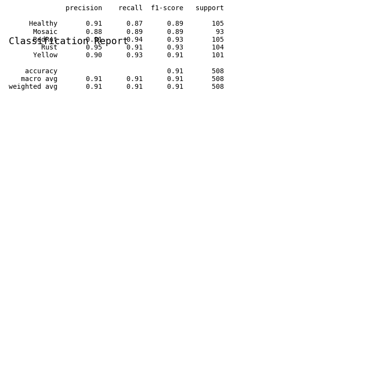

# Sugarcane Disease Prediction Using Ensemble Model

## AIM
To develop an ensemble model that predicts sugarcane diseases using various deep learning architectures.

## DATASET LINK
[Sugarcane Leaf Disease Dataset](https://www.kaggle.com/datasets/nirmalsankalana/sugarcane-leaf-disease-dataset)

## MY NOTEBOOK LINK
Refer to the notebook in the `/models` directory.

## DESCRIPTION
This project focuses on predicting diseases in sugarcane using an ensemble model that combines several well-known architectures: MobileNet, InceptionV3, VGG16, Conv2D, and ResNet152. 

- **Requirement**: With the rise of agricultural challenges, timely diagnosis of plant diseases is crucial for ensuring crop health and yield.
- **Necessity**: This model provides farmers with a tool to quickly identify disease types, enabling timely intervention.
- **Benefits**: It helps in maintaining crop health, increasing agricultural productivity, and reducing economic losses due to diseases.
- **Approach**: The project began with data collection and exploration, followed by model selection based on their individual performance metrics.
  
## EXPLANATION

### DETAILS OF THE DIFFERENT FEATURES
- **MobileNet**: A lightweight model suitable for mobile applications, known for its efficiency and speed.
- **InceptionV3**: A deep convolutional network designed to improve accuracy by utilizing parallel convolutional layers.
- **VGG16**: A widely used model recognized for its simplicity and deep architecture.
- **Conv2D**: Custom convolutional layers designed for feature extraction specific to sugarcane diseases.
- **ResNet152**: A deep network that uses skip connections to combat the vanishing gradient problem, enhancing learning.

### WHAT I HAVE DONE
1. Initial data exploration and understanding.
2. Data cleaning and preprocessing.
3. Feature engineering and selection.
4. Model training and evaluation.
5. Model optimization and fine-tuning.
6. Validation and testing.

### LIBRARIES NEEDED
- pandas
- numpy
- scikit-learn
- matplotlib
- seaborn
- tensorflow
- keras

### Images

- 
- 
- 
- 
### MODELS USED AND THEIR ACCURACIES
| Model      | Accuracy 
|------------|----------
| MobileNet  | 83.20%   
| VGG16      | 79.76%   
| Conv2D     | 86.06%   
| ResNet152  | 81.21%   
| InceptionV3| 86.06%   
| **Ensemble**  | **90.94%** 

### USE CASES OF THIS MODEL
1. **Application in Agriculture**: Farmers can use this model to diagnose sugarcane diseases quickly, ensuring better crop management.
2. **Research and Development**: Agricultural researchers can utilize this model to study disease patterns and develop better disease-resistant sugarcane varieties.

### HOW TO INTEGRATE THIS MODEL IN REAL WORLD
1. Prepare the data pipeline to ensure real-time data feeding.
2. Deploy the model using appropriate tools (e.g., Flask, Docker) to create an accessible web application.
3. Monitor and maintain the model in production to ensure continued accuracy and performance.

### FEATURES PLANNED BUT NOT IMPLEMENTED
- **Feature 1**: Integration of real-time data input for immediate predictions; not implemented due to time constraints.
- **Feature 2**: Development of a user-friendly mobile application; not implemented due to lack of mobile development experience.

### Signature
*Vivek Prakash*

[Linkedin](https://www.linkedin.com/in/vivek-prakash-b46830283/)
