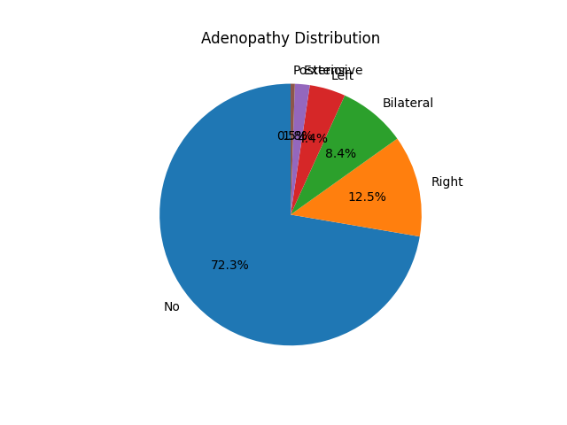

## **Thyroid Recurrence Prediction**

### 🎯 **Goal**

The objective of this project is to predict whether a person is prone to have thyroid again or not, as part of supervised learning to help recognize them.

## Overview

The **Thyroid Recurrence Prediction** project aims to develop a predictive model to identify individuals at risk of thyroid cancer recurrence. By leveraging supervised learning techniques, the project seeks to enhance early detection and management strategies, thereby improving patient outcomes and guiding clinical decisions.

## Objectives

- **Predict Thyroid Recurrence:** Develop a model to predict whether a patient is prone to thyroid cancer recurrence based on various features.
- **Compare Model Performance:** Evaluate and compare the performance of different machine learning models to determine the most accurate and effective approach.

## Dataset

The dataset used in this project includes patient information and clinical data with the following attributes:

- **Age:** Age of the patient at diagnosis or treatment.
- **Gender:** Gender of the patient.
- **Smoking:** Smoking status of the patient.
- **Hx Smoking:** Smoking history.
- **Hx Radiotherapy:** History of radiotherapy treatment.
- **Thyroid Function:** Status of thyroid function.
- **Physical Examination:** Findings from physical examination.
- **Adenopathy:** Presence of enlarged lymph nodes in the neck.
- **Pathology:** Types of thyroid cancer based on biopsy.
- **Focality:** Whether the cancer is unifocal or multifocal.
- **Risk:** Risk category of cancer based on tumor characteristics.
- **T, N, M:** Tumor, nodal, and metastasis classifications.
- **Stage:** Overall stage of the cancer.
- **Response:** Response to treatment.
- **Recurred:** Indicator of cancer recurrence.

[Link to the dataset](https://www.kaggle.com/datasets/jainaru/thyroid-disease-data/data)

## Methodology

1. **Data Preprocessing:** The dataset was cleaned and preprocessed to handle missing values, encode categorical variables, and normalize features.
2. **Model Selection:** Three different models were implemented:
   - **Multilayer Perceptron (MLP):** A neural network model that learns complex patterns in data.
   - **TabNet:** A deep learning model designed for tabular data, combining attention mechanisms with decision trees.
   - **WeightedEnsemble_L2:** An ensemble learning approach that combines predictions from multiple models to improve accuracy.
3. **Evaluation:** Each model was evaluated based on accuracy scores to determine its effectiveness in predicting thyroid recurrence.

### 🧵 **Dataset**

The Dataset consists of 17 columns:
| Attribute            | Description                                                                                               |
|----------------------|-----------------------------------------------------------------------------------------------------------|
| Age                  | The age of the patient at the time of diagnosis or treatment.                                             |
| Gender               | The gender of the patient (male or female).                                                                |
| Smoking              | Whether the patient is a smoker or not.                                                                   |
| Hx Smoking           | Smoking history of the patient (e.g., whether they have ever smoked).                                      |
| Hx Radiotherapy      | History of radiotherapy treatment for any condition.                                                       |
| Thyroid Function     | The status of thyroid function, possibly indicating if there are any abnormalities.                        |
| Physical Examination | Findings from a physical examination of the patient, which may include palpation of the thyroid gland and surrounding structures. |
| Adenopathy           | Presence or absence of enlarged lymph nodes (adenopathy) in the neck region.                                 |
| Pathology            | Specific types of thyroid cancer as determined by pathology examination of biopsy samples.                   |
| Focality             | Whether the cancer is unifocal (limited to one location) or multifocal (present in multiple locations).     |
| Risk                 | The risk category of the cancer based on various factors, such as tumor size, extent of spread, and histological type. |
| T                    | Tumor classification based on its size and extent of invasion into nearby structures.                        |
| N                    | Nodal classification indicating the involvement of lymph nodes.                                            |
| M                    | Metastasis classification indicating the presence or absence of distant metastases.                         |
| Stage                | The overall stage of the cancer, typically determined by combining T, N, and M classifications.             |
| Response             | Response to treatment, indicating whether the cancer responded positively, negatively, or remained stable after treatment. |
| Recurred             | Indicates whether the cancer has recurred after initial treatment.                                           |

[Link to the dataset](https://www.kaggle.com/datasets/jainaru/thyroid-disease-data/data)

### 🧾 **Description**

I focused on creating a model proficient in predicting if the patient is prone to have thyroid again or not.

### 🧮 **What I had done!**

To achieve our goals we:

- Tested out three different models for performing binary classification on the [Thyroid Recurrence dataset](https://www.kaggle.com/datasets/jainaru/thyroid-disease-data/data).

### 🚀 **Models Implemented**

models used:

- Multilayer Perceptron
- TabNet
- WeightedEnsemble_L2

### 📚 **Libraries Needed**

- keras
- tensorflow
- pytorch-tabnet
- numpy
- autogluon
- matplotlib

### Visualization

#### Adenopathy Distribution

#### Age Distribution

#### Age Distribution by Smoking Status

#### Gender Distribution

#### MLP Model Accuracy

#### MosaicPlot

#### Thyroid Cancer Recurrence Dataset EDA

### 📈 **Performance of the Models based on the Accuracy Scores**

Metrics:

| Models | Accuracy |
|--------|---------------------|
| WeightedEnsemble_L2 | 0.9839 |
| MLP | 0.9870 |
| TabNet | 0.9610  |

### 📢 **Conclusion**

The project successfully developed and compared multiple models for predicting thyroid cancer recurrence. The **MLP model** demonstrated the highest accuracy, making it the most reliable model for this task. The results highlight the potential of machine learning in improving cancer management and patient care.
`WeightedEnsemble_L2` gave the best accuracy i.e, 98.39%.

