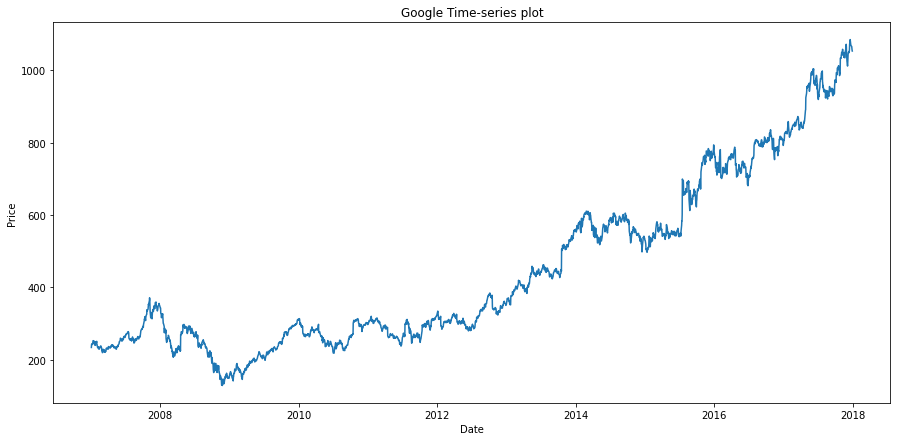
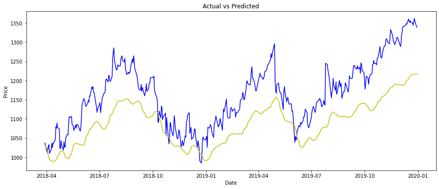

# Time-Series LSTM Model

## Time-Series Stock Prediction using LSTM Model

## LSTM
Long Short Term Memory networks – usually just called “LSTMs” – are a special kind of RNN, capable of learning long-term dependencies. .1 They work tremendously well on a large variety of problems, and are now widely used.

LSTMs are explicitly designed to avoid the long-term dependency problem. Remembering information for long periods of time is practically their default behavior, not something they struggle to learn!

## Dataset

We have Download the Historical **GOOGLE** Stock Price Data From Yahoo Finance.
Feel free to try with other Stock just by giving Stock Symbol and Time Period!!.

## Model
Our Model consist of Four LSTM layer with a Dense Layer as Output.

## Prediction

