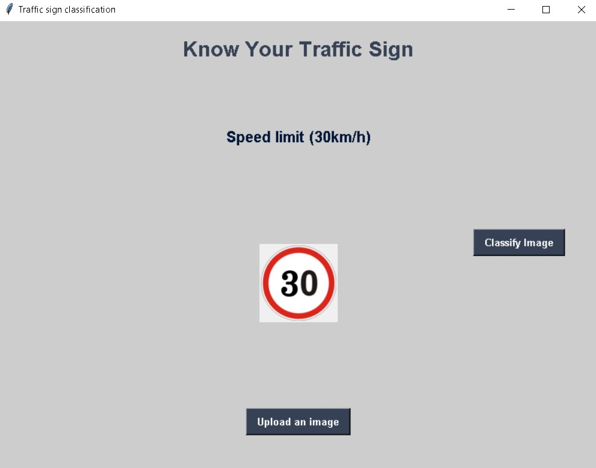

# Traffic Sign Recognition

------

This python project, Traffic Sign Recognition, recognizes the various traffic signs in the image and classify them using a deep neural network model. It is built using Keras, Tensorflow, Pandas and Scikit-learn. The model is able to recognize the images with 95% of accuracy.

The Kaggle dataset used in the project is: [https://www.kaggle.com/datasets/meowmeowmeowmeowmeow/gtsrb-german-traffic-sign](https://www.kaggle.com/datasets/meowmeowmeowmeowmeow/gtsrb-german-traffic-sign)

There are more than 50,000 images of various traffic signals and more than 40 classes are present in the dataset.

## Setup

------------

To install the required packages run the following command:
```
pip install pandas keras tensorflow matplotlib pillow sklearn
```

Then run the gui.py file and you are good to go!
Simply upload the image and hit the classify button as shown in the image below:
