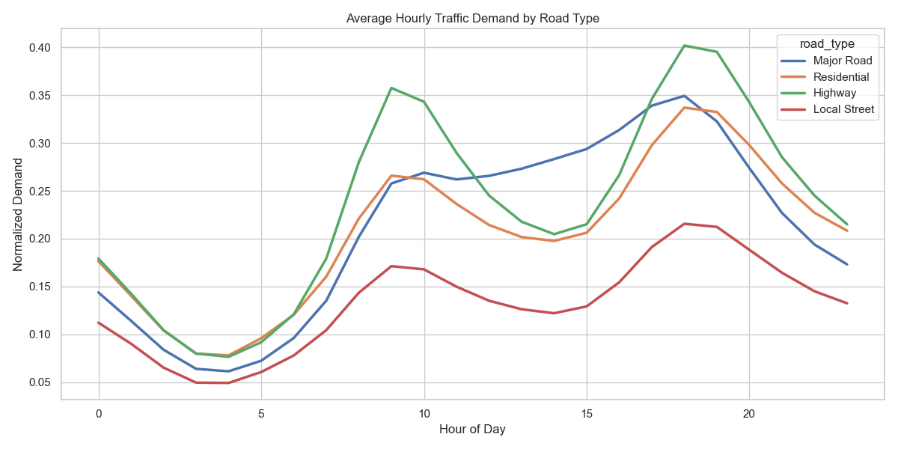
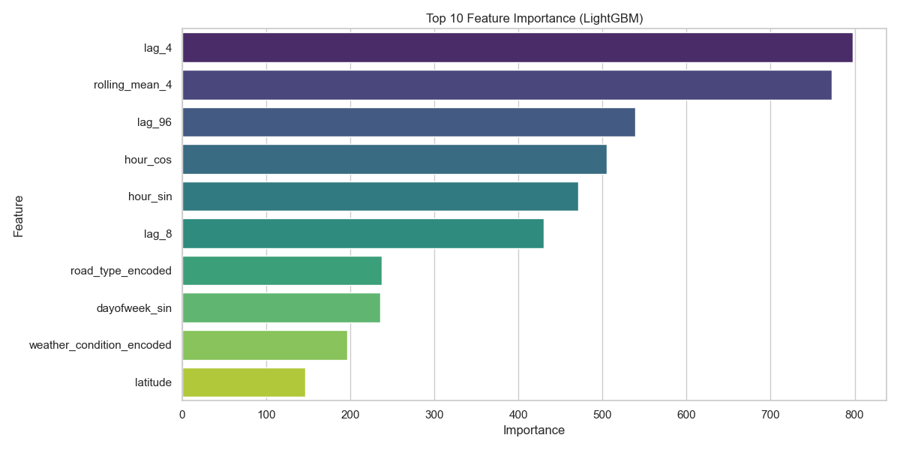
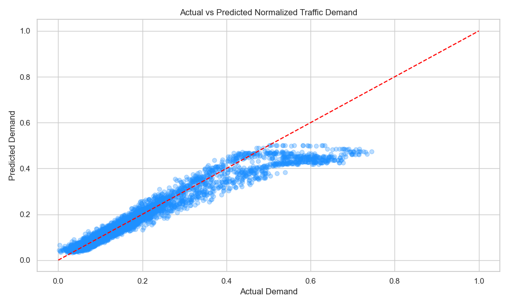

# Traffic Demand Prediction

This project implements a state-of-the-art machine learning system to predict normalized traffic demand (ranging from `0.0` to `1.0`) for road segments based on spatial (geohash) and temporal features. Originally built for traffic forecasting applications (similar to the Flipkart Gridlock Hackathon 2.0), this solution leverages advanced feature engineering, target encoding, and gradient boosting algorithms.

## Project Features & Architecture

1. **Feature Engineering**:
   - **Cyclical Time Encoding**: Uses sine and cosine transformations of hour of day and day of week to preserve temporal continuity.
   - **Geohash Prefix Extraction**: Extracts hierarchical geohash levels (length 5 and 4) to capture geographic area groupings.
   - **Lag Features**: Incorporates 24-hour (`lag_96`), 1-hour (`lag_4`), and 2-hour (`lag_8`) historical demand variables, alongside rolling average statistics.

2. **Leak-Safe Target Encoding**:
   - Computes out-of-fold target encodings for high-cardinality categorical features (geohash and prefixes) using a 5-fold `TimeSeriesSplit`. This prevents any future target value lookahead bias (data leakage).

3. **Weighted Ensemble**:
   - Combines the predictive power of **LightGBM** and **CatBoost** regressors.
   - Achieves a test accuracy ($R^2$ score) of **90.33%**.

---

## Directory Structure

```text
Traffic_Demand_Prediction/
├── data/
│   └── traffic_demand_dataset.csv     # Traffic logs with coordinates, geohashes, road types
├── models/
│   ├── lightgbm_model.pkl             # Serialized LightGBM weights
│   └── catboost_model.cbm             # CatBoost model weights
├── images/
│   ├── demand_distribution.png        # Visualization of demand labels
│   ├── hourly_demand_by_road_type.png # Peak hour demand trends
│   ├── weekly_demand.png              # Weekday vs Weekend demand profile
│   ├── actual_vs_predicted.png        # Scatter plot of model predictions
│   └── feature_importance.png         # Feature importance chart
├── traffic_demand_prediction.ipynb    # Main Jupyter Notebook walkthrough
├── requirements.txt                   # Environment setup dependencies
└── README.md                          # Documentation
```

---

## Model Evaluation Results

Evaluation metrics computed on the chronological out-of-time test set (20% split):

| Model | $R^2$ Score | Mean Absolute Error (MAE) | Root Mean Squared Error (RMSE) |
|---|---|---|---|
| **LightGBM** | 90.34% | 0.0230 | 0.0436 |
| **CatBoost** | 90.12% | 0.0232 | 0.0441 |
| **Weighted Ensemble** | **90.33%** | **0.0230** | **0.0436** |

---

## Visualizations

### 1. Demand Patterns by Road Type


### 2. Feature Importance


### 3. Model Accuracy (Actual vs. Predicted)


---

## Getting Started

### 1. Installation
Install the required packages using pip:
```bash
pip install -r requirements.txt
```

### 2. Run the Notebook
Open the Jupyter notebook to see the detailed implementation:
```bash
jupyter notebook traffic_demand_prediction.ipynb
```
