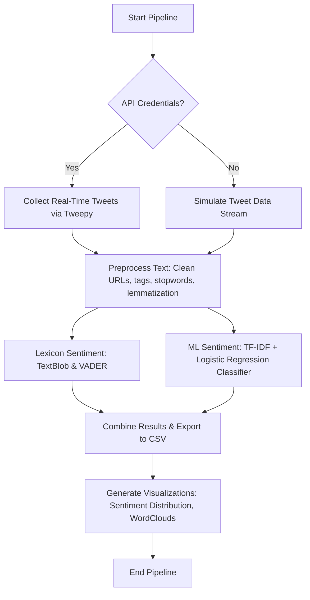

# TweetMiner AI: Real-Time Twitter Data Collector and Sentiment Analysis Pipeline

A beginner-friendly machine learning and natural language processing (NLP) project that collects real-time Twitter/X posts based on keywords or hashtags and performs sentiment analysis to classify them as **Positive**, **Negative**, or **Neutral**.

## 📌 Project Overview

This project implements a complete pipeline for retrieving and analyzing social media text data:
1. **Data Collection**: Retrieves tweets matching specific keywords or hashtags using the Twitter/X API (v2) via `tweepy`.
2. **Mock / Simulation Mode**: Includes a fully-functional simulation that generates realistic synthetic tweets if API credentials are not provided or if the API request fails, ensuring the notebook is always runnable and beginner-friendly.
3. **Data Preprocessing**: Cleans and prepares social media text (removing handles, URLs, hashtags, punctuation, stopwords, and performing lemmatization).
4. **Sentiment Analysis**:
   - **Lexicon-Based**: Calculates sentiment polarity and subjectivity scores using `TextBlob` and `NLTK VADER`.
   - **Machine Learning-Based**: Trains a supervised ML model (Logistic Regression / Naive Bayes) on a subset of sentiment data to classify sentiment.
5. **Visualization**: Generates insight-rich visualizations including:
   - Bar and pie charts showing sentiment distribution.
   - Word clouds highlighting common terms in Positive, Negative, and Neutral tweets.
   - Polarity score distribution curves.
6. **Data Export**: Saves the compiled dataset of tweets along with their calculated/predicted sentiments into a structured CSV file.

---

## 🛠️ Tech Stack & Dependencies

- **Python 3.8+**
- **Tweepy**: Twitter/X API v2 integration
- **Pandas & NumPy**: Data manipulation and structuring
- **NLTK & TextBlob**: Natural Language Toolkit for NLP cleaning and lexicon-based analysis
- **Scikit-learn**: Feature extraction (TF-IDF) and Machine Learning modeling
- **Matplotlib & Seaborn**: Data visualizations
- **WordCloud**: Visualizing text frequency distributions

---

## 🚀 Installation & Setup

### Step 1: Install Dependencies
Install all required libraries using pip:
```bash
pip install -r requirements.txt
```

### Step 2: Open and Run the Notebook
Launch Jupyter Notebook to run the pipeline:
```bash
jupyter notebook tweet_miner_ai.ipynb
```
Set up cell execution sequentially (`Kernel -> Restart & Run All`).

---

## 🔑 Setting up Twitter API Credentials

To stream real-time tweets, you need a Twitter Developer Account:
1. Visit the [Twitter Developer Portal](https://developer.twitter.com/en/portal/dashboard).
2. Create a new App under a Project to obtain your Keys & Tokens.
3. Keep the following credentials ready:
   - `Bearer Token` (Required for Twitter API v2 search)
   - `API Key` & `API Key Secret`
   - `Access Token` & `Access Token Secret`

> 💡 **No API Keys? No problem!** The notebook automatically detects if keys are missing and runs in **Simulation Mode**, generating realistic real-time tweets so you can still learn the entire preprocessing, analysis, and visualization workflow.

---

## 📊 Pipeline Workflow



---

## 📁 Repository Structure

```
TweetMiner_AI/
├── tweet_miner_ai.ipynb     # Interactive Jupyter Notebook pipeline
├── README.md                # Project documentation
└── requirements.txt         # Package dependencies
```

---

## 🤝 Contribution

Contributed to [ML-CaPsule](https://github.com/Niketkumardheeryan/ML-CaPsule) under GSSoC. Feel free to open issues or submit PRs to enhance models, add advanced visualizations, or integrate newer API features!
