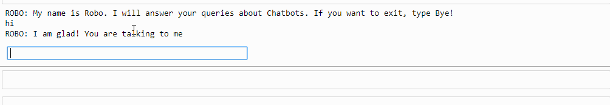

# Unique Chatbot using Python
Meet Robo, the unique chat assitant, this cahtbot is built on nltk library of Python Programming language.

## Setup Instructions
To setup this chatbot we need to do the follwoing steps.
1. First of all download all the libraries written and mentioned in the `requirements.text` file.
2. After downloading and installing the libraries, open the Anaconda Navigator and the Python IDEs for running and compiling the .py files.
3. First run the Jupyter File in the Navigator.
4. Then, open your IDE and run the .py file, which is the main file.
5. Deployed Successfully.

## Description 
This chatbot is developed using the Natural laguage processing and NLTK. After that we have done the noise cancellation so that it should work fine enough.

## Output

*****************************************************************************************************
Code contributed by, Abhishek Sharma, 2021, @abhisheks008 #LGMSOC21
