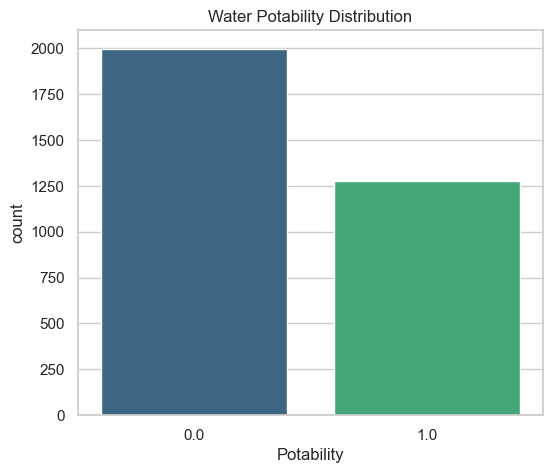
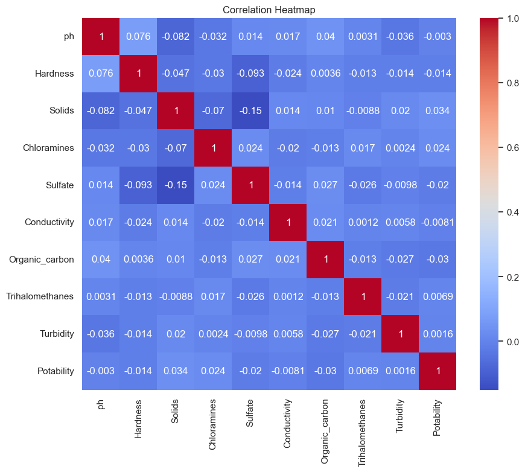
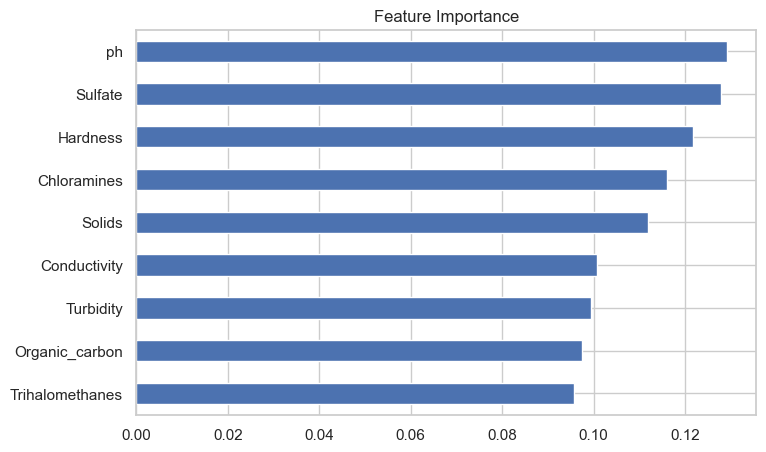
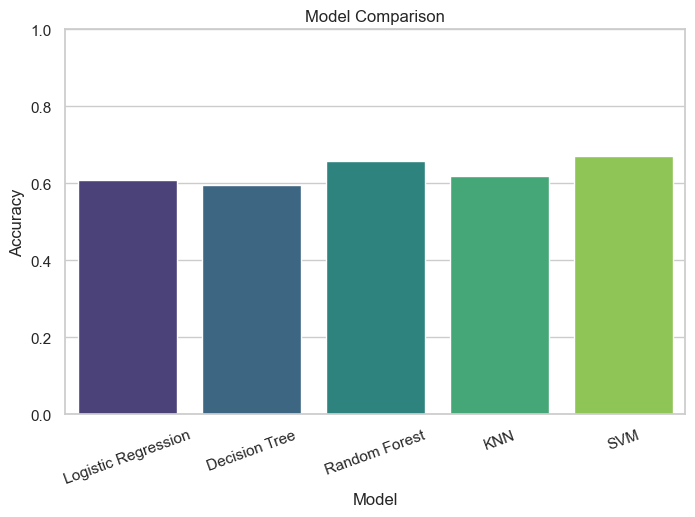

# 💧 Water Potability Prediction using Machine Learning

A machine learning project that predicts whether water is safe for drinking based on its physicochemical properties. This project demonstrates a complete end-to-end machine learning workflow, including data preprocessing, exploratory data analysis (EDA), feature engineering, model training, evaluation, and comparison.

---

## 📌 Overview

Access to clean drinking water is an important global concern. This project uses various supervised machine learning algorithms to classify water samples as **Potable (Safe)** or **Not Potable (Unsafe)** based on water quality measurements.

The notebook covers:

- Data Cleaning
- Missing Value Handling
- Exploratory Data Analysis
- Feature Scaling
- Class Imbalance Handling using SMOTE
- Model Training
- Performance Evaluation
- Model Comparison
- Feature Importance Analysis
- ROC Curve Comparison

---

## 📂 Dataset

The dataset contains physicochemical properties of water samples.

### Features

- pH
- Hardness
- Solids
- Chloramines
- Sulfate
- Conductivity
- Organic Carbon
- Trihalomethanes
- Turbidity

### Target

- **Potability**
  - 0 → Not Safe to Drink
  - 1 → Safe to Drink

---

## 🛠 Technologies Used

- Python
- NumPy
- Pandas
- Matplotlib
- Seaborn
- Scikit-learn
- Imbalanced-learn (SMOTE)
- Jupyter Notebook

---

## ⚙️ Machine Learning Models

The following classification algorithms were implemented and compared:

- Logistic Regression
- Decision Tree
- Random Forest
- K-Nearest Neighbors (KNN)
- Support Vector Machine (SVM)

---

## 📊 Data Preprocessing

The following preprocessing steps were performed:

- Missing value imputation using Median strategy
- Duplicate removal
- Feature scaling using StandardScaler
- Class balancing using SMOTE
- Train-Test Split (80:20)

---

## 📈 Exploratory Data Analysis

The notebook includes:

- Missing Value Heatmap
- Class Distribution
- Feature Histograms
- Boxplots
- Correlation Heatmap

---

## 📉 Model Performance

| Model               | Accuracy   |
| ------------------- | ---------- |
| Random Forest       | **73.63%** |
| KNN                 | 65.13%     |
| SVM                 | 64.75%     |
| Decision Tree       | 61.25%     |
| Logistic Regression | 51.50%     |

Random Forest achieved the best overall performance.

---

## 📷 Visualizations

### Class Distribution



---

### Correlation Heatmap



---

### Feature Importance



---

### Model Comparison



---

### ROC Curve


---

## 📁 Project Structure

```
Water_Potability_Prediction/
│
├── dataset/
│   └── water_potability.csv
│
├── images/
│   ├── class_distribution.png
│   ├── correlation_heatmap.png
│   ├── feature_importance.png
│   ├── model_comparison.png
│   └── roc_curve.png
│
├── Water_Potability_Prediction.ipynb
├── requirements.txt
└── README.md
```

---

## 🚀 Installation

Clone the repository

```bash
git clone https://github.com/Niketkumardheeryan/ML-CaPsule.git
```

Install dependencies

```bash
pip install -r requirements.txt
```

Run the notebook

```bash
jupyter notebook
```

---

## 📌 Future Improvements

- Hyperparameter tuning using GridSearchCV
- XGBoost and LightGBM implementation
- Cross-validation
- Flask/Streamlit deployment
- Real-time prediction interface

---

## 📜 License

This project is contributed to the **ML-CaPsule** repository under its respective license.

---

## 👩‍💻 Author

**Paridhi Mishra**

GitHub: https://github.com/ParidhiMis
