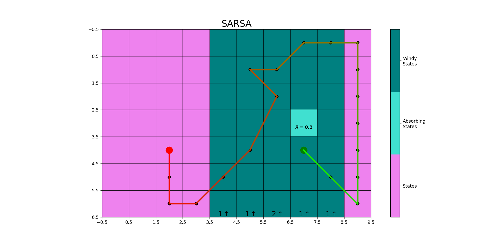
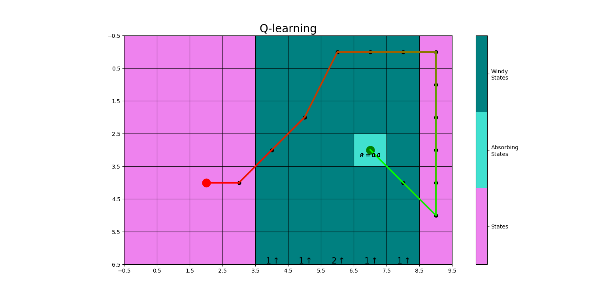

# SARSA and Q-learning used for solving the "Windy Grid World" problem

## About
SARSA and Q-learning Reinforcement Learning methods on a Windy Grid World using PyTorch. The picture below shows the state space. Arrows represent the strength of the wind flowing upwards in each column.

### Problem Statement Explantion
The Windy Gridworld Problem involves having an agent learn the optimal path to get to the goal state on a grid. Some of the columns of the grid have wind values that can alter the position of the agent if moving out of said column.

The first two times use SARSA and Q-learning respectively to solve this problem. The agent is allowed to make only four moves (N, S, E, W) and the wind values are deterministic.

The last two times also use SARSA and Q-learning respectively to solve the probelm. the agent is allowed to make the previous four moves as well as Agent's Moves (NE, SE, SW, NE). The wind values are stochastic, sometimes varying by 1 from the mean values given for each column.


## Example

SARSA and Q-learning performance experiment:



## Libraries 
* ```pytorch```
* ```numpy```
* ```opencv```
* ```matplotlib```.

