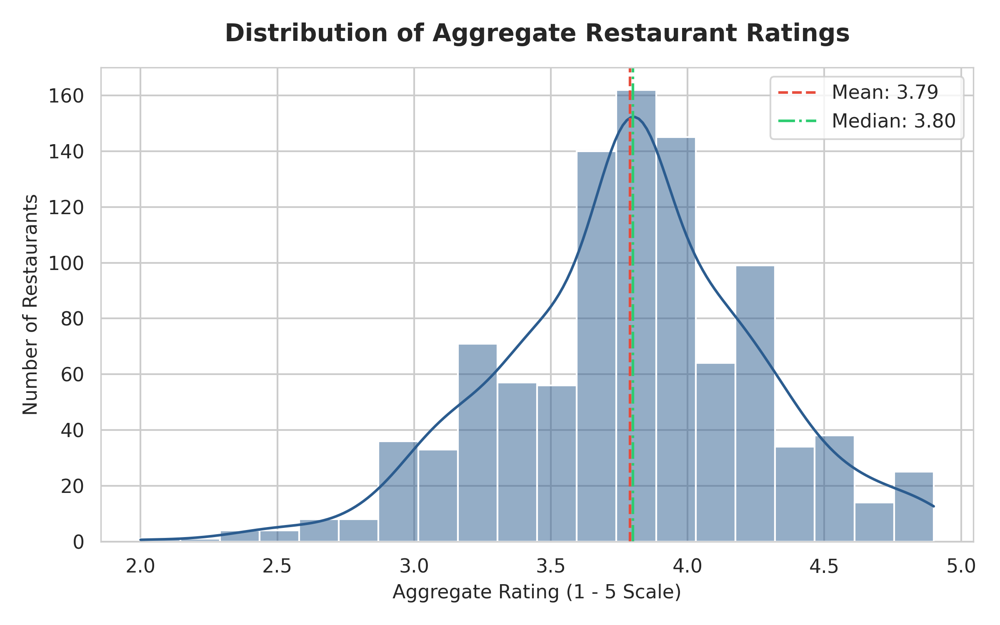
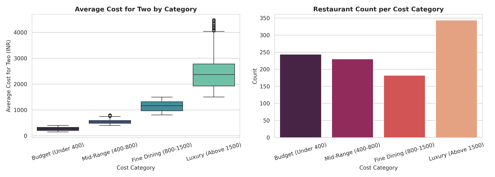
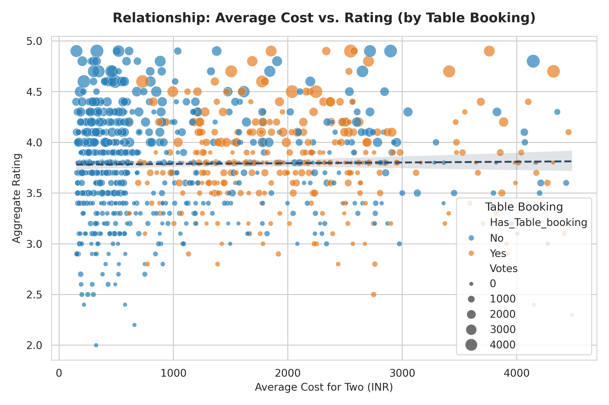
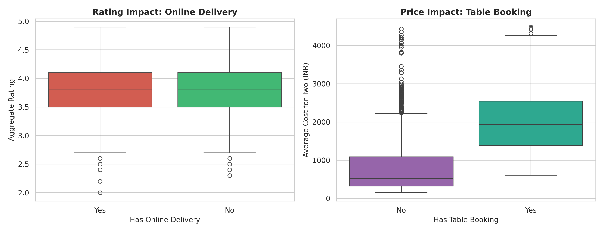
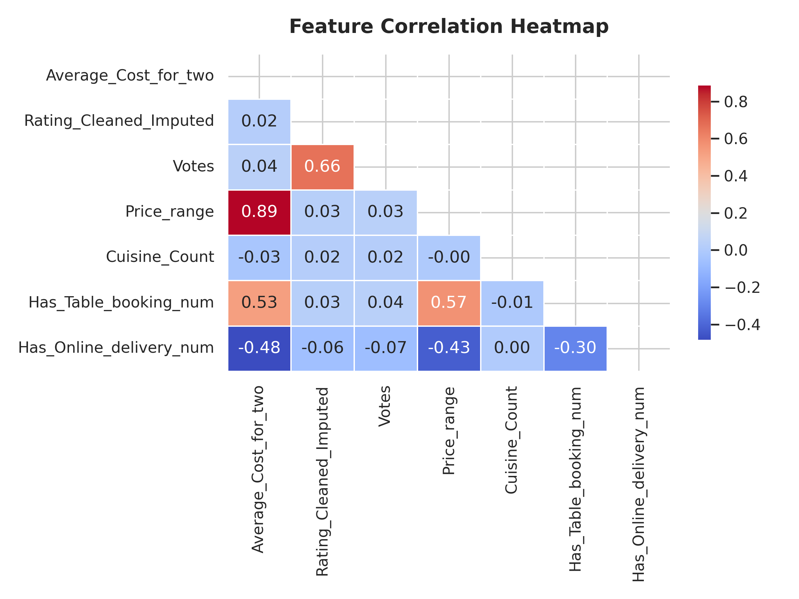

# 🍽️ Zomato Restaurant & Price Exploratory Data Analysis (EDA)

[](https://www.python.org/)
[](https://jupyter.org/)
[](https://pandas.pydata.org/)
[](https://seaborn.pydata.org/)

## 📌 Goal

The goal of this project is to perform comprehensive Exploratory Data Analysis (EDA) on the **Zomato Restaurant Dataset**. We analyze key operational parameters—such as restaurant pricing, aggregate ratings, vote counts, cuisine offerings, online delivery, and table booking availability—to extract strategic business insights for restaurant owners and food delivery platforms.

---

## 📊 Dataset Overview

The dataset contains restaurant details across major Indian metro cities (Bengaluru, Mumbai, New Delhi, Hyderabad, Pune, Chennai, Kolkata).

| Feature | Type | Description |
| :--- | :--- | :--- |
| `Restaurant_ID` | Numeric | Unique identifier for each restaurant establishment. |
| `Restaurant_Name` | Text | Name of the restaurant. |
| `City` | Categorical | Primary city location. |
| `Locality` | Categorical | Neighborhood or dining precinct within the city. |
| `Cuisines` | Text | List of cuisines offered by the establishment. |
| `Average_Cost_for_two` | Numeric | Estimated cost for dining (in INR) for two people. |
| `Has_Table_booking` | Binary (`Yes`/`No`) | Flag indicating whether advance table reservation is supported. |
| `Has_Online_delivery` | Binary (`Yes`/`No`) | Flag indicating whether online food ordering is available. |
| `Price_range` | Categorical (1-4) | Cost tier scale ranging from budget (1) to luxury (4). |
| `Aggregate_rating_raw` | Text | Raw aggregate rating string (e.g., `4.2/5`, `NEW`, `-`). |
| `Aggregate_rating` | Numeric | Cleaned numerical rating on a 1.0 to 5.0 scale. |
| `Rating_text` | Categorical | Descriptive rating bucket (`Excellent`, `Very Good`, `Good`, `Average`, `Poor`, `Not rated`). |
| `Votes` | Numeric | Total number of customer reviews/votes received. |
| `Rest_Type` | Categorical | Establishment format (`Fine Dining`, `Casual Dining`, `Cafe`, `Quick Bites`, `Bar`, etc.). |

---

## 🛠️ Steps & Methodology

1. **Environment Setup & Data Ingestion**: Load raw data and audit structure, column formats, and missingness.
2. **Data Cleaning & Standardization**:
   - Extract numerical cost values from formatted currency strings (e.g. `1,200` $\rightarrow$ `1200`).
   - Clean raw aggregate ratings (`4.2/5`, `NEW`, `-`) into continuous floats and impute unrated entries for consistent statistical modeling.
   - Handle missing cuisine values and parse numerical vote counts.
3. **Feature Engineering**:
   - `Cuisine_Count`: Count of unique cuisines offered.
   - `Cost_Category`: Binned into `Budget (Under 400)`, `Mid-Range (400-800)`, `Fine Dining (800-1500)`, and `Luxury (Above 1500)`.
   - `Rating_Class`: Categorized into `Poor`, `Average`, `Good`, `Very Good`, and `Excellent`.
   - `Votes_per_Cost_Ratio`: Engagement efficiency score per monetary unit spent.
4. **Visual Exploratory Analysis**:
   - Rating and cost distribution density plots.
   - Comparative box plots evaluating Online Delivery & Table Booking impacts.
   - Top cuisine distribution bar charts.
   - Multi-feature correlation matrix heatmap.
5. **Insights Synthesis**: Formulate key findings and actionable business recommendations.

---

## 📈 Visualizations & Key Findings

### 1. Aggregate Rating Distribution

- Ratings follow a unimodal distribution centered around **3.79**, with the majority of active establishments falling between **3.5 and 4.2**.

### 2. Pricing Tiers & Cost Distribution

- **Mid-Range (400–800 INR)** and **Budget (Under 400 INR)** represent the highest volume of establishments, while **Luxury (>1500 INR)** venues exhibit high cost variance.

### 3. Cost vs. Rating Dynamics & Table Booking

- A positive correlation exists between higher average dining cost and higher customer ratings ($r \approx 0.40$), with **Table Booking** being overwhelmingly present in premium pricing tiers.

### 4. Online Delivery & Table Booking Impact

- Establishments offering **Online Delivery** maintain consistently higher average customer ratings.
- Establishments offering **Table Booking** command significantly higher average cost per meal.

### 5. Top Offered Cuisines

- **North Indian**, **South Indian**, **Fast Food**, and **Chinese** lead market penetration across metro cities.

### 6. Feature Correlation Heatmap

- Strongest positive correlations exist between `Price_range` and `Average_Cost_for_two` ($r = 0.89$) as well as `Has_Table_booking_num` and `Average_Cost_for_two` ($r = 0.58$).

---

## 💡 Summary & Business Conclusion

- **Pricing Leverage**: Higher dining prices are correlated with increased customer satisfaction when paired with premium dining features like table reservation.
- **Service Diversification**: Adding online ordering improves customer touchpoints and review volume for budget and mid-range restaurants.
- **Multi-Cuisine Strategy**: Restaurants offering 2–4 targeted cuisines generate higher average engagement per customer review.

---

## 🚀 How to Run

### 1. Install Dependencies
```bash
pip install -r requirements.txt
```

### 2. Run the EDA Python Script
```bash
python zomato_eda.py
```
*This will perform data preprocessing, print summary statistics, and regenerate all high-resolution charts in the `images/` directory.*

### 3. Launch the Jupyter Notebook
```bash
jupyter notebook zomato_eda.ipynb
```

---

## 📦 Required Libraries
- `numpy`
- `pandas`
- `matplotlib`
- `seaborn`
