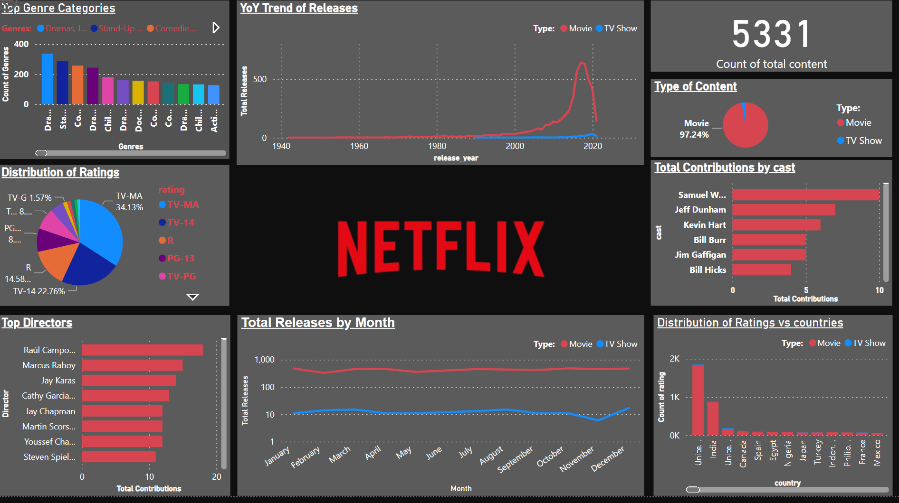
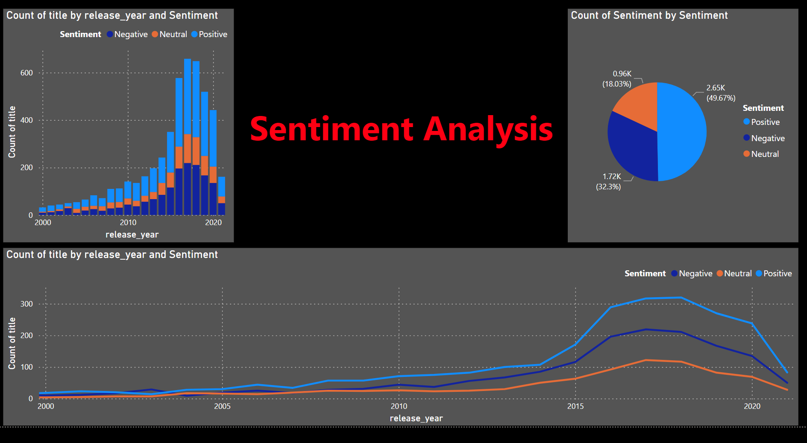

# Netflix Power BI Report

## Overview

This project involves analyzing Netflix data using Power BI to uncover insights and trends. The report includes various visualizations that highlight key metrics such as viewing trends, genre popularity, and user demographics.

## Screenshots




## Features

- **Content Analysis**: Visualization of content distribution by genre, country, and release year.
- **Trend Analysis**: Identification of trends in content production and user ratings over time.
- **Top Content**: Highlighting the most popular shows and movies based on user ratings and watch counts.
- **User Demographics**: Insights into user preferences by region and age group.
- **Top Casts**: Highlighting the top Casts based on total contents.

- ## Files
- **Netflix.pbix**: The main Power BI file containing all the visualizations and dashboards.
- **Netflix(Dataset)**: The folder containing the dataset used for the analysis.

## Steps

1. **Open the Power BI File**: Download and open the `Netflix_PowerBI_Report.pbix` file in Power BI Desktop.
2. **Explore the Visualizations**: Navigate through the different pages to explore various insights.
3. **Customize as Needed**: Modify the visualizations and data as needed to suit your requirements.

## Getting Started

To get started with the project, follow these steps:

1. **Clone the Repository**:

   ```sh
   git clone https://github.com/your-username/Netflix-PowerBI-Report.git
   ```

2. **Open the Power BI Report**:
   - Open `Netflix_PowerBI_Report.pbix` in Power BI Desktop.

**Author**: Shubham Nakum  
**Contact**: nakumshubham@gmail.com
