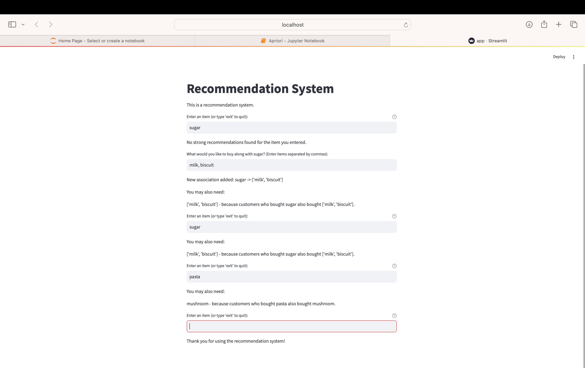

# Market Basket Analysis using Apriori Algorithm

This project focuses on uncovering hidden insights within datasets through association rule mining using the Apriori algorithm and sequential pattern mining techniques.

In the era of data-driven decision-making, understanding the relationships and patterns within large datasets is crucial. This project delves into applying the Apriori algorithm and sequential pattern mining to extract valuable insights from transactional data. By identifying frequent itemsets and sequential patterns, we aim to uncover hidden associations and trends that can inform business strategies and decision-making processes.

## Why is this Needed?

Market Basket Analysis is a powerful tool for businesses to understand customer purchasing behavior. By identifying associations between items, businesses can:
- **Optimize product placement**: Strategically place related products together to increase sales.
- **Design effective promotions**: Create bundled offers or discounts on frequently bought together items.
- **Enhance inventory management**: Ensure that items frequently bought together are stocked adequately.
- **Improve customer experience**: Provide personalized recommendations to customers based on their purchasing patterns.

## Project Description

Market Basket Analysis is a popular data mining technique used to identify associations between items in large datasets. This notebook demonstrates the use of the Apriori algorithm to find frequent itemsets and generate association rules from a transactional dataset. The Apriori algorithm works by identifying the frequent individual items in the dataset and extending them to larger and larger itemsets as long as those itemsets appear sufficiently often in the dataset. The key concepts involved in this process are:

- **Support:** The proportion of transactions that contain the itemset.
- **Confidence:** The likelihood that a transaction containing item A also contains item B.
- **Lift:** The ratio of the observed support to that expected if A and B were independent.

_In this notebook, we will:_
1. Load and preprocess the dataset.
2. Generate frequent itemsets using the Apriori algorithm.
3. Derive association rules from the frequent itemsets.
4. Visualize the top associations.
5. Build a simple recommendation system based on the association rules.
6. Further allow users to give their recommendations.

## Workflow

1. User inputs an item.
2. If no strong recommendations are found, the system prompts the user to enter additional items they would like to buy along with the input item.
3. User provides additional items separated by commas.
4. The system adds these associations to its data.
5. Recommendations are displayed to the user, including the newly added associations.

## Streamlit App

We have built a Streamlit app to interactively visualize and generate recommendations from the market basket analysis. The app allows users to input items and get recommendations based on association rules. If no recommendations are found, users can input their own associations, which are then incorporated into the system.

## How to Run the App

### Steps to Run the App

1. **Clone the repository**:
   ```
   git clone https://github.com/your-repo/market-basket.git
   cd market-basket-analysis

2. Create a virtual environment (optional but recommended):

```

python3 -m venv venv
source venv/bin/activate  # On Windows, use venv\Scripts\activate
```

3. Install required packages:
Ensure you have all the necessary packages installed. You can do this by running:
```
pip install -r req.txt
```
4. Run the Streamlit app:
Start the Streamlit server by running:

```sh
streamlit run app.py
```
This will start a local server, and you can access the app in your web browser at `http://localhost:8501`.

### Prerequisites

Before proceeding, ensure you have Python installed on your system. You can download it from [python.org](https://www.python.org/downloads/).

## Authors
- [Pooja Harihar](https://github.com/poojaharihar03)


## screenshots



