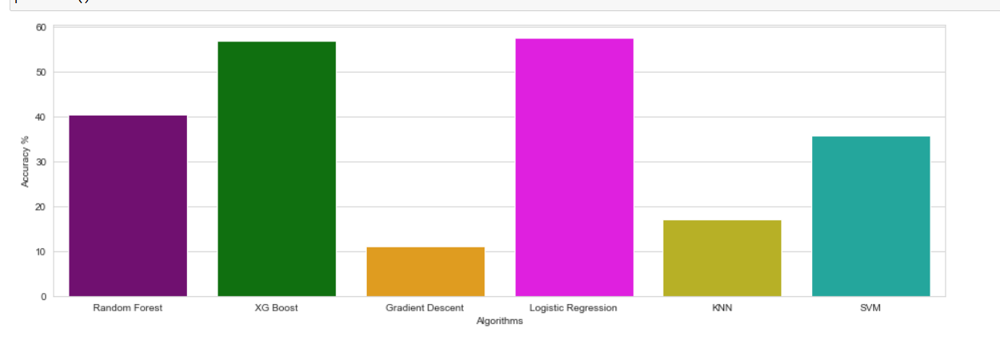
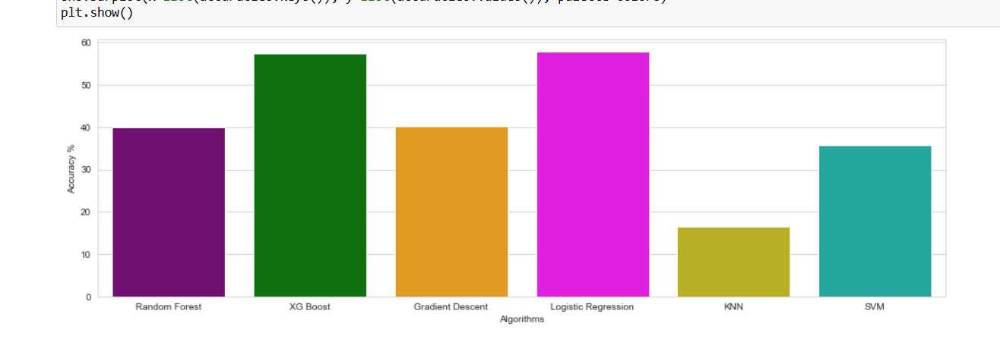

# Personality Prediction System Using Machine Learning

This project predicts MBTI personality types from text using multiple machine learning models.

## Overview
The system processes textual input, vectorizes it with TF-IDF, and evaluates a range of classifiers to predict personality type.

## Workflow
1. Load the dataset
2. Preprocess the text
3. Perform tokenization, stemming, and lemmatization
4. Convert text to features using TF-IDF
5. Train and evaluate models

## Models
- Logistic Regression
- Stochastic Gradient Descent
- K-Nearest Neighbors
- Naive Bayes
- Support Vector Machine
- Random Forest
- Gradient Boosting
- XGBoost

## Metrics
- Accuracy
- Precision
- Recall
- F1 score
- Confusion matrix

## Visualization
The project includes plots for data distribution, model performance, and word clouds for common terms.

## Results

