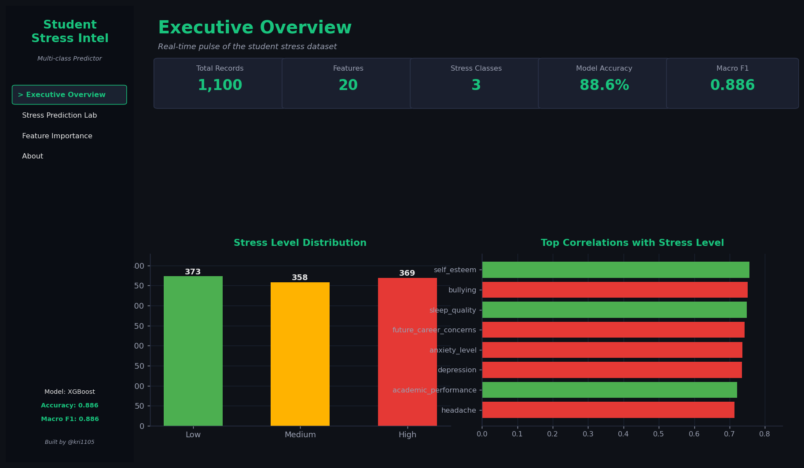
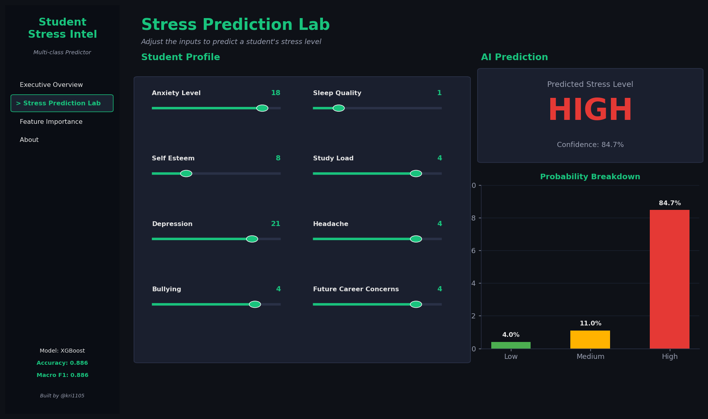

# 🧠 Student Stress Intelligence Platform

A multi-class machine learning project that predicts a student's stress level (**Low / Medium / High**) from 20 lifestyle, academic, and psychological factors — with an interactive Streamlit dashboard for live predictions.


---

## 📸 Application Sneak Peek

| Executive Overview Dashboard | Stress Prediction Lab |
|:---:|:---:|
|  |  |
| *Real-time KPIs, class distribution & top correlations* | *Interactive XGBoost predictions with confidence breakdown* |

---

## 🎯 The Problem

Student stress is multi-causal — it stems from sleep, academic load, mental health, peer environment, and social support all at once. Counselors and student-wellness teams rarely have time to assess all 20 dimensions for every student.

**The Solution:** An ML-powered intelligence platform that lets educators, researchers, and students:

- **Understand** which factors most drive stress in the population.
- **Predict** a student's stress level from a structured questionnaire.
- **Interpret** the prediction with per-feature importance and confidence scores.

---

## ⚙️ Tech Stack

| Category | Technologies |
| :--- | :--- |
| **Machine Learning** | XGBoost, scikit-learn (Logistic Regression, Random Forest) |
| **Data Analysis** | Pandas, NumPy |
| **Visualization** | Matplotlib, Seaborn, Plotly |
| **Frontend / UI** | Streamlit |
| **Notebook** | Jupyter, Google Colab compatible |
| **Version Control** | Git, GitHub |

---

## 🧠 Key Engineering & ML Insights

### 1. Linear vs. tree models are tied
All three models — Logistic Regression, Random Forest, and XGBoost — land within 0.5 percentage points of each other (≈ 88.6% accuracy). That means the signal is **largely monotonic**: simple linear combinations of the features already capture most of the predictive power. Picking XGBoost wins on interpretability of feature interactions, not on raw accuracy.

### 2. `blood_pressure` dominates tree importance
Despite a mid-range raw correlation with `stress_level`, `blood_pressure` is the **single most important feature** by tree-model gain (~28%). That's a signature of an **interaction splitter** — the tree uses it to gate decisions on other features. A SHAP analysis (planned for v2) should expose exactly which interactions it's catching.

### 3. Class balance means no resampling needed
The target is ~33/33/33 split across Low/Medium/High, so accuracy and macro-F1 agree closely. No SMOTE, no class weights — the validation story is clean.

### 4. The hardest class is sometimes the easiest
Counter-intuitively, the **Medium** class — usually the most error-prone in 3-class ordinal problems — is the best predicted (F1 ≈ 0.90), because students at the extremes share more variance in their features than those in the middle band.

### 5. Mental health > environment
`self_esteem`, `bullying`, `anxiety_level`, `depression`, and `sleep_quality` carry far more predictive weight than environmental features like `noise_level`, `living_conditions`, or `safety`. **Actionable** signals (sleep, study load) are also high-importance — useful for intervention design.

---

## 🚀 Local Setup & Installation

### Prerequisites
- Python 3.10+
- pip

### 1. Clone the project folder

```bash
git clone https://github.com/Niketkumardheeryan/ML-CaPsule.git
cd "ML-CaPsule/Projects/Student Stress Level Prediction"
```

### 2. Install dependencies

```bash
python -m venv .venv
source .venv/bin/activate          # Windows: .venv\Scripts\activate
pip install -r requirements.txt
```

### 3. Train the model

```bash
python train_model.py
```

This loads `data/StressLevelDataset.csv`, trains XGBoost, and writes `models/stress_model.pkl` + `models/feature_meta.json`.

### 4. Launch the Streamlit UI

```bash
streamlit run app.py
```

The dashboard opens at `http://localhost:8501`.

### 5. Or just open the notebook

```bash
jupyter notebook student_stress_prediction.ipynb
```

The notebook is Colab-compatible — if you upload it to [Google Colab](https://colab.research.google.com), it auto-installs XGBoost and prompts you to upload the CSV.

---

## 📂 Project Structure

```
Student Stress Level Prediction/
│
├── assets/                          # README screenshots
│   ├── dashboard-overview.png
│   └── prediction-lab.png
│
├── data/
│   ├── README.txt
│   └── StressLevelDataset.csv       # Kaggle dataset (1,100 × 21)
│
├── models/                          # Generated by train_model.py
│   ├── stress_model.pkl
│   └── feature_meta.json
│
├── app.py                           # Streamlit dashboard
├── train_model.py                   # Trains + saves the XGBoost model
├── student_stress_prediction.ipynb  # Full EDA + modeling notebook
├── requirements.txt
└── README.md
```

---

## 📊 Results

Real Kaggle dataset, stratified 80/20 split, 5-fold CV:

| Model | CV macro-F1 | Test Accuracy | Test macro-F1 |
| :--- | ---: | ---: | ---: |
| Logistic Regression | 0.877 | 0.882 | 0.882 |
| Random Forest | 0.873 | **0.886** | 0.886 |
| **XGBoost** ⭐ | 0.877 | **0.886** | **0.886** |

### Per-class breakdown (XGBoost)

| Class | Precision | Recall | F1 |
| :--- | ---: | ---: | ---: |
| Low | 0.89 | 0.86 | 0.88 |
| Medium | 0.89 | 0.92 | 0.90 |
| High | 0.88 | 0.88 | 0.88 |

---

## 📚 Dataset

[**Student Stress Factors – A Comprehensive Analysis**](https://www.kaggle.com/datasets/rxnach/student-stress-factors-a-comprehensive-analysis) by *rxnach* on Kaggle.

- **1,100 rows × 21 columns** (20 features + target)
- No missing values
- Features span psychological (anxiety, depression, self-esteem), physiological (headache, blood pressure, sleep, breathing), environmental (noise, safety, living conditions), academic (performance, study load, teacher relationship, career concerns), and social (support, peer pressure, extracurriculars, bullying) factors

---

## 🗺️ Roadmap

- [x] EDA + correlation analysis
- [x] Train and compare LogReg / RandomForest / XGBoost
- [x] Persist model + Streamlit dashboard
- [x] Colab-compatible notebook with auto-upload
- [ ] **v2:** Hyperparameter tuning (Optuna) + stacked ensemble
- [ ] **v2:** SHAP per-prediction explanations (especially for the `blood_pressure` interaction)
- [ ] **v2:** Engineered interaction features (`anxiety × sleep`, `self_esteem − depression`)
- [ ] **v3:** Hosted Streamlit Cloud demo + REST API endpoint

---

## 📄 License

This project is open source under the MIT License.

---

**Built with ☕ and 🧠 by [@kri1105](https://github.com/kri1105)** as a **GSSoC'26** contribution to [ML-CaPsule](https://github.com/Niketkumardheeryan/ML-CaPsule) — closes [issue #1867](https://github.com/Niketkumardheeryan/ML-CaPsule/issues/1867).
